---
# You can also start simply with 'default'
theme: seriph
# random image from a curated Unsplash collection by Anthony
# like them? see https://unsplash.com/collections/94734566/slidev
background: https://cover.sli.dev
# some information about your slides (markdown enabled)
title: Welcome to Slidev
info: |
  ## Slidev Starter Template
  Presentation slides for developers.

  Learn more at [Sli.dev](https://sli.dev)
# apply unocss classes to the current slide
class: text-center
# https://sli.dev/features/drawing
drawings:
  persist: false
# slide transition: https://sli.dev/guide/animations.html#slide-transitions
transition: slide-left
# enable MDC Syntax: https://sli.dev/features/mdc
mdc: true

---

## 行動科学概論
 
# 社会科学におけるモデル入門

意見ダイナミクス

### 呂沢宇

  Press Space for next page <carbon:arrow-right />

  <a href="https://github.com/lvzeyu/social_modeling_lecture" target="_blank" class="slidev-icon-btn">
    <carbon:logo-github />
  </a>

<!--
The last comment block of each slide will be treated as slide notes. It will be visible and editable in Presenter Mode along with the slide. [Read more in the docs](https://sli.dev/guide/syntax.html#notes)
-->

---
transition: slide-up
level: 2
---
# 振り返りとこれからの内容

<v-clicks depth="2">

- Agent based model(ABM)
    - 個々の自律的な「エージェント」が、ルールに従って行動し、他のエージェントや環境と相互作用することにより、マクロな現象を創発的に再現・分析するモデル
- ネットワークモデル
    - 現実世界の複雑な関係構造や相互作用をノード（点）とリンク（辺）に基づいて表現・分析する枠組み

</v-clicks>

  ネットワークモデルとABMの組み合わせによる  複雑現象のシミュレーションと解析

---
transition: slide-up
level: 2
---

# 振り返りとこれからの内容

ABMの要素

<v-clicks depth="2">

- エージェント (Agents)
- 相互作用 (Interactions)
- 環境 (Environment)
    - グリッドベース (Grid-based): 離散的なセル（マス目）で構成される空間
    - **ネットワーク (Network)**
        - ノードとリンクで構成される空間: エージェントがノード上に存在し、リンクを介して相互作用をする
        - ネットワークの構造がエージェントの振る舞いを制約する場合がある

</v-clicks>

  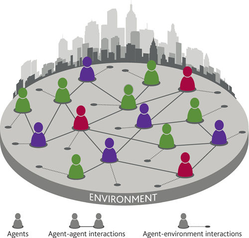

---
transition: slide-up
level: 2
---

# 振り返りとこれからの内容

ABMの要素

<v-clicks depth="2">

- **関係性の明示的表現**:物理的な位置関係だけでなく、抽象的な関係性をノード間のリンクとして直接的にモデル化できる
- **多様な構造**: 規則的なものから、ランダム、スモールワールド、スケールフリーといった現実世界によく見られる複雑な構造まで、様々な構造を表現できる
- **動的な変化の表現**:エージェントの行動変化に応じて、リンクが生成・削除される動的な環境として機能することは可能である

</v-clicks>

  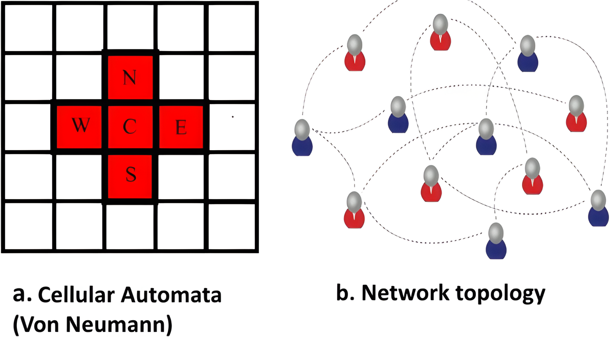

---
transition: slide-up
level: 2
---

# 振り返りとこれからの内容

ネットワーク

  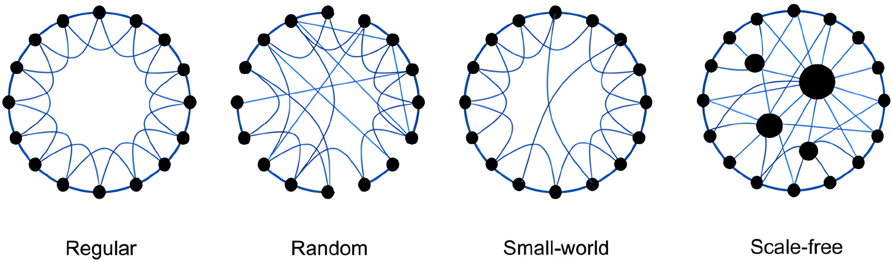

<v-clicks depth="2">

- ネットワークの構造は、ネットワークにおけるシミュレーションの過程と結果に大きな影響を与える

    - 構造的影響の特定:特定のネットワーク構造（例：ハブの有無、クラスタリングの度合い、平均経路長）が、シミュレーションで観察される現象 にどのように影響するかを明確
    - クリティカルな要素の特定: ある種のネットワーク構造では顕著に現れるが、別の構造ではそうでない現象を特定することで、その現象を引き起こすためにどのような構造的要素が必要なのかを明らかにする
    - 異なる状況下での性能評価

</v-clicks>

---
transition: slide-up
level: 2
---

# 意見ダイナミクス

背景

<v-clicks depth="2">

- 意見の分極化とは、社会における人々の意見がより極端な方向に分かれていき、穏健な意見や中間的立場が少なくなる現象
    - 異なる立場の人々の間で共通の理解や対話が難しくなり、集団間の対立が強くなる
    - 民主主義機能の阻害: 合意形成に必要な「相互理解」や「妥協」が成り立たなくなる
    - フェイクニュース・陰謀論の拡散:分極化した社会では、事実ではなく感情や立場によって情報の信頼性が判断されやすくなる

</v-clicks>

  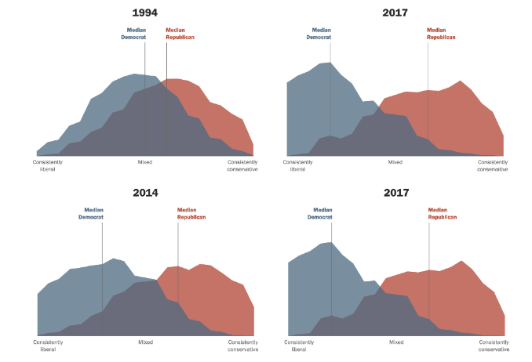
  

      アメリカにおける世論調査では、近年意見分極化の拡大傾向が一貫して確認されている 
    

---
transition: slide-up
level: 2
---

# 意見ダイナミクス

背景

<v-clicks depth="2">

- **意見ダイナミクス**に関するシミュレーション：社会における意見の形成と拡散を決定するプロセス
    - 意見形成メカニズムの解明
        - どのような要因（個人の信念、他者の影響、情報の質、ネットワーク構造など）が人々の意見形成に影響を与えるのか
    - 分極化・合意の条件の検証
        - 異なる意見を持つ人々がどのようにして対立を深めるのか、またその対立を緩和するためにはどのような介入が有効なのか
    - 政策介入の評価
        - 特定の情報が社会全体にどのような影響を与えるかを事前に評価する「What-if」シナリオ分析 

</v-clicks>

---
transition: slide-up
level: 2
---

# 意見ダイナミクスのシミュレーション

意見ダイナミクスのシミュレーションの概要

<v-clicks depth="2">

- 初期状態として、ネットワークのノードに意見をランダムに割り当てる。
    - 基本的には、初期状態ではどちらの意見を持つ人はそれぞれ存在している（非合意の状態）

- 意見の更新ルールは、すべてのノードに対して繰り返し適用される。
    - 一回の反複で、すべてのノードに対してループを実行する
    - 通常、収束しやすいように、ノードはランダムな順序で非同期更新される
- 考えられる結果は2種類と考える
    - システムは定常状態に達し、どのノードもそれ以上意見を変更しなくなる。
        - すべてのノードが同じ意見を持つ合意
        - 一部のノードが一方の意見をもち、残りのノードがもう一方の意見を持つ分極化
    - システムは定常状態にいらず、一部のノードは意見を変え続ける
</v-clicks>

---
transition: slide-up
level: 2
---

# 意見ダイナミクス

モデルの種類

- 連続的な意見

  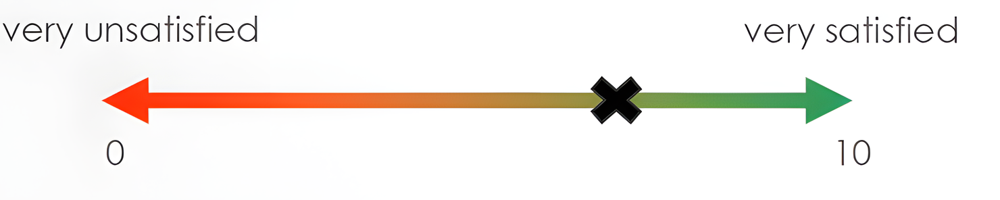

- 離散的な意見　
    - 二値選択
        - 例：賛成／反対、はい／いいえ
    - 複数段階のリッカート尺度
        - 例：「まったくそう思わない」〜「非常にそう思う」までの5段階や7段階

  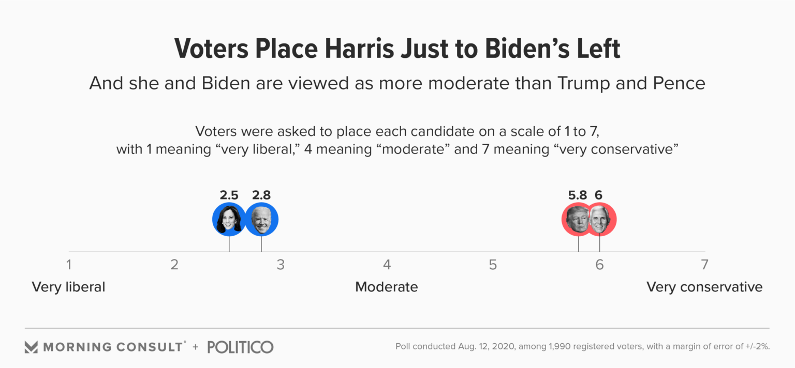

---
transition: slide-up
level: 2
---

# 意見ダイナミクスのシミュレーション

意見ダイナミクスのシミュレーションの指標

<v-clicks depth="2">

- 平均的意見：ノード全体の意見の平均
    - 平均的意見はダイナミクスを通じて変化していく、各反複の後にその値を確認する
    - システムが定常状態に達した場合、平均値はある値に収束する
- 離脱確率:ネットワークにおいて意見$1$で合意に達する頻度を、初期設定における意見$1$を持つノードの割合の関数として推定する
    - シミュレーションを複数回実行し、各実行の終わりに、システムが「意見1での合意状態」に達したかどうかを判定する
    - 各初期意見1比率において、意見1で合意に達したシミュレーション実行の回数を、その初期意見1比率での総実行回数で割ることで、離脱確率を算出する
</v-clicks>

---
transition: slide-up
level: 2
---

# 意見ダイナミクスの発想

Ising model

<v-clicks depth="2">

- イジングモデル (Ising model) は、統計力学において、特に磁性体の性質を記述するモデル
    - 隣接スピン間の相互作用: 隣り合ったスピンは、同じ向きを向こうとするとエネルギー的に安定し、異なる向きを向くとエネルギー的に不安定になるという相互作用を持つ

- スピンを個々の人や集団、その相互作用が社会全体の振る舞いを決定するという発想で意見ダイナミクスをモデル化
    - 各個人は、自身の周囲の意見や外部からの情報（=外部磁場）を考慮し、自身の意見を修正する
</v-clicks>

  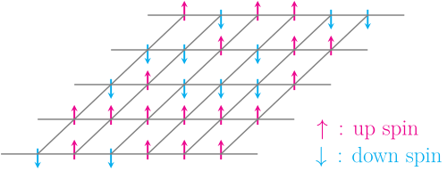
  

      格子状に並んだスピンと呼ばれる要素から構成される。 
      各スピンは、上向き (+1) または下向き (-1) のどちらか2つの状態しか取らない
    

---
transition: slide-up
level: 2
---

# 多数派モデル(Majority model)

概要

<v-clicks depth="2">

- 個人（エージェント）の意見が、局所的なグループにおける多数派の意見に従って更新される
    - 各エージェント $i$ は二値意見（例：$+1$ or $-1$）を持つ
    - 毎ステップ、ネットワーク上隣接するノードの意見を確認
    - 多数派意見（$+1$ または $-1$）を採用する
       - 同数の場合は、ランダムでどちらの意見を採用する
</v-clicks>

  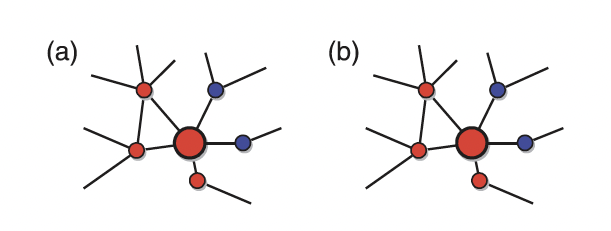
  

      大きなノード（更新対象）は、現在「意見1（赤）」を持っている。 
      このノードの5つの隣接ノードにおける、3つのノードは「意見1（赤）」、つのノードは「意見0（青）」であるため、 
      意見を変更せずにそのまま 「意見1（赤）」を保持する
    

---
transition: slide-up
level: 2
---

# 多数派モデル(Majority model)

意見ダイナミクスの考察

<v-clicks depth="2">

- 格子構造では合意に達しやすい
    - エージェントは局所的（近傍）にしか相互作用しないため、同じ意見が拡大しやすい
- 多くのネットワーク構造において、多数派ルールに基づく意見ダイナミクスは、単一の意見への合意に至るのではなく、異なる意見が長期的に共存する定常状態に収束する
    - 非局所的リンクの存在 
        - スケールフリーや小世界ネットワークでは、遠く離れたノード間にもリンクがあるため、局所的な意見が一貫して拡張できなくなる 
        - 意見の「境界」が簡単に乱され、一方向的に収束する過程が阻害される
    - ノード次数の非均質性
        - 極端に多くのリンクを持つハブノードが存在し、意見拡散に大きな影響力を持つ
        - 複数のハブが異なる意見を持っているとき、それぞれの周辺で安定した意見ドメインが形成され、意見の統一が阻害される
</v-clicks>

---
transition: slide-up
level: 2
---

# Voter Model

概要

- 個人（エージェント）はランダムに選ばれた隣接ノードの意見を採用する
    - 各エージェント $i$ は二値意見（例：$+1$ or $-1$）を持つ
    - 毎ステップ、エージェントが、ランダムに選択された隣接エージェントの意見を採用する

  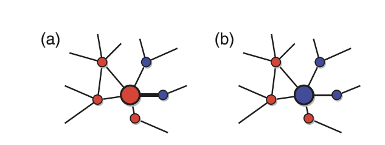

---
transition: slide-up
level: 2
---

# Voter Model

意見ダイナミクスの考察

- ネットワークにおける、Voterモデルの唯一の定常状態は合意である
    - 十分に長い時間が経過すると、すべてのエージェントが同じ意見（すべて +1 あるいはすべて −1）を持つ状態に必ず到達する
    - 多数派の意見の拡大と少数派の消滅
        - ある意見が多数派である場合、その意見を持つエージェントが隣接するエージェントを模倣させる機会が多くになり、多数派の意見はさらに多くのエージェントに伝播し、拡大していく
        - 少数派の意見を持つエージェントは、周囲に多数派の意見を持つエージェントが多い状況に置かれやすく、自身の意見を変える可能性が高い
- Demo

---
transition: slide-up
level: 2
---

# Voter Model

Voter Modelの拡張: q-Voterモデル

  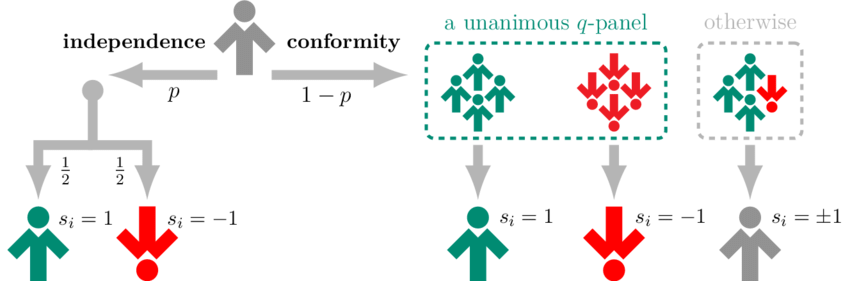

- 各ステップで、ランダムに選ばれた1人のエージェントが$q$人の近隣ノードを参照し、その意見に応じて自身の意見を変える
    - エージェント$i$の隣接ノードから$q$人を無作為に選出
    - $q$人が全員同じ意見なら、$i$はその意見に従う
    - $q$人の意見が一致していない場合は、エージェントは確率的に意見を変化させるか、あるいは自身の意見を維持する 

<!--
エージェントと意見: システム内の各エージェントは、通常、バイナリな意見（例: +1 または -1）を持っています。
影響グループ (q-panel): ランダムに選ばれたエージェント（ターゲット）は、その隣接するエージェントの中からランダムにq人の「影響グループ（q-panel）」を選びます。
意見の変化ルール:
同調 (Conformity): もし影響グループ内のq人全員が同じ意見を持っていた場合、ターゲットエージェントはその意見に同調し、自身の意見を変化させます。
不一致: もし影響グループ内に異なる意見を持つエージェントが一人でもいた場合、ターゲットエージェントは自身の意見をある確率で変更するか、あるいは変更しないまま維持します。この「不一致」の場合のルールは、モデルのバリエーションによって異なります。例えば、一定の確率で意見を反転させる「ノイズ」の導入や、意見を変えない「独立性」の要素などが考えられます。
-->

---
transition: slide-up
level: 2
---

# Voter Model

Voter Modelの拡張: バイアスや柔軟性の導入

<v-clicks depth="2">

- $q$人の意見が一致していない場合は、エージェントが特定の意見にバイアス偏りを持つような設定
    - 現実社会におけるメディアの偏向、社会的規範や選好バイアスなどをモデル化す
        - $q$人の意見が一致しなかった場合に、確率$\epsilon$で$+1$の意見が選ばれやすくなるようにする
        - 意見を変える確率が、$+1$→$-1$ と $-1$→$+1$ で異なる
- [柔軟性](https://www.mdpi.com/1099-4300/22/1/120):エージェントの独立行動における多様性を記述する
    - 確率$p$で独立した行動を取る際には、意見を変える確率$f$(柔軟性)により、エージェントの「自己への態度」や「内的ノイズ」がモデリングされる　

| $f$   | 意味          | 行動の特徴     |
| --------- | --------------- | -------------- |
| $f = 0$   | 純粋な独立性（自己同調）    | 自分の意見を変えない |
| $f = 0.5$ | 純粋な変動性（ノイズ）     | 意見をランダムに変更 |
| $f = 1$   | 純粋な自己反同調（逆張り行動） | 意見を必ず反転    |

</v-clicks>

---
transition: slide-up
level: 2
---

# Voter Model

Voter Modelの拡張: 記憶の導入

意見変化の確率は、（内部の記憶による）意見変化の意欲と、（隣人からの）外部の圧力/影響を掛け合わせたもの

<v-clicks depth="2">

- エージェント $i$ が自身の意見 $\theta_i$ を変えることへの抵抗(reluctance)がその意見を保持している時間（persistence time） $\tau_i$ とともに変化
- $$\nu_i = \frac{1}{1 + e^{-\mu \tau_i}}$$
- 意思決定のダイナミクス
- $$w(\theta'_i | \theta_i) = [1 - \nu_i(\tau_i)] f_{\theta'_i}$$
    - $[1 - \nu_i(\tau_i)]$: 意見変化の意欲を表す
        - $\nu_i$ が高い（抵抗が高い）場合、$1 - \nu_i$ は低くなり、意見を変える確率は低くなる
    - $f_{\theta'_i}$: $q$人の隣人のグループからの影響
</v-clicks>

<!--

## 記憶効果：意見を変えることへの抵抗 $\nu_i(\tau_i)$

この重要な要素は、エージェント $i$ が自身の意見 $\theta_i$ を変えることへの**抵抗（reluctance）**という概念を導入しています。この抵抗は静的なものではなく、エージェントがその意見を**保持している時間（persistence time）** $\tau_i$ とともに変化します。

* **意見保持時間 ($\tau_i$)**: これは、エージェント $i$ が意見を**変えずに**保持している時間の長さを表します。エージェントの「履歴」や、現在の意見がどれだけ根付いているかの尺度です。意見を変えずに長く保持するほど、$\tau_i$ は長くなります。
* **抵抗関数 ($\nu_i(\tau_i)$)**: 提供された式 $\nu_i = \frac{1}{1 + e^{-\mu \tau_i}}$ は**ロジスティック関数**です。この関数は、最初はゆっくりと始まり、加速し、最終的に頭打ちになる現象をモデル化する際によく使われます。
    * **$\nu_i(\tau_i)$ の挙動**:
        * $\tau_i$ が小さい場合（エージェントが最近意見を変えた、またはまだ長く意見を持っていない場合）、$\nu_i$ は0に近くなります。これは、意見を変えることへの**抵抗が低い**ことを意味し、エージェントは新しい影響を受け入れやすくなります。
        * $\tau_i$ が増加するにつれて（エージェントが意見を長く保持するにつれて）、$\nu_i$ は1に近づきます。これは**抵抗が高い**ことを示し、エージェントが意見を変える可能性が低くなります。
    * **$\mu > 0$**: このパラメータはロジスティック曲線の傾きを制御します。$\mu$ が大きいほど、$\tau_i$ の増加に伴う意見変化への抵抗の増加が急になります。これは、エージェントが自分の意見をすぐに確固たるものにするため、**意見ダイナミクスが減速する**ことを意味します。
* **「履歴」が近隣のエージェントとの局所的な経験を反映する**: この記憶効果は、エージェントの個人的な経験が、その局所的な近隣との相互作用の中で、意見変化に対する感受性をどのように形成するかを反映しています。もし現在の意見がエージェントにとってうまく機能している（変更する必要性を感じていない）場合、その信念は強まります。

## 意思決定のダイナミクス：意見変化の確率

意思決定のダイナミクスには、この抵抗がエージェントの意見変化の確率に組み込まれます。

* **$w(\theta'_i | \theta_i) = [1 - \nu_i(\tau_i)] f_{\theta'_i}$**: この式は、エージェント $i$ が意見を $\theta_i$ から $\theta'_i$ へと**変化させる遷移確率** $w$ を記述しています。
    * **$[1 - \nu_i(\tau_i)]$**: この項は**意見変化の意欲**を表します。
        * $\nu_i$ が高い（抵抗が高い）場合、$1 - \nu_i$ は低くなり、意見を変える確率は低くなります。
        * $\nu_i$ が低い（抵抗が低い）場合、$1 - \nu_i$ は高くなり、意見を変える確率は高くなります。
    * **$f_{\theta'_i}$**: この項は、Q-パネル（$q$人の隣人のグループ）からの影響を示唆していると考えられます。これは、局所的な環境から意見 $\theta'_i$ へと「引っ張る力」です。標準的なQ-voterモデルでは、Q-パネルの $q$人全員が $\theta'_i$ に同意していれば $f_{\theta'_i}$ は1となり、そうでなければ0またはランダムな成分となるのが一般的です。
        * したがって、全体的な解釈は次のようになります：意見変化の確率は、**（内部の記憶による）意見変化の意欲**と、**（隣人からの）外部の圧力/影響**を掛け合わせたものです。

## 意見の共存に対する影響

これらの記憶効果の導入は、意見がどのように進化し、共存が起こるかに大きな影響を与えます。

1.  **意見の持続性の強化**: 長い間意見を保持しているエージェントは、変化に対してより抵抗力を持つようになります。これは自然に**意見の持続性**を高め、急速な合意形成を防ぎ、共存を促進する可能性があります。
2.  **ダイナミクスの減速**: $\mu > 0$ の場合、全体的な意見ダイナミクスは減速します。これは、意見が広まったり、合意に達するのに時間がかかることを意味し、異なる意見が長期間共存することを可能にします。
3.  **感受性の不均一性**: このモデルは、$\tau_i$ に基づいてエージェント間に不均一性を導入します。一部のエージェントは変化に非常に抵抗し、「頑固な」個人として振る舞う一方で、最近意見を変えたエージェントはより柔軟になります。この感受性の本質的な多様性が、システム内の意見の多様性を維持することができます。
4.  **非平衡共存**: これまでの議論と同様に、このモデルは**非平衡共存**につながる可能性が高いです。エージェントは常に意見を評価し、潜在的に変更していますが、記憶効果はシステムが単純な吸収状態（合意）に落ち着くのを防ぎます。代わりに、外部の影響と内部の履歴の相互作用によって、複数の意見が存在する状態の周りを変動する可能性があります。

この記憶効果が強化されたQ-voterモデルは、個人の経験や過去の行動が社会システムにおける意見形成の集合的なダイナミクスにどのように貢献するかを理解するための、より豊かな枠組みを提供します。
-->

---
transition: slide-up
level: 2
---

# Voter Model

Voter Modelの拡張: 記憶の導入

- $\mu$ が大きいほど、$\tau_i$ の増加に伴う意見変化への抵抗の増加が急になる
    - 記憶効果は、エージェント間に「頑固さ」の不均一性をもたらす
- 特定の条件下（$\mu$ の最適な値）では、過度に変動するエージェントが減り、合意の達成に促進する可能性がある
    - 社会における意見リーダーや頑固な信者が、特定の考え方を広める上で果たす役割を示唆している

  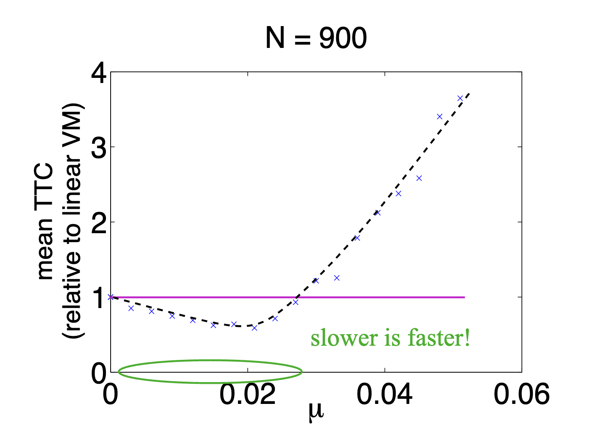

<!--

**グラフの解釈**:

1.  **$\mu \approx 0$ の場合**: mean TTC は線形VMと同程度（相対値が1）です。これは、$\mu$ が非常に小さい、つまり記憶効果がほとんどないか、あっても抵抗がほとんど形成されない場合、システムは線形Voter Modelと同様の振る舞いを示すことを意味します。
2.  **$\mu$ の増加に伴うTTCの減少**: $\mu$ が約0から0.02付近まで増加するにつれて、mean TTC は急激に減少します。つまり、線形VMよりも速く（相対値が1未満）なります。
    * **"slower is faster!" (遅い方が速い！)** という緑色のテキストが示唆するように、この区間では、意見変化への抵抗（$\mu$ によって制御される）が導入されることで、**システム全体の意見の収束が加速される**という逆説的な現象が起こっています。
    * これは、記憶効果が適度なレベルで導入されることで、過度に変動するエージェントが減り、特定の意見がより効率的に「定着」しやすくなる、あるいは意見のクラスタリングが促進されるといったメカニズムが働いている可能性があります。例えば、少し抵抗を持つことで、軽々しく意見を変えなくなり、結果的に意見が固まりやすくなる、というような解釈ができます。
3.  **$\mu > 0.02$ でのTTCの増加**: $\mu$ が約0.02を超えると、mean TTC は再び増加し始め、線形VMよりも遅くなります。
    * これは、記憶効果が**強すぎる**場合、つまり抵抗が非常に高くなり、エージェントがほとんど意見を変えなくなる場合、意見の伝播自体が非常に遅くなるため、システム全体として合意に達するのに時間がかかるようになることを示しています。極端な場合、誰も意見を変えなくなり、初期の意見分布がそのまま固定されてしまう（合意に至らない）可能性もあります。
    * 曲線がV字型またはU字型になっているのは、最適化問題を示唆しています。**「最適な」$\mu$ の値（約0.02）が存在し、そのときに最も速く意見が収束する**ことを示しています。

* **エージェントの不均一性**: 記憶効果 ($\nu_i(\tau_i)$ と $\tau_i$) が導入されると、エージェントは一様ではなくなります。一部のエージェントは長く意見を変えていないため抵抗が高く（「自信がある」エージェント）、他のエージェントは最近意見を変えたか、まだ意見を持って間もないため抵抗が低い（「無関心な」エージェント）状態になります。
* **「自信のある」エージェントの局所グループ**: 意見保持時間 $\tau_i$ が長く、したがって意見を変えることへの抵抗 $\nu_i(\tau_i)$ が高いエージェントは、自分の意見に「自信がある」と見なすことができます。このようなエージェントが局所的に集まってグループを形成すると、そのグループは非常に安定した意見を持ちます。
* **「無関心な」近隣を説得する**:
    * Q-voterモデルでは、意見変化の確率 $w(\theta'_i | \theta_i) = [1 - \nu_i(\tau_i)] f_{\theta'_i}$ で示されるように、意見変化への「意欲」は $1 - \nu_i(\tau_i)$ に比例します。
    * 「自信のある」エージェントは $1 - \nu_i(\tau_i)$ が小さいため、自分自身はほとんど意見を変えません。しかし、彼らが多数を占めるQ-パネルに入ると、他のエージェントに強い影響を与えます（$f_{\theta'_i}$ が強くなる）。
    * 一方で、「無関心な」近隣のエージェントは $\nu_j(\tau_j)$ が小さく、$1 - \nu_j(\tau_j)$ が大きいため、意見変化への「意欲」が高いです。
    * この組み合わせにより、**「自信のある」エージェントの安定したグループが、比較的柔軟な「無関心な」エージェントからなる周囲の近隣を効率的に説得し、自分たちの意見に引き込む**というメカニズムが働くことになります。

**結論として**:

記憶効果の導入は、エージェント間に「頑固さ」の不均一性をもたらします。これにより、Q-voterモデルの動態は大きく変化し、特定の条件下（$\mu$ の最適な値）では、**「自信のある」少数派（または安定したグループ）が「無関心な」多数派を巻き込むことで、全体としての意見の収束が加速される**という、興味深い集団現象を引き起こす可能性があります。これは、社会における意見リーダーや頑固な信者が、特定の考え方を広める上で果たす役割を示唆しているとも言えるでしょう。
-->