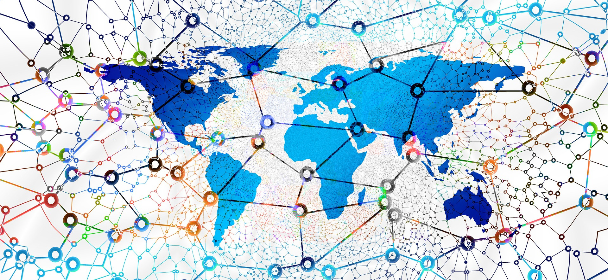
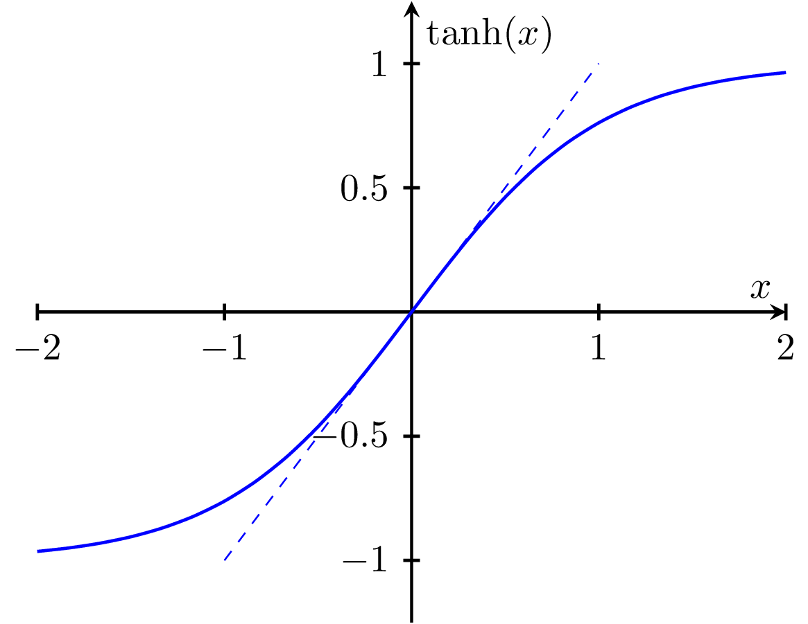
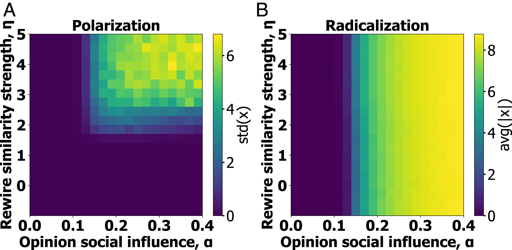
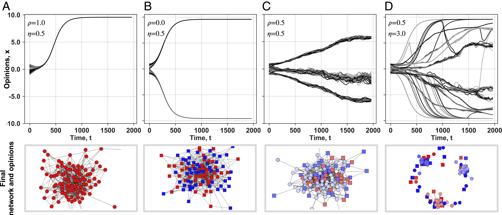

---
# You can also start simply with 'default'
theme: seriph
# random image from a curated Unsplash collection by Anthony
# like them? see https://unsplash.com/collections/94734566/slidev
background: https://cover.sli.dev
# some information about your slides (markdown enabled)
title: Welcome to Slidev
info: |
  ## Slidev Starter Template
  Presentation slides for developers.

  Learn more at [Sli.dev](https://sli.dev)
# apply unocss classes to the current slide
class: text-center
# https://sli.dev/features/drawing
drawings:
  persist: false
# slide transition: https://sli.dev/guide/animations.html#slide-transitions
transition: slide-left
# enable MDC Syntax: https://sli.dev/features/mdc
mdc: true

---

## 行動科学概論
 
# 社会科学におけるモデル入門

意見ダイナミクス 

### 呂沢宇

  Press Space for next page <carbon:arrow-right />

  <a href="https://github.com/lvzeyu/social_modeling_lecture" target="_blank" class="slidev-icon-btn">
    <carbon:logo-github />
  </a>

<!--
The last comment block of each slide will be treated as slide notes. It will be visible and editable in Presenter Mode along with the slide. [Read more in the docs](https://sli.dev/guide/syntax.html#notes)
-->

---
transition: slide-up
level: 2
---
# 振り返りとこれからの内容

<v-clicks depth="2">

- ABMとネットワークを組み合わせることによる意見ダイナミクスのシミュレーション
    - Majority Model
    - Voter Model
    - →　離散的意見を想定する意見ダイナミクスモデル　
- 連続的意見を想定する意見ダイナミクスモデル
    - 個人の意見は、さまざまな選択肢の中から極端なものからそうでないものまでなめらかに変化する状態がある。
       - 政治的立場を、非常に革新的($-1$)から非常に保守的($+1$)までの範囲でモデル化する
</v-clicks>

---
transition: slide-up
level: 2
---
# 連続的意見に関する意見ダイナミクスモデル

意見ダイナミクスシミュレーションの流れ

<v-clicks depth="2">

- 初期状態においてはネットワークの各ノードに無作為に意見が割り当てられる
- 意見の値は、特定なルールに従って更新されるにつれて変化する
- ある時点で、どの意見の最大変動も事前に規定された閾値より小さくなれば、システムは最終的に定常状態に到達し、シミュレーションを停止することができる
    - 典型的な定常状態が二極化か断片化である
</v-clicks>

---
transition: slide-up
level: 2
---
# 限定信頼モデル(Bounded-confidence model)

概要

<v-clicks depth="2">

- **基本設定**: あるトピックについての議論を行い、特にお互いの立場が近い場合には、相手の意見に影響を与える可能性がある
    - もし相手が正反対反対の意見を持っている場合、その相手を説得することは難しい

- **限定信頼の原理**：ある二つの意見は、その差が信頼限界または許容度と呼ばれる量より小さい場合にのみ。互い影響し合う。
    - あるノードとその隣接ノードを一つずつ選択する
    - もし両者の意見の差が信頼限界よりも小さければ、収束パラメータによって決定される相対量の分だけ、両者のお互いの方向に向かって「動く」
        - それ以外の場合には、意見は変化しない
</v-clicks>

---
transition: slide-up
level: 2
---
# 限定信頼モデル(Bounded-confidence model)

Deffuant-Weisbuch (DW) モデル

<v-clicks depth="2">

- ランダムに選ばれた2つのエージェント $i$ と $j$ の意見 $x_i(t)$ と $x_j(t)$ が、$t$ 時刻から $t+1$ 時刻へ更新される
  - もし $|x_i(t) - x_j(t)| < \epsilon$ であれば、意見は更新される
      - $$x_i(t+1) = x_i(t) + \mu (x_j(t) - x_i(t))$$
      - $$x_j(t+1) = x_j(t) + \mu (x_i(t) - x_j(t))$$
  - もし $|x_i(t) - x_j(t)| \ge \epsilon$ であれば、意見は変化しない
      - $$x_i(t+1) = x_i(t)$$
      - $$x_j(t+1) = x_j(t)$$
  - $\epsilon$ は信頼限界（許容度）
  - $\mu$ は収束パラメータ（妥協度）
</v-clicks>

---
transition: slide-up
level: 2
---
# 限定信頼モデル(Bounded-confidence model)

Deffuant-Weisbuch (DW) モデル

$$|x_i(t) - x_j(t)| < \epsilon$$

<v-clicks depth="2">

- $\epsilon$が、どの程度意見の異なる相手までなら、その意見を受け入れ、相互作用を通じて自分の意見を変化させるかを制御する
- $\epsilon$ が小さい場合: 自分とほとんど同じ意見を持つ相手としか相互作用し
    - 多数の非常に小さな意見のクラスターに分断する
- $\epsilon$ が大きい場合: 自分とかなり異なる意見を持つ相手でも、積極的に受け入れて相互作用する
    - 社会全体の意見は最終的に一つの意見に収束しやすい
    - (意見の範囲が$[0,1]である$)$\epsilon>0.5$の時、どのようなネットワークにおいても意見はならず$0.5$の周りに集中し、合意に達する
        - 最も離れた意見を持つエージェント同士ですら、最終的には相互作用の連鎖を通じてつながり、お互い影響を与え合うことができる

</v-clicks>

---
transition: slide-up
level: 2
---
# 限定信頼モデル(Bounded-confidence model)

Deffuant-Weisbuch (DW) モデル

$$x_i(t+1) = x_i(t) + \mu (x_j(t) - x_i(t))$$

<v-clicks depth="2">

- $\mu$ は意見変化の「速さ」と「度合い」を決定する
- $\mu=1$の時、相互作用した2つのエージェントの意見が完全に相手の意見に入れ替わる
    - モデルの挙動は非常に極端なものになる
- 通常、$\mu$ は $0 < \mu \le 0.5$ の範囲で設定される
    - $\mu$ が小さい場合 
        - 各エージェントは、相手の意見に対してわずかしか歩み寄りません
        - 意見の収束にはより多くの時間がかかる
    - $\mu$ が大きい場合
        - 各エージェントは、相手の意見に対して積極的に歩み寄り
        - $\mu = 0.5$ の場合は、相互作用した2つのエージェントの意見は完全に平均値に収束し、両者ともに中間的な立場を取る
</v-clicks>

---
transition: slide-up
level: 2
---
# 限定信頼モデル(Bounded-confidence model)

Hegselmann-Krause (HK) モデル

<v-clicks depth="2">

- 「自分と似た意見を持つグループの平均に合わせる」という行動をモデル化

- エージェント $i$ が相互作用の対象とするエージェントの集合 $N_i(t)$ を定義する
    - $$N_i(t) = \{ j \mid |x_i(t) - x_j(t)| < \epsilon \}$$
- エージェント $i$ の意見は、この集合内のエージェントの意見の平均に更新される
    - $$x_i(t+1) = \frac{1}{|N_i(t)|} \sum_{j \in N_i(t)} x_j(t)$$

- 各タイムステップで、全てのエージェントが同時に自分の意見を更新する
    - DWモデルはランダムにペアを選ぶ
</v-clicks>

---
transition: slide-up
level: 2
---
# 限定信頼モデル(Bounded-confidence model)

HKモデルとDWモデル

<v-clicks depth="2">

- 意見クラスターの形成
    - HKモデルには、より明確で、分離したクラスターに収束する
    - DWモデルでは、ランダムなペア選択と逐次的な更新のため、より小さな意見クラスターが形成される傾向がある
- 収束速度
    - HKモデルでは、全てのエージェントが同時に意見を更新するため、意見の収束は比較的速い
    - DWモデルでは、ンダムなペア選択と逐次的な更新のため、意見の収束はHKモデルよりも時間がかかる
</v-clicks>

---
transition: slide-up
level: 2
---
# 限定信頼モデル(Bounded-confidence model)

モデルの拡張

<v-clicks depth="2">

- 信頼限界の動的変化
    - エージェントの経験や状況に応じて、信頼区間の幅が変化する
       - $\epsilon$ が個人ごとに異なる
       - 意見が収束するにつれて信頼区間が狭くなったり、意見の多様性が高い場合は広がったりする
- 外部要因の導入
    - バイアス/感情: エージェントが持つ認知バイアス（確証バイアスなど）や感情（怒り、不安など）が、意見の受容や更新にどう影響するかをモデルに組み込む
        - 更新にランダム項（外部情報の影響、観測誤差）を加える: $x_i(t+1) = x_i(t)+\mu(x_j-x_i)+\sigma$
        - 影響力のあるエージェント/リーダー: 特定のエージェントが他よりも強い影響力を持つことを設定する
</v-clicks>

---
transition: slide-up
level: 2
---
# 意見ダイナミクスの応用

実世界における意見ダイナミクスメカニズムの解明

  

<v-clicks depth="2">

- 実際の意見ダイナミクスには複数の要素やメカニズムが相互に作用することで形成・変化している
    - 基本的な意見ダイナミクスモデルを拡張することで、実世界におけるより複雑なメカニズムを説明することが可能である
    - 基本的な意見ダイナミクスモデルを拡張することで、実世界における特定な要因や特性に焦点を当てて説明することが可能である

 </v-clicks>

---
transition: slide-up
level: 2
---
# 意見ダイナミクスの応用

意見ダイナミクスシミュレーションの流れ

<v-clicks depth="2">

- **基本設定**：エージェントは環境と他のエージェントと相互作用しながら自分の意見を更新する
- ネットワークと意見ダイナミクスのシミュレーションの流れ
    - ネットワークモデルの選択: ネットワーク構造による相互作用の対象と範囲を制御する
    - **意見ダイナミクスモデルの構築:基本の意見ダイナミクスモデルを踏まえて、目的と対象に合わせて適切な拡張を行う**
    - 初期条件の設定:ノードの意見の初期化やネットワークの生成
    - シミュレーションの実行と解析
        - モデルのパラメータ（信頼限界、影響の重み、ネットワークの構造など）が結果にどのように影響するかを検討
        - 実世界の現象との比較を行い、シミュレーションがどの程度現実を再現できているかを評価

 </v-clicks>

---
transition: slide-up
level: 2
---
# 意見ダイナミクスの応用

Link recommendation algorithms and dynamics of polarization in online social networks

<v-clicks depth="2">

- 推薦アルゴリズム：ユーザーの過去の行動（クリック、閲覧記録、いいねなど）や属性情報に基づき、興味・関心に合ったコンテンツを推薦する仕組み
- 推薦アルゴリズムが分極化に与える影響
    - エコーチェンバー: 同じような意見を持つ人たちとの交流が強化され、異なる意見に触れる機会が減少することにより、意見の分極化が形成する
</v-clicks>

  シミュレーションによる推薦アルゴリズムの影響過程を解明する　

  
  

      ソーシャルメディアでは、ユーザーのプロファイル・関心に基づいて新たな接続先（友達、フォロー先、グループなど）を推薦すること機能が実装されている
    

---
transition: slide-up
level: 2
---
# 意見ダイナミクスの応用

Link recommendation algorithms影響のモデル化

$$x_i(t+1) = \gamma x_i(t) + K \sum_{j}^{N} A_{ij} \tanh(\alpha x_j(t)) / k_i$$

- 現在のタイムステップ ($t$) における個体 $i$ の意見
- $\gamma$:減衰因子$0 < \gamma < 1$ の範囲の値をとり、社会的強化がない場合、個人の意見が中立状態 ($x_i=0$) に向かって減衰することを表す
- $K$: 社会的相互作用の強さを制御するパラメータ
    - 隣人の意見が、中心となるエージェント（個体 $i$）の意見にどれだけ強く影響するかを制御する
- $A_{ij}$: (隣接行列で定義している)ネットワークによる相互作用のノード制御する
- $/ k_i$:**個体 $i$ の次数（接続している隣人の数）** $k_i = \sum_{j}^{N} A_{ij}$ で除算することで、隣人の平均的な影響に基づいて更新される

---
transition: slide-up
level: 2
---
# 意見ダイナミクスの応用

Link recommendation algorithms影響のモデル化

$$x_i(t+1) = \gamma x_i(t) + K \sum_{j}^{N} A_{ij} \tanh(\alpha x_j(t)) / k_i$$

- $\tanh(\cdot)$: 意見の社会的影響に非線形性を導入し、個人が互いに与える影響のレベルに境界を設定する ($-1 < \tanh(x) < 1$)
- $\alpha$: 個人の意見が社会的影響にどのように変換されるかを制御する
    - $\alpha$ が低い場合、極端な意見のみが影響をもつ
    - $\alpha$ が高い場合、穏健な意見でさえ強い社会的影響を持つ
        - 高い $\alpha$ は、より論争的な話題で、社会的影響を受けやすくなる文脈を想定する

  

---
transition: slide-up
level: 2
---
# 意見ダイナミクスの応用

意見ダイナミクスとネットワークの共進化

- ネットワークは時間とともに動的に変化し、個人は新しいつながりを形成したり、既存のつながりを解消することができる
- 構造的類似性に基づくリンク形成　→　アルゴリズムで一般的に使用される
- $$S_{i,j} = \frac{|N_i \cap N_j|^\eta}{\sum_{k}^{N} |N_i \cap N_k|^\eta}$$
    - $S_{i,j}$: 個体 $i$ と個体 $j$ の間の構造的類似性を表す指標である
        - 類似性が高いほど、両者が新しいリンクを形成する確率が高くなる
    - $N_i$ : $i$ の隣人の集合
    - $|N_i \cap N_j|$ : $i$ と $j$ の共通の隣人の数
    - $\sum_{k}^{N} |N_i \cap N_k|$: 個体 $i$ と、ネットワーク内の他の**すべての**個体 $k$ との間の共通の隣人の数
        - 個体 $i$ が個体 $j$ とリンクを形成する確率を正規化する

---
transition: slide-up
level: 2
---
# 意見ダイナミクスの応用

意見ダイナミクスとネットワークの共進化

$$S_{i,j} = \frac{|N_i \cap N_j|^\eta}{\sum_{k}^{N} |N_i \cap N_k|^\eta}$$

- $\eta$: 構造的類似性が新しいリンクの形成にどの程度影響するかを制御する
    - $\eta = 0$ の場合: 共通の隣人の数に関わらず、新しいリンクはランダムに選択された個体と追加される
    - $\eta > 0$ の場合: 個体 $i$ と $j$ の構造的類似性が増加するにつれて、それらの間にリンクが形成される確率が増加する
- リンク推薦アルゴリズムの挙動と効果: $\eta$ は、リンク推薦アルゴリズムが共通の隣人という構造的類似性をどの程度重視するかをモデル化
    - アルゴリズムに設計が意見分極化に与える影響を解明
    - 政策介入の可能性

<!--
* [cite_start]**$\eta$ の値が小さい場合（例: $\eta = 0$）**[cite: 88]:
    * 式は $S_{i,j} = \frac{|N_i \cap N_j|^0}{\sum_{k}^{N} |N_i \cap N_k|^0}$ となります。
    * 任意の数（0を除く）の0乗は1であるため、これは $S_{i,j} = \frac{1}{\sum_{k}^{N} 1}$ と単純化されます。
    * 分母は基本的にネットワーク内のノードの総数に依存する定数となります。
    * [cite_start]この場合、個体 $i$ が新しいリンクを形成する確率は、共通の隣人の数に関わらず、**ほぼ均一**になります。これは、新しいリンクがランダムに選択された個体と追加されることを意味します [cite: 88]。

* [cite_start]**$\eta$ の値が大きい場合（例: $\eta > 0$）**[cite: 89]:
    * 共通の隣人の数 $|N_i \cap N_j|$ が大きいほど、その $\eta$ 乗 $|N_i \cap N_j|^\eta$ は**劇的に大きく**なります。
    * 例えば、$\eta=1$ であれば線形に、$\eta=2$ であれば二乗で影響します。$\eta$ が大きくなると、この差はさらに顕著になります。
    * これにより、共通の隣人の数がわずかに多いペアは、他のペアと比較して、はるかに高い類似性スコアを持つことになります。
    * [cite_start]結果として、個体 $i$ と $j$ の構造的類似性（共通の隣人の数）が増加するにつれて、それらの間にリンクが形成される確率が**飛躍的に増加します** [cite: 89][cite_start]。これは、「非常に高い $\eta$ の値は、各タイムステップで最も類似したノード $j$ のみが $i$ に接続する可能性が高いことを意味する」と述べられていることからもわかります [cite: 89]。

-->

---
transition: slide-up
level: 2
---
# 意見ダイナミクスの応用

シミュレーションの実行と解析

- 一部のパラメータだけを変化させることで、特定のパラメータがシステムにどのような独立した影響を与えるのか

  

<!--
**A. [cite_start]中立的コンセンサス (Neutral consensus)** [cite: 136]
* [cite_start]**パラメータ設定**: $\alpha=0.1$, $\eta=1.0$ [cite: 136]。ここでは、意見が社会に与える影響が低く ($\alpha=0.1$)、構造的類似性に基づく再接続の強さが中程度 ($\eta=1.0$) です。
* [cite_start]**上段 (時間経過に伴う意見の変化)**: 全ての個体の意見が時間とともに $x=0$（中立意見）に収束しています [cite: 137, 138]。
* [cite_start]**下段 (最終的なネットワークと意見)**: 初期ネットワークは多様な意見（赤と青のノード）を持っていますが、最終的には全てのノードが中立意見（白色）に収束し、ネットワーク全体が一つの均質なコミュニティを形成しています [cite: 142, 143, 144]。

**B. [cite_start]過激化 (Radicalization)** [cite: 136]
* [cite_start]**パラメータ設定**: $\alpha=0.2$, $\eta=1.0$ [cite: 136]。ここでは、意見が社会に与える影響が高く ($\alpha=0.2$)、構造的類似性に基づく再接続の強さは中程度 ($\eta=1.0$) です。
* [cite_start]**上段 (時間経過に伴う意見の変化)**: 全ての個体の意見が時間とともに極端な値（ここでは負の極端な意見）に収束し、意見が過激化していることを示しています [cite: 137, 139][cite_start]。この場合、$\eta$ が低いため、すべての個人が同じ意見に収束する傾向があります [cite: 140]。
* [cite_start]**下段 (最終的なネットワークと意見)**: ネットワーク全体が、ほぼ均一な極端な意見（青色）を持つノードで構成されています。ノードの色が濃いほど意見が極端であることを示しています [cite: 142, 143, 144]。

**C. [cite_start]二極化 (Polarization)** [cite: 136]
* [cite_start]**パラメータ設定**: $\alpha=0.2$, $\eta=4.0$ [cite: 136]。ここでは、意見が社会に与える影響が高く ($\alpha=0.2$)、構造的類似性に基づく再接続の強さも高い ($\eta=4.0$) です。
* [cite_start]**上段 (時間経過に伴う意見の変化)**: 意見は時間とともに二つの異なる極端な値（正と負の意見）に分かれており、二極化が生じていることを示しています [cite: 137, 141]。
* [cite_start]**下段 (最終的なネットワークと意見)**: ネットワークは、正の極端な意見（赤色）を持つノードと負の極端な意見（青色）を持つノードの二つの明確なクラスターに分かれています [cite: 142, 143][cite_start]。高い $\eta$ の値が、孤立したモジュールを生成し、それが異なる意見を維持することを可能にしていることを示唆しています [cite: 141]。

**総括**:
[cite_start]この図は、意見の社会的影響力 ($\alpha$) と構造的類似性に基づく再接続の強さ ($\eta$) の組み合わせが、集団の意見ダイナミクスに劇的な影響を与えることを示しています [cite: 136]。
* [cite_start]$\alpha$ が低い場合、中立的なコンセンサスに達します [cite: 138]。
* [cite_start]$\alpha$ が高く、$\eta$ が低い場合、集団全体が過激化します [cite: 139, 140]。
* [cite_start]$\alpha$ が高く、$\eta$ も高い場合、集団内で意見が二極化します [cite: 141]。

[cite_start]特に、リンク推薦アルゴリズムの作用を捉える意図のある構造的類似性に基づく再接続（高い $\eta$）が、意見の二極化を助長する孤立したコミュニティを生成することを示しています [cite: 97]。

-->

---
transition: slide-up
level: 2
---
# 意見ダイナミクスの応用

シミュレーションの実行と解析

- 異なるシナリオにおける分極化と過激化の帰結を比較することで、分極化と過激化の条件を特定する
    - 色が明るいほど、過激化か二極化が進んでいることを意味している

  

<!--
**A. [cite_start]中立的コンセンサス (Neutral consensus)** [cite: 136]
* [cite_start]**パラメータ設定**: $\alpha=0.1$, $\eta=1.0$ [cite: 136]。ここでは、意見が社会に与える影響が低く ($\alpha=0.1$)、構造的類似性に基づく再接続の強さが中程度 ($\eta=1.0$) です。
* [cite_start]**上段 (時間経過に伴う意見の変化)**: 全ての個体の意見が時間とともに $x=0$（中立意見）に収束しています [cite: 137, 138]。
* [cite_start]**下段 (最終的なネットワークと意見)**: 初期ネットワークは多様な意見（赤と青のノード）を持っていますが、最終的には全てのノードが中立意見（白色）に収束し、ネットワーク全体が一つの均質なコミュニティを形成しています [cite: 142, 143, 144]。

**B. [cite_start]過激化 (Radicalization)** [cite: 136]
* [cite_start]**パラメータ設定**: $\alpha=0.2$, $\eta=1.0$ [cite: 136]。ここでは、意見が社会に与える影響が高く ($\alpha=0.2$)、構造的類似性に基づく再接続の強さは中程度 ($\eta=1.0$) です。
* [cite_start]**上段 (時間経過に伴う意見の変化)**: 全ての個体の意見が時間とともに極端な値（ここでは負の極端な意見）に収束し、意見が過激化していることを示しています [cite: 137, 139][cite_start]。この場合、$\eta$ が低いため、すべての個人が同じ意見に収束する傾向があります [cite: 140]。
* [cite_start]**下段 (最終的なネットワークと意見)**: ネットワーク全体が、ほぼ均一な極端な意見（青色）を持つノードで構成されています。ノードの色が濃いほど意見が極端であることを示しています [cite: 142, 143, 144]。

**C. [cite_start]二極化 (Polarization)** [cite: 136]
* [cite_start]**パラメータ設定**: $\alpha=0.2$, $\eta=4.0$ [cite: 136]。ここでは、意見が社会に与える影響が高く ($\alpha=0.2$)、構造的類似性に基づく再接続の強さも高い ($\eta=4.0$) です。
* [cite_start]**上段 (時間経過に伴う意見の変化)**: 意見は時間とともに二つの異なる極端な値（正と負の意見）に分かれており、二極化が生じていることを示しています [cite: 137, 141]。
* [cite_start]**下段 (最終的なネットワークと意見)**: ネットワークは、正の極端な意見（赤色）を持つノードと負の極端な意見（青色）を持つノードの二つの明確なクラスターに分かれています [cite: 142, 143][cite_start]。高い $\eta$ の値が、孤立したモジュールを生成し、それが異なる意見を維持することを可能にしていることを示唆しています [cite: 141]。

**総括**:
[cite_start]この図は、意見の社会的影響力 ($\alpha$) と構造的類似性に基づく再接続の強さ ($\eta$) の組み合わせが、集団の意見ダイナミクスに劇的な影響を与えることを示しています [cite: 136]。
* [cite_start]$\alpha$ が低い場合、中立的なコンセンサスに達します [cite: 138]。
* [cite_start]$\alpha$ が高く、$\eta$ が低い場合、集団全体が過激化します [cite: 139, 140]。
* [cite_start]$\alpha$ が高く、$\eta$ も高い場合、集団内で意見が二極化します [cite: 141]。

[cite_start]特に、リンク推薦アルゴリズムの作用を捉える意図のある構造的類似性に基づく再接続（高い $\eta$）が、意見の二極化を助長する孤立したコミュニティを生成することを示しています [cite: 97]。

-->

---
transition: slide-up
level: 2
---
# 意見ダイナミクスの応用

モデルの更なるの拡張

- 異なる立場の意見との接触による意見変化をモデル化
    - 収束型:異なる意見を持つ個人と接触することで、自身の意見が相手の意見に引き寄せられ、最終的に意見が近づく(=集団間接触理論)
    - **分極型:異なる意見を持つ個人に対する不寛容や嫌悪感が増加するため意見をさらに乖離させる**

- $$x_i(t+1) = \gamma x_i(t) + K \sum_{j}^{N} A_{ij} \tanh(\alpha (\sigma_i(t) \sigma_j(t)) x_j(t)) / k_i$$
    - $x_i(t)$ と $x_j(t)$ が**同じ符号**を持つ場合（$\sigma_i(t) \sigma_j(t) = +1$）、$\tanh(\alpha x_j(t))$ の項はそのまま機能し、意見は強化されます。
    - $x_i(t)$ と $x_j(t)$ が**異なる符号**を持つ場合（$\sigma_i(t) \sigma_j(t) = -1$）、$\tanh(\alpha (-x_j(t)))$ となり、、 $j$ の意見が $i$ の意見を**さらに反対方向へ押しやる**ように作用し、結果として意見の分極を促進する　→　**分極型**

---
transition: slide-up
level: 2
---
# 意見ダイナミクスの応用

モデルの更なるの拡張

  

- 各ノードは、確率 $\rho$ で「収束型」ノードとして、確率 $1-\rho$ で「分極型」ノードとして割り当てられる
    - **$\rho=1.0$**: 全てのノードが収束型である集団
    - **$\rho=0.0$**: 全てのノードが分極型である集団

  異なる意見への反応の多様性が、リンク推薦アルゴリズムやネットワーク構造の変化とどのように相互作用し、最終的な意見の二極化や過激化にどのような影響を与えるかを詳細に調べる　

<!--

**A. [cite_start]全てのノードが収束型 ($\rho=1.0$) かつ $\eta=0.5$ の場合** [cite: 193]
* [cite_start]**上段（時間経過に伴う意見の変化）**: 全ての個体の意見が時間と共に急激に過激化し、最終的に単一の極端な意見（正または負のいずれか）に収束しています [cite: 193][cite_start]。これは、意見が強い社会的影響力を持つ場合に典型的であり、全てのノードが異なる意見に触れると収束する性質を持つため、単一の極端な意見に全体が引き寄せられることを示唆しています [cite: 193]。
* [cite_start]**下段（最終的なネットワークと意見）**: ネットワーク全体が、ほぼ均一な極端な意見（図では赤色）を持つノードで構成されています [cite: 192, 193][cite_start]。全てのノードが収束型（円形で表現）であり、全体として一つの大きなコミュニティが形成されています [cite: 192]。

**B. [cite_start]全てのノードが分極型 ($\rho=0.0$) かつ $\eta=0.5$ の場合** [cite: 193]
* [cite_start]**上段（時間経過に伴う意見の変化）**: 意見は時間と共に二つの極端な値に分かれ、それぞれ正と負の極に収束しています [cite: 193][cite_start]。これは典型的な二極化のダイナミクスを示しています [cite: 193]。
* [cite_start]**下段（最終的なネットワークと意見）**: ネットワークは、正の極端な意見（赤色）を持つノードと負の極端な意見（青色）を持つノードの二つの明確なクラスターに分かれています [cite: 192][cite_start]。全てのノードが分極型（正方形で表現）であり、互いに異なる意見を持つグループが形成されていることがわかります [cite: 192]。

**C. [cite_start]収束型と分極型が半々 ($\rho=0.5$) かつ $\eta=0.5$ の場合** [cite: 194]
* [cite_start]**上段（時間経過に伴う意見の変化）**: 意見は二つの極端なグループに分かれる傾向を示しつつも、中間的な意見に留まるノードも存在しています [cite: 194]。
* [cite_start]**下段（最終的なネットワークと意見）**: ネットワークは、分極型ノード（正方形）が極端な意見（赤または青）を持つ傾向があるのに対し、収束型ノード（円形）はより穏健な（白色に近い）意見を持つノードと混在しています [cite: 192, 194][cite_start]。ここでは、単一の大きな連結成分内で、分極型ノードがより過激な意見へと収束し、収束型ノードが穏健な意見を採用している様子が明確に識別できます [cite: 194]。

**D. [cite_start]収束型と分極型が半々 ($\rho=0.5$) かつ $\eta=3.0$ の場合** [cite: 195]
* [cite_start]**上段（時間経過に伴う意見の変化）**: 意見のダイナミクスは非常に異質であり、個々の意見が大きく変動し、予測不能なパターンを示しています [cite: 195][cite_start]。これは、ネットワーク内に孤立したコミュニティが存在するためです [cite: 195]。
* [cite_start]**下段（最終的なネットワークと意見）**: ネットワークは多数の**孤立したモジュール**に断片化しており、それぞれのモジュール内で異なる意見ダイナミクスが展開されています [cite: 195][cite_start]。これらのモジュールは、収束型ノード（円形）と分極型ノード（正方形）の混合から構成されており、特定のコミュニティでは収束型ノードでさえ多様な意見に触れる機会がなくなり、より極端な意見を持つようになることが観察されます [cite: 196][cite_start]。結果として、高い $\eta$ は、分極型ノードと収束型ノードが混在する場合に、平均してより過激な意見につながります [cite: 197]。

**総括**:
[cite_start]この図は、リンク推薦アルゴリズムが共通の隣人（構造的類似性）をどの程度重視するかを示すパラメータ $\eta$ が、集団における意見の二極化と過激化に大きく影響することを明確に示しています。特に、$\eta$ が高いと、ネットワーク内に孤立したコミュニティが形成され、それが個々人の意見形成に大きな影響を与え、場合によっては収束型ノードでさえ極端な意見へと向かわせることで、全体的な二極化を助長する可能性を明らかにしています [cite: 195, 196, 197]。
-->

---
transition: slide-up
level: 2
---
# 意見ダイナミクスの応用

シミュレーションのプロセス

- 理論または実世界への観察に基づいてシミュレーションの設定を設計する
   - Agent属性と行動
   - 環境の設定
- 目的に応じて初期条件を設定する
   - 特定なパラメータの影響を解析する
   - 実世界の状況を再現する
- 結果の評価と解釈
   - 仮説の検証
   - 感度分析
- モデルの改善
   - 解析と検証の結果、または新たな知見に基づいて、モデルの構造、エージェントの行動ルール、環境設定などを修正・追加する

