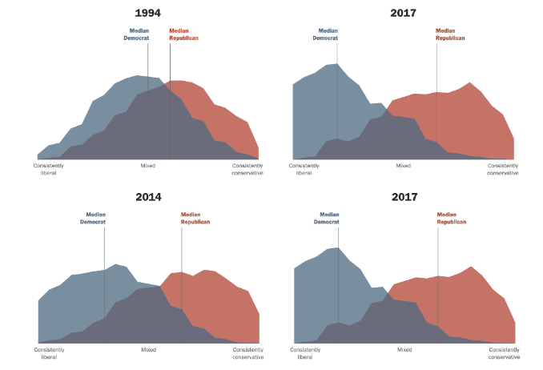
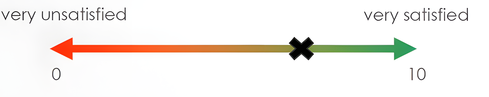
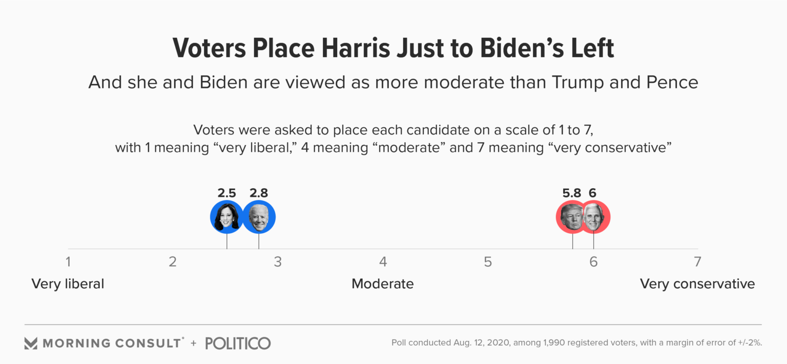
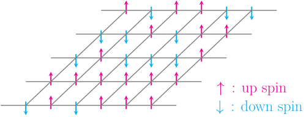
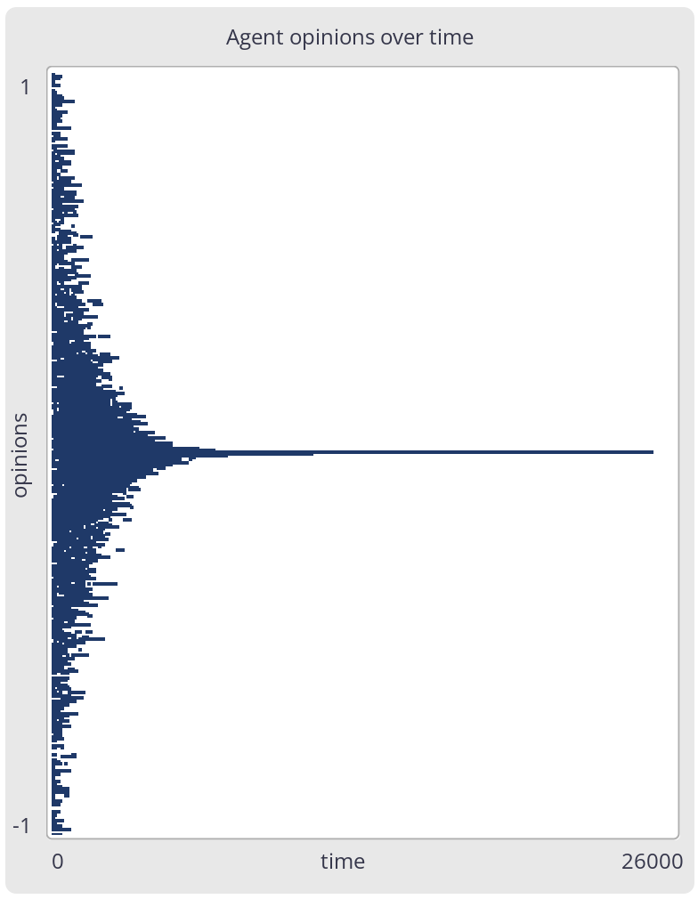
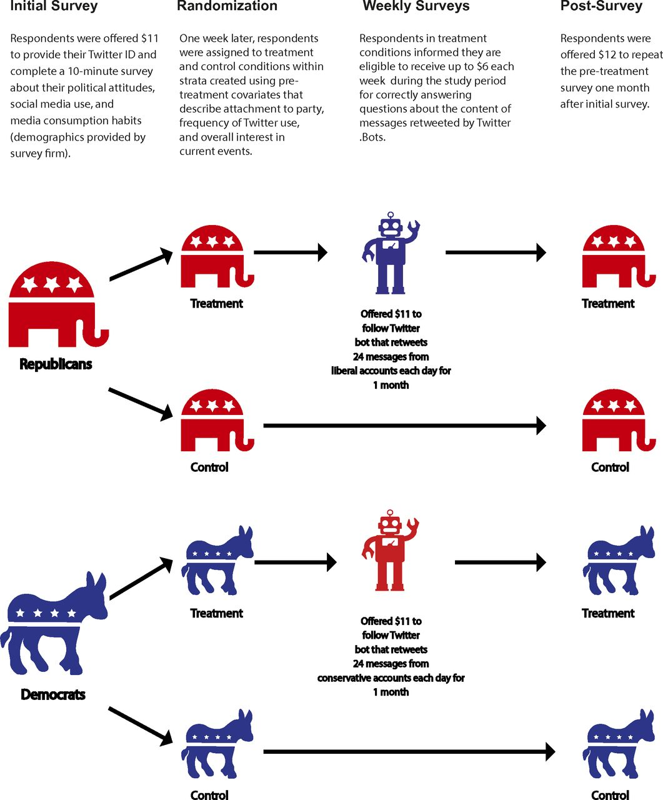
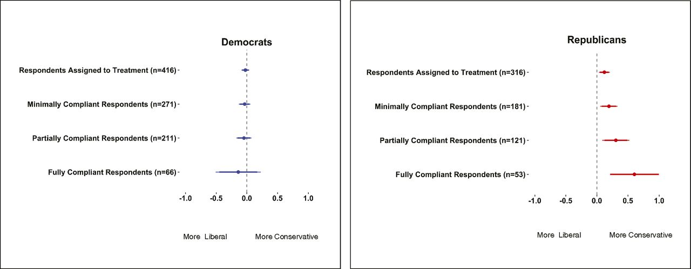

---
# You can also start simply with 'default'
theme: seriph
# random image from a curated Unsplash collection by Anthony
# like them? see https://unsplash.com/collections/94734566/slidev
background: https://cover.sli.dev
# some information about your slides (markdown enabled)
title: Welcome to Slidev
info: |
  ## Slidev Starter Template
  Presentation slides for developers.

  Learn more at [Sli.dev](https://sli.dev)
# apply unocss classes to the current slide
class: text-center
# https://sli.dev/features/drawing
drawings:
  persist: false
# slide transition: https://sli.dev/guide/animations.html#slide-transitions
transition: slide-left
# enable MDC Syntax: https://sli.dev/features/mdc
mdc: true

---

## 行動科学概論
 
# 社会科学におけるモデル入門

意見ダイナミクス

### 呂沢宇

  Press Space for next page <carbon:arrow-right />

  <a href="https://github.com/lvzeyu/social_modeling_lecture" target="_blank" class="slidev-icon-btn">
    <carbon:logo-github />
  </a>

<!--
The last comment block of each slide will be treated as slide notes. It will be visible and editable in Presenter Mode along with the slide. [Read more in the docs](https://sli.dev/guide/syntax.html#notes)
-->

---
transition: slide-up
level: 2
---

# 意見ダイナミクス

背景

<v-clicks depth="2">

- 意見の分極化とは、社会における人々の意見がより極端な方向に分かれていき、穏健な意見や中間的立場が少なくなる現象
    - 異なる立場の人々の間で共通の理解や対話が難しくなり、集団間の対立が強くなる
    - 民主主義機能の阻害: 合意形成に必要な「相互理解」や「妥協」が成り立たなくなる
    - フェイクニュース・陰謀論の拡散:分極化した社会では、事実ではなく感情や立場によって情報の信頼性が判断されやすくなる

</v-clicks>

  
  

      アメリカにおける世論調査では、近年意見分極化の拡大傾向が一貫して確認されている 
    

---
transition: slide-up
level: 2
---

# 意見ダイナミクス

背景

<v-clicks depth="2">

- **意見ダイナミクス**に関するシミュレーション：社会における意見の形成と拡散を決定するプロセス
    - 意見形成メカニズムの解明
        - どのような要因（個人の信念、他者の影響、情報の質、ネットワーク構造など）が人々の意見形成に影響を与えるのか
    - 分極化・合意の条件の検証
        - 異なる意見を持つ人々がどのようにして対立を深めるのか、またその対立を緩和するためにはどのような介入が有効なのか
    - 政策介入の評価
        - 特定の情報が社会全体にどのような影響を与えるかを事前に評価する「What-if」シナリオ分析 

</v-clicks>

---
transition: slide-up
level: 2
---

# 意見ダイナミクスのシミュレーション

意見ダイナミクスのシミュレーションの概要

<v-clicks depth="2">

- 初期状態として、エージェントに意見をランダムに割り当てる。
    - 基本的には、初期状態ではどちらの意見を持つ人もそれぞれ存在している（非合意の状態）

- 意見の更新ルールは、すべてのエージェントに対して繰り返し適用される。
    - 一回の反復で、すべてのエージェントに対してループを実行する
    - 通常、収束しやすいように、エージェントはランダムな順序で非同期更新される
- 考えられる結果は2種類と考える
    - システムは定常状態に達し、どのエージェントもそれ以上意見を変更しなくなる。
        - すべてのエージェントが同じ意見を持つ合意
        - 一部のエージェントが一方の意見をもち、残りのエージェントがもう一方の意見を持つ分極化
    - システムは定常状態に至らず、一部のエージェントは意見を変え続ける
</v-clicks>

---
transition: slide-up
level: 2
---

# 意見ダイナミクス

モデルの種類

- 連続的な意見

  

- 離散的な意見　
    - 二値選択
        - 例：賛成／反対、はい／いいえ
    - 複数段階のリッカート尺度
        - 例：「まったくそう思わない」〜「非常にそう思う」までの5段階や7段階

  

---
transition: slide-up
level: 2
---

# 意見ダイナミクスのシミュレーション

意見ダイナミクスのシミュレーションの指標

<v-clicks depth="2">

- 平均的意見：エージェント全体の意見の平均
    - 平均的意見はダイナミクスを通じて変化していく。各反復の後にその値を確認する
    - システムが定常状態に達した場合、平均値はある値に収束する
- 離脱確率:意見$1$で合意に達する頻度を、初期設定における意見$1$を持つエージェントの割合の関数として推定する
    - シミュレーションを複数回実行し、各実行の終わりに、システムが「意見1での合意状態」に達したかどうかを判定する
    - 各初期意見1比率において、意見1で合意に達したシミュレーション実行の回数を、その初期意見1比率での総実行回数で割ることで、離脱確率を算出する
</v-clicks>

---
transition: slide-up
level: 2
---

# 意見ダイナミクスの発想

Ising model

<v-clicks depth="2">

- イジングモデル (Ising model) は、統計力学において、特に磁性体の性質を記述するモデル
    - 隣接スピン間の相互作用: 隣り合ったスピンは、同じ向きを向こうとするとエネルギー的に安定し、異なる向きを向くとエネルギー的に不安定になるという相互作用を持つ

- スピンを個々の人や集団、その相互作用が社会全体の振る舞いを決定するという発想で意見ダイナミクスをモデル化
    - 各個人は、自身の周囲の意見や外部からの情報（=外部磁場）を考慮し、自身の意見を修正する
</v-clicks>

  
  

      格子状に並んだスピンと呼ばれる要素から構成される。 
      各スピンは、上向き (+1) または下向き (-1) のどちらか2つの状態しか取らない
    

---
transition: slide-up
level: 2
---

# 意見ダイナミクスの発想

意見形成における影響のタイプ

<v-clicks depth="2">

- 多くの意見ダイナミクスモデルは、他者との意見差に応じて自分の意見をどう調整するかという「影響のルール」として定式化できる
    - **Positive influence**：相手の意見に自分の意見を近づける方向に働く影響
    - **Bounded confidence**：意見差がある閾値（信頼限界）を超える相手からは、影響を一切受けない
    - **Negative influence**：意見差が大きい相手に対しては、逆に自分の意見をより遠ざける方向（反発）に調整する

- ここで挙げた影響メカニズムは、あくまで単純化された操作的定義にすぎない
    - 目的はこれらのメカニズムそのものの妥当性を検証することではなく、その存在を仮定した場合にどのような帰結が生じるかを検討することにある
    - ただし、その仮定から導かれる帰結が非現実的なものであれば、その結果は仮定自体の妥当性について何らかの示唆を与えている可能性がある

</v-clicks>

---
transition: slide-up
level: 2
---

# Positive Influenceモデル

影響ルールの定式化

$$
\begin{aligned}
x_1 &\leftarrow x_1 + \gamma (x_2 - x_1) \\
x_2 &\leftarrow x_2 + \gamma (x_1 - x_2)
\end{aligned}
$$

<v-clicks depth="2">

- 学習率$\gamma$: 社会的影響の大きさを表す
    - 各エージェントは、自分の意見と相手の意見との差の$\gamma$倍だけ、自分の意見を相手の意見に近づける
- モデルのダイナミクスは、エージェントたちが十分に均衡状態に近づくまで継続する
- **NetLogoによる実装**
</v-clicks>

<v-click>

$x_1=-0.6,\ x_2=0.4,\ \gamma=0.1$

$$
\begin{aligned}
x_1^{new} &= -0.6 + 0.1 \times (0.4-(-0.6)) = -0.5 \\
x_2^{new} &= 0.4 + 0.1 \times (-0.6-0.4) = 0.3
\end{aligned}
$$

相互作用前： $-0.6$ と $0.4$ 　→　相互作用後： $-0.5$ と $0.3$

  

</v-click>

---
transition: slide-up
level: 2
---

# Positive Influenceモデル

なぜ合意に収束するのか

<v-clicks depth="2">

- ランダムに選ばれたエージェントの意見の期待値は集団平均に等しく、初期状態ではゼロである
    - 各エージェントは、自分の意見と学習率$\gamma$に応じて、この平均に向かって移動していく
- 平均から遠ざかるエージェントも存在するが、平均に向かって移動するエージェントの方が多い
    - 平均から離れているエージェントほど、平均方向の意見を持つ相手と出会いやすい
    - 意見の差に比例して更新するため、平均から離れているエージェントほど一回の更新で大きく移動する
- 相互作用が繰り返されるにつれ、集団は合意（consensus）に達する

</v-clicks>

  

---
transition: slide-up
level: 2
---
# 限定信頼モデル(Bounded-confidence model)

概要

<v-clicks depth="2">

- **限定信頼の原理**：ある二つの意見は、その差が信頼限界または許容度と呼ばれる量より小さい場合にのみ、互いに影響し合う。
  - もし $|x_i(t) - x_j(t)| < \epsilon$ であれば、意見は更新される
      - $$x_i(t+1) = x_i(t) + \mu (x_j(t) - x_i(t))$$
      - $$x_j(t+1) = x_j(t) + \mu (x_i(t) - x_j(t))$$
  - もし $|x_i(t) - x_j(t)| \ge \epsilon$ であれば、意見は変化しない
      - $$x_i(t+1) = x_i(t)$$
      - $$x_j(t+1) = x_j(t)$$
  - $\epsilon$ は信頼限界（許容度）
  - $\mu$ は収束パラメータ（妥協度）
</v-clicks>

---
transition: slide-up
level: 2
---
# 限定信頼モデル(Bounded-confidence model)

Deffuant-Weisbuch (DW) モデル

$$x_i(t+1) = x_i(t) + \mu (x_j(t) - x_i(t))$$

<v-clicks depth="2">

- $\mu$ は意見変化の「速さ」と「度合い」を決定する
- $\mu=1$の時、相互作用した2つのエージェントの意見が完全に相手の意見に入れ替わる
    - モデルの挙動は非常に極端なものになる
- 通常、$\mu$ は $0 < \mu \le 0.5$ の範囲で設定される
    - $\mu$ が小さい場合 
        - 各エージェントは、相手の意見に対してわずかしか歩み寄らない
        - 意見の収束にはより多くの時間がかかる
    - $\mu$ が大きい場合
        - 各エージェントは、相手の意見に対して積極的に歩み寄る
        - $\mu = 0.5$ の場合は、相互作用した2つのエージェントの意見は完全に平均値に収束し、両者ともに中間的な立場を取る
</v-clicks>

 
---
transition: slide-up
level: 2
---
# 限定信頼モデル(Bounded-confidence model)

Deffuant-Weisbuch (DW) モデル

$$|x_i(t) - x_j(t)| < \epsilon$$

<v-clicks depth="2">

- $\epsilon$が、どの程度意見の異なる相手までなら、その意見を受け入れ、相互作用を通じて自分の意見を変化させるかを制御する
- $\epsilon$ が小さい場合: 自分とほとんど同じ意見を持つ相手としか相互作用しない
    - 多数の非常に小さな意見のクラスターに分断する
- $\epsilon$ が大きい場合: 自分とかなり異なる意見を持つ相手でも、積極的に受け入れて相互作用する
    - 社会全体の意見は最終的に一つの意見に収束しやすい
        - 最も離れた意見を持つエージェント同士ですら、最終的には相互作用の連鎖を通じてつながり、お互い影響を与え合うことができる

</v-clicks>

---
transition: slide-up
level: 2
---

# 限定信頼モデル(Bounded-confidence model)

Deffuant-Weisbuch (DW) モデル

<v-clicks depth="2">

- $\epsilon$が、どの程度意見の異なる相手までなら、その意見を受け入れ、相互作用を通じて自分の意見を変化させるかを制御する
- $\epsilon$ が小さい場合: 自分とほとんど同じ意見を持つ相手としか相互作用しない
    - 多数の非常に小さな意見のクラスターに分断する
- $\epsilon$ が大きい場合: 自分とかなり異なる意見を持つ相手でも、積極的に受け入れて相互作用する
    - 社会全体の意見は最終的に一つの意見に収束する傾向になる

</v-clicks>

  
  

      学習率0.3 
      許容度が大きい場合（例:0.8）、他の誰からも影響を受けず「過激派」が残るが、全体的に一つの意見に収束する人が多い 
      許容度が小さくなると、エージェントは自分と似た意見の相手としか関わらなくなり、集団全体の平均とは必ずしも一致しない意見を持つ複数の集団に分けられる
    

---
transition: slide-up
level: 2
---

# 限定信頼モデル(Bounded-confidence model)

シミュレーション結果への考察

  
  

(A) 信頼限界$d$を横軸に、収束後に形成される意見クラスタ（クリーク）の数を縦軸にとったもの 
(B) $d=0.2$とした1回の実行における、各エージェントの初期意見（横軸）と最終意見（縦軸）の関係 
いずれも $N=441,\ \gamma=0.5$

  

---
transition: slide-up
level: 2
---
# 限定信頼モデル(Bounded-confidence model)

Hegselmann-Krause (HK) モデル

<v-clicks depth="2">

- 「自分と似た意見を持つグループの平均に合わせる」という行動をモデル化

- エージェント $i$ が相互作用の対象とするエージェントの集合 $N_i(t)$ を定義する
    - $$N_i(t) = \{ j \mid |x_i(t) - x_j(t)| < \epsilon \}$$
- エージェント $i$ の意見は、この集合内のエージェントの意見の平均に更新される
    - $$x_i(t+1) = \frac{1}{|N_i(t)|} \sum_{j \in N_i(t)} x_j(t)$$

- 各タイムステップで、全てのエージェントが同時に自分の意見を更新する
    - DWモデルはランダムにペアを選ぶ
</v-clicks>

---
transition: slide-up
level: 2
---
# 限定信頼モデル(Bounded-confidence model)

HKモデルとDWモデル

<v-clicks depth="2">

- 意見クラスターの形成
    - HKモデルには、より明確で、分離したクラスターに収束する
    - DWモデルでは、ランダムなペア選択と逐次的な更新のため、より小さな意見クラスターが形成される傾向がある
- 収束速度
    - HKモデルでは、全てのエージェントが同時に意見を更新するため、意見の収束は比較的速い
    - DWモデルでは、ランダムなペア選択と逐次的な更新のため、意見の収束はHKモデルよりも時間がかかる
- [Demo](https://colab.research.google.com/github/lvzeyu/social_modeling_lecture/blob/main/lecture11/bd_model.ipynb)
</v-clicks>

---
transition: slide-up
level: 2
---
# 限定信頼モデル(Bounded-confidence model)

モデルの拡張

<v-clicks depth="2">

- 信頼限界の動的変化
    - エージェントの経験や状況に応じて、信頼区間の幅が変化する
       - $\epsilon$ が個人ごとに異なる
       - 意見が収束するにつれて信頼区間が狭くなったり、意見の多様性が高い場合は広がったりする
- 外部要因の導入
    - バイアス/感情: エージェントが持つ認知バイアス（確証バイアスなど）や感情（怒り、不安など）が、意見の受容や更新にどう影響するかをモデルに組み込む
        - 更新にランダム項（外部情報の影響、観測誤差）を加える: $x_i(t+1) = x_i(t)+\mu(x_j-x_i)+\sigma$
        - 影響力のあるエージェント/リーダー: 特定のエージェントが他よりも強い影響力を持つことを設定する
</v-clicks>

---
transition: slide-up
level: 2
---

# Negative Influenceモデル

Negative Influenceの発想

- 人々は、自分と異なる意見に接すると、むしろその意見を遠ざける傾向がある
（＝負の影響）
    - Backfire Effect[(Bail et al., 2018)](https://www.pnas.org/doi/10.1073/pnas.1804840115)

  
  

---
transition: slide-up
level: 2
---

# Negative Influenceモデル

影響ルールの定式化

$$
\begin{aligned}
x_1 &\leftarrow x_1 + \frac{\gamma}{2}(x_1-x_2)(1-x_1), && \text{if } x_1>x_2 \\
x_1 &\leftarrow x_1 + \frac{\gamma}{2}(x_1-x_2)(1+x_1), && \text{otherwise} \\
x_2 &\leftarrow x_2 + \frac{\gamma}{2}(x_2-x_1)(1+x_2), && \text{if } x_1>x_2 \\
x_2 &\leftarrow x_2 + \frac{\gamma}{2}(x_2-x_1)(1-x_2), && \text{otherwise}
\end{aligned}
$$

<v-clicks depth="2">

- 意見差 $|x_2-x_1|$ が閾値$d$未満の場合：Positive influenceに従う
- 意見差が閾値$d$以上の場合：負の影響が働き、互いの意見はより離れていく
    - 括弧内の項（$1-x_1$など）は、相手と反対方向にある極値（$\pm1$）までの距離を表す
    - エージェントは、学習率$\gamma$と現在の意見差に比例して、この距離の一部だけ移動する
    - 意見差の最大値は$2$であるため、$2$で割ることで移動量を$[0,1]$の範囲に収める
    - この設計により、意見が範囲$[-1,1]$を超えることはない

</v-clicks>

---
transition: slide-up
level: 2
---

# Negative Influenceモデル

結果への考察

<v-clicks depth="2">

- $d$が大きい(例:$d=0.9$)場合
    - 過激派との相互作用が繰り返されるうちに、残りの集団はゆっくりと反対側の極端な意見へと押しやられる
- $d$が小さくなる(例:$d=0.8$)場合
    - 各エージェントが他の半数以上から反発を受け、分極化に至る
- $d$が小さい(例:$d=0.2$)場合
    - 中間的な意見を持つエージェントが両方向から絶えず押され、分極化に至る
- NetLogoの実装

</v-clicks>

  

---
transition: slide-up
level: 2
---

# まとめ

<v-clicks depth="2">

- 意見ダイナミクスの多くのモデルは、他者との意見差に応じて自分の意見をどのように調整するかという「影響のルール」として定式化できる
- **Positive influence**：常に相手の意見に近づく
    - 集団の平均意見は変化せず、意見の分散のみが縮小し続けるため、最終的には合意に達する
- **Bounded confidence**：意見差が信頼限界$\epsilon$を超える相手からは影響を受けない
    - $\epsilon$が大きい場合は合意に達する。一方、$\epsilon$ を小さくしていくと、少数の極端な意見を持つエージェントが孤立して残る。さらに小さくすると、集団は複数の意見集団、すなわち「クリーク」に分断する。
- **Negative influence**：意見差が閾値$d$を超える相手に対しては、逆に意見を遠ざける
    - $d$ が大きい場合は合意に達するが、少数の過激派が長期的に集団全体を極端な意見へ導くこともある
    - $d$ が小さくなるにつれて、集団は両極へと分かれ、分極化に至る
- 意見ダイナミクスモデルは、影響ルールにおけるわずかな仮定の違いが、合意・過激化・分極化・分断といった質的に異なる集団的帰結を生み出しうることを示している

</v-clicks>

