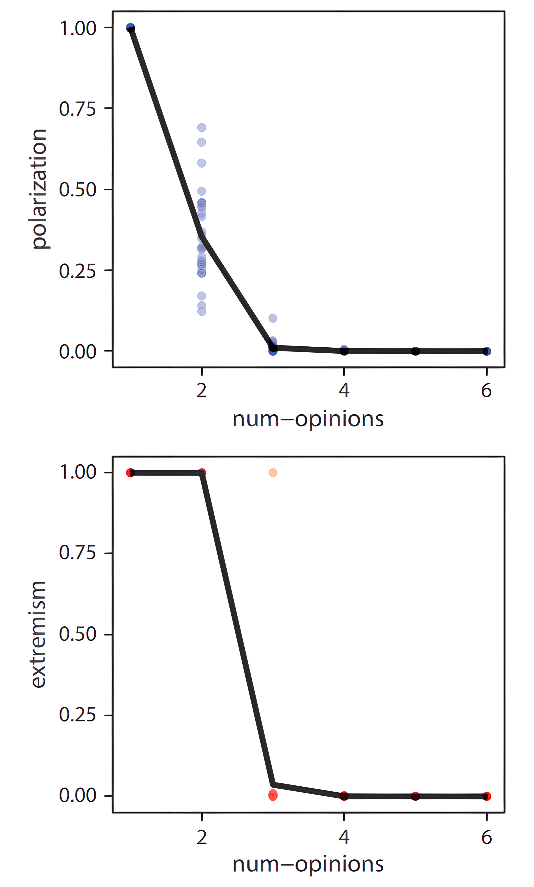
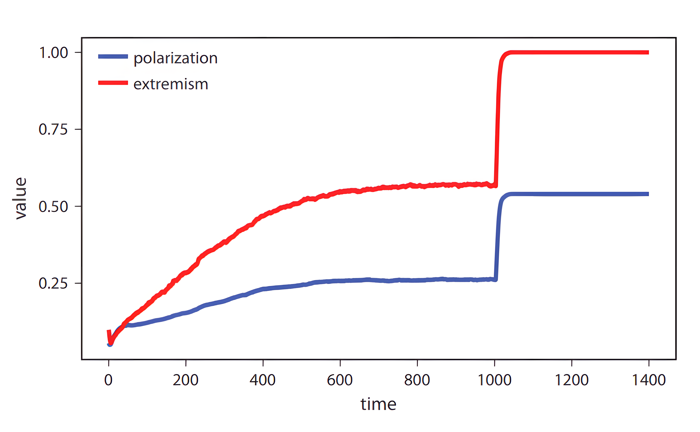
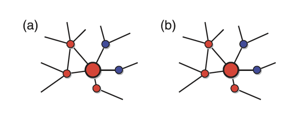
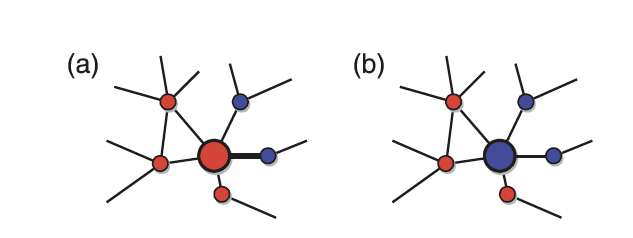
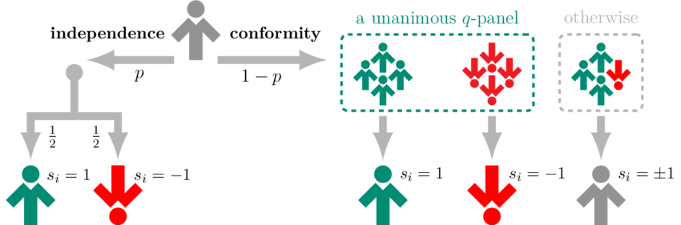
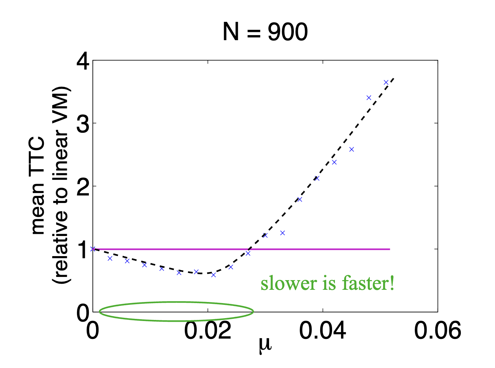
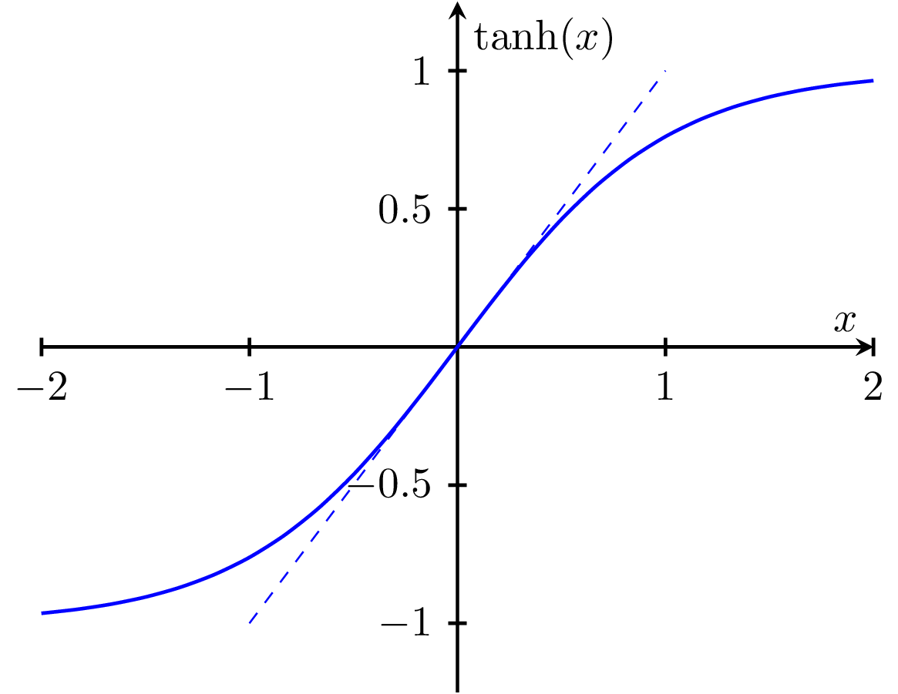
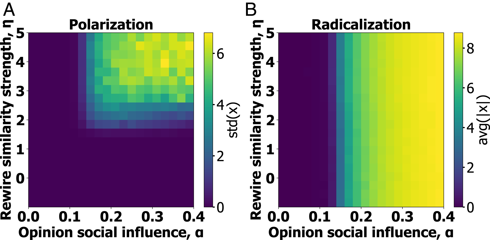
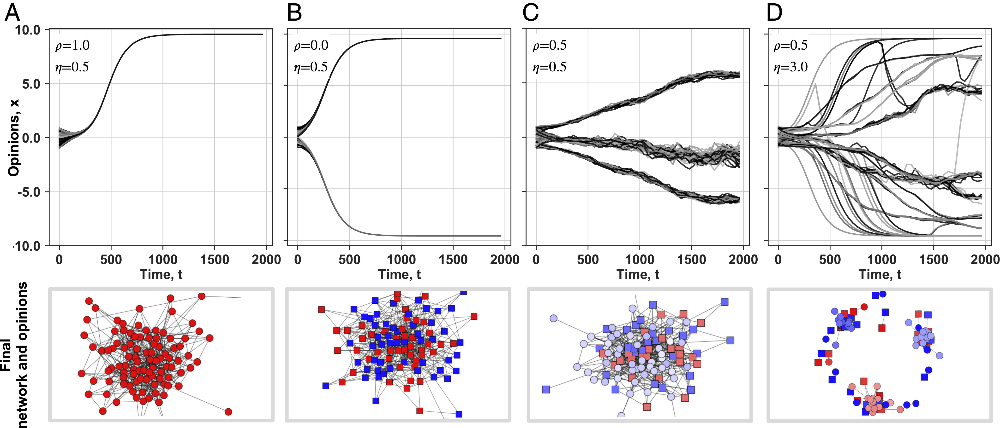

---
# You can also start simply with 'default'
theme: seriph
# random image from a curated Unsplash collection by Anthony
# like them? see https://unsplash.com/collections/94734566/slidev
background: https://cover.sli.dev
# some information about your slides (markdown enabled)
title: Welcome to Slidev
info: |
  ## Slidev Starter Template
  Presentation slides for developers.

  Learn more at [Sli.dev](https://sli.dev)
# apply unocss classes to the current slide
class: text-center
# https://sli.dev/features/drawing
drawings:
  persist: false
# slide transition: https://sli.dev/guide/animations.html#slide-transitions
transition: slide-left
# enable MDC Syntax: https://sli.dev/features/mdc
mdc: true
contextMenu: false
---

## 行動科学概論
 
# 社会科学におけるモデル入門

意見ダイナミクス 

### 呂沢宇

  Press Space for next page <carbon:arrow-right />

  <a href="https://github.com/lvzeyu/social_modeling_lecture" target="_blank" class="slidev-icon-btn">
    <carbon:logo-github />
  </a>

<!--
The last comment block of each slide will be treated as slide notes. It will be visible and editable in Presenter Mode along with the slide. [Read more in the docs](https://sli.dev/guide/syntax.html#notes)
-->

---
transition: slide-up
level: 2
---

# 先週の振り返りと今週の授業内容

<v-clicks depth="2">

- 意見を連続値として扱う意見ダイナミックモデル
   - Positive Influence
   - Bounded Confidence
   - Negative Influence
- 意見ダイナミックモデルの拡張：複数の意見に関する意見ダイナミックモデル
- 意見をカテゴリ値として扱う意見ダイナミックモデル
    - Majority model
    - Voter Model
- 意見ダイナミクスの応用

</v-clicks>

---
transition: slide-up
level: 2
---

# 複数意見のモデリング

<v-clicks depth="2">

- 意見ダイナミクスモデルは、単純な相互作用ルールから合意・分極化・分断が生じることを示してきた
   - これまでのモデルでは、個人が「1つの争点上の位置」だけで定義されている。
- 人々は複数の争点について意見を持っており、他者との類似性も複数の意見を総合して判断される場合が多い

- エージェント$i$は、長さ$K$の意見ベクトルによって表される
$$
\vec{x_i} = (x_{i1}, x_{i2}, \ldots, x_{iK})
$$

- ここで、$x_{ik}$はエージェント$i$の第$k$番目の意見を表す。
    - 各意見は、$-1$から$1$の連続値として表される。
    - すべての意見は互いに独立し、同じ程度に影響を受けやすいと仮定されている
</v-clicks>

---
transition: slide-up
level: 2
---

# 複数意見のモデリング

<v-clicks depth="2">

- エージェント間の意見の隔たりを、複数の意見差の平均として計算する
    - 値が小さいほど、二つのエージェントの意見は全体として似ている
$$
D_{ij} = \frac{1}{K} \sum_{k=1}^{K} |x_{ik} - x_{jk}|
$$

- エージェント間の影響の重み $w_{ij}$

$$
w_{ij} = 1 - D_{ij}, \quad w_{ij} \in [-1, 1]
$$

- $w_{ij} > 0$ の場合、positive influence で意見をアップデートする
- $w_{ij} < 0$ の場合、negative influence で意見をアップデートする

$$
x_{ik} \leftarrow x_{ik}
+ \frac{1}{2} w_{ij}(x_{jk} - x_{ik})(1 - |x_{ik}|)
$$
$$
x_{jk} \leftarrow x_{jk}
+ \frac{1}{2} w_{ij}(x_{ik} - x_{jk})(1 - |x_{jk}|)
$$

</v-clicks>

---
transition: slide-up
level: 2
---

# 複数意見のモデリング

意見分布を説明する指標

<v-clicks depth="2">

- **分極化指標**：すべてのエージェントペアについて意見空間上の距離$D_{ij}$を計算し、その分散を求める
    - エージェントの意見が複数の極端な立場に分かれている場合、エージェント間距離のばらつきが大きくなる
    - ただし、全員が同じ方向に極端な意見を持つ場合も、エージェント間の距離は小さいため、値は低くなる

- **極端化指標**：集団内のすべての意見のうち、極端な値をとる意見の割合で極端主義の度合いを測る
    - 意見の絶対値が$0.9$を超える場合、その意見を「極端」とみなす
$$
E =
\frac{
\# \{ |x_{ik}| > 0.9 \}
}{
NK
}
$$

</v-clicks>

---
transition: slide-up
level: 2
---

# 複数意見のモデリングに基づくシミュレーション
意見数による意見ダイナミクスの帰結の差異

<v-clicks depth="2">

- $K$が少ない場合、エージェント間の類似性は少数の争点だけで決まる
    - 少しの違いが相互作用全体を大きく左右する
    - 異なる相手との相互作用では negative influence が働きやすくなり、意見が極端化・分極化しやすい
- $K$が大きくなると、合意に向かいやすくなる
    - 意見数が多いほど、(中心極限定理により)2人のエージェントの意見差の分散は小さくなり、安定して1未満に収まりやすくなる。
    - positive influence が働きやすくなり、集団全体が中心へ収束しやすくなる

</v-clicks>

  

---
transition: slide-up
level: 2
---

# 複数意見のモデリングに基づくシミュレーション
意見数による意見ダイナミクスの帰結の差異

- 2人の意見が $[-1,1]$ の一様分布からランダムに選ばれるとき、2人の意見差の期待値は
$$
E[|X-Y|]=\frac{2}{3}
$$

- $K$が小さいと、意見差の分布は広く、1を超えるペアも比較的多い。
- しかし、$K$ が大きくなると、距離の分布は$\frac{2}{3}$付近に集中する。そのため、1を超える距離を持つペアが少なくなる
- 初期状態では、ランダムに選ばれた多くのペアで positive influence が生じやすい

  

---
transition: slide-up
level: 2
---

# 複数意見のモデリングに基づくシミュレーション

空間構造による意見ダイナミクスの帰結の差異

<v-clicks depth="2">

- エージェントが上下左右の4近傍とだけ相互作用する空間モデルを考える
- 空間モデルでは、非空間モデルよりも収束に時間がかかる
    - 情報や影響は集団全体に一気に広がるのではなく、局所的な相互作用を通じて少しずつ広がる
- 空間構造がある場合、より多様な意見が長く維持される
- 空間モデルでも、意見数$K$が増えるにつれて、分極化と極端化の度合いは低下する
    - ただし、空間構造がある場合、意見数が増えても、多様な意見や一定程度の極端性が残りやすい
</v-clicks>

  

---
transition: slide-up
level: 2
---

# 複数意見のモデリングに基づくシミュレーション

空間構造による意見ダイナミクスの帰結の差異

<v-clicks depth="2">

- 最初の1000ステップの間、エージェントは近隣の4人とだけ相互作用があり、1000の時点で空間制約を取り除く
- 空間モデルでは、相互作用範囲が限定されているため、全体が一気に一方向へ収束したり、全体的に二極化したりしにくく、多様な意見が維持される。
- 空間制約が取り除かれると、集団は急速に再編成され、極端主義が最大に近づき、高い分極化状態へ転換する
- **社会的含意**：インターネットのように全体的なコミュニケーションを促進する環境では、分極化や極端化を促進する可能性がある
</v-clicks>

  

    
  

  

    
  

---
transition: slide-up
level: 2
---

# 多数派モデル(Majority model)

概要

<v-clicks depth="2">

- 個人（エージェント）の意見が、局所的なグループにおける多数派の意見に従って更新される
    - 各エージェント $i$ は二値意見（例：$+1$ or $-1$）を持つ
    - 毎ステップ、ネットワーク上隣接するノードの意見を確認
    - 多数派意見（$+1$ または $-1$）を採用する
       - 同数の場合は、ランダムにどちらかの意見を採用する
</v-clicks>

  
  

      大きなノード（更新対象）は、現在「意見1（赤）」を持っている。 
      このノードの5つの隣接ノードのうち、3つのノードは「意見1（赤）」、2つのノードは「意見0（青）」であるため、 
      意見を変更せずにそのまま 「意見1（赤）」を保持する
    

---
transition: slide-up
level: 2
---

# 多数派モデル(Majority model)

意見ダイナミクスの考察

<v-clicks depth="2">

- 格子構造では合意に達しやすい
    - エージェントは局所的（近傍）にしか相互作用しないため、同じ意見が拡大しやすい
- 多くのネットワーク構造において、多数派ルールに基づく意見ダイナミクスは、単一の意見への合意に至るのではなく、異なる意見が長期的に共存する定常状態に収束する
    - 非局所的リンクの存在 
        - スケールフリーや小世界ネットワークでは、遠く離れたノード間にもリンクがあるため、局所的な意見が一貫して拡散できなくなる
        - 意見の「境界」が簡単に乱され、一方向的に収束する過程が阻害される
    - ノード次数の非均質性
        - 極端に多くのリンクを持つハブノードが存在し、意見拡散に大きな影響力を持つ
        - 複数のハブが異なる意見を持っているとき、それぞれの周辺で安定した意見ドメインが形成され、意見の統一が阻害される
</v-clicks>

---
transition: slide-up
level: 2
---

# Voter Model

概要

- 個人（エージェント）はランダムに選ばれた隣接ノードの意見を採用する
    - 各エージェント $i$ は二値意見（例：$+1$ or $-1$）を持つ
    - 毎ステップ、エージェントはランダムに選択された隣接エージェントの意見を採用する

  

---
transition: slide-up
level: 2
---

# Voter Model

意見ダイナミクスの考察

- ネットワークにおける、Voterモデルの唯一の定常状態は合意である
    - 十分に長い時間が経過すると、すべてのエージェントが同じ意見（すべて +1 あるいはすべて -1）を持つ状態に必ず到達する
    - 多数派の意見の拡大と少数派の消滅
        - ある意見が多数派である場合、その意見を持つエージェントが隣接するエージェントを模倣させる機会が多くなり、多数派の意見はさらに多くのエージェントに伝播し、拡大していく
        - 少数派の意見を持つエージェントは、周囲に多数派の意見を持つエージェントが多い状況に置かれやすく、自身の意見を変える可能性が高い
- [Demo](https://colab.research.google.com/github/lvzeyu/social_modeling_lecture/blob/main/lecture10/voter_majority_comparision.ipynb)

---
transition: slide-up
level: 2
---

# Voter Model

Voter Modelの拡張: q-Voterモデル

  

- 各ステップで、ランダムに選ばれた1人のエージェントが$q$人の近隣ノードを参照し、その意見に応じて自身の意見を変える
    - エージェント$i$の隣接ノードから$q$人を無作為に選出
    - $q$人が全員同じ意見なら、$i$はその意見に従う
    - $q$人の意見が一致していない場合は、エージェントは確率的に意見を変化させるか、あるいは自身の意見を維持する 

<!--
エージェントと意見: システム内の各エージェントは、通常、バイナリな意見（例: +1 または -1）を持っています。
影響グループ (q-panel): ランダムに選ばれたエージェント（ターゲット）は、その隣接するエージェントの中からランダムにq人の「影響グループ（q-panel）」を選びます。
意見の変化ルール:
同調 (Conformity): もし影響グループ内のq人全員が同じ意見を持っていた場合、ターゲットエージェントはその意見に同調し、自身の意見を変化させます。
不一致: もし影響グループ内に異なる意見を持つエージェントが一人でもいた場合、ターゲットエージェントは自身の意見をある確率で変更するか、あるいは変更しないまま維持します。この「不一致」の場合のルールは、モデルのバリエーションによって異なります。例えば、一定の確率で意見を反転させる「ノイズ」の導入や、意見を変えない「独立性」の要素などが考えられます。
-->

---
transition: slide-up
level: 2
---

# Voter Model

Voter Modelの拡張: バイアスや柔軟性の導入

<v-clicks depth="2">

- $q$人の意見が一致していない場合は、エージェントが特定の意見へのバイアス（偏り）を持つような設定
    - 現実社会におけるメディアの偏向、社会的規範や選好バイアスなどをモデル化する
        - $q$人の意見が一致しなかった場合に、確率$\epsilon$で$+1$の意見が選ばれやすくなるようにする
        - 意見を変える確率が、$+1$→$-1$ と $-1$→$+1$ で異なる
- [柔軟性](https://www.mdpi.com/1099-4300/22/1/120):エージェントの独立行動における多様性を記述する
    - 確率$p$で独立した行動を取る際には、意見を変える確率$f$(柔軟性)により、エージェントの「自己への態度」や「内的ノイズ」がモデリングされる　

| $f$   | 意味          | 行動の特徴     |
| --------- | --------------- | -------------- |
| $f = 0$   | 純粋な独立性（自己同調）    | 自分の意見を変えない |
| $f = 0.5$ | 純粋な変動性（ノイズ）     | 意見をランダムに変更 |
| $f = 1$   | 純粋な自己反同調（逆張り行動） | 意見を必ず反転    |

</v-clicks>

---
transition: slide-up
level: 2
---

# Voter Model

Voter Modelの拡張: 記憶の導入

意見変化の確率は、（内部の記憶による）意見変化の意欲と、（隣人からの）外部の圧力/影響を掛け合わせたもの

<v-clicks depth="2">

- エージェント $i$ が自身の意見 $\theta_i$ を変えることへの抵抗(reluctance)がその意見を保持している時間（persistence time） $\tau_i$ とともに変化
- $$\nu_i = \frac{1}{1 + e^{-\mu \tau_i}}$$
- 意思決定のダイナミクス
- $$w(\theta'_i | \theta_i) = [1 - \nu_i(\tau_i)] f_{\theta'_i}$$
    - $[1 - \nu_i(\tau_i)]$: 意見変化の意欲を表す
        - $\nu_i$ が高い（抵抗が高い）場合、$1 - \nu_i$ は低くなり、意見を変える確率は低くなる
    - $f_{\theta'_i}$: $q$人の隣人のグループからの影響
</v-clicks>

<!--

## 記憶効果：意見を変えることへの抵抗 $\nu_i(\tau_i)$

この重要な要素は、エージェント $i$ が自身の意見 $\theta_i$ を変えることへの**抵抗（reluctance）**という概念を導入しています。この抵抗は静的なものではなく、エージェントがその意見を**保持している時間（persistence time）** $\tau_i$ とともに変化します。

* **意見保持時間 ($\tau_i$)**: これは、エージェント $i$ が意見を**変えずに**保持している時間の長さを表します。エージェントの「履歴」や、現在の意見がどれだけ根付いているかの尺度です。意見を変えずに長く保持するほど、$\tau_i$ は長くなります。
* **抵抗関数 ($\nu_i(\tau_i)$)**: 提供された式 $\nu_i = \frac{1}{1 + e^{-\mu \tau_i}}$ は**ロジスティック関数**です。この関数は、最初はゆっくりと始まり、加速し、最終的に頭打ちになる現象をモデル化する際によく使われます。
    * **$\nu_i(\tau_i)$ の挙動**:
        * $\tau_i$ が小さい場合（エージェントが最近意見を変えた、またはまだ長く意見を持っていない場合）、$\nu_i$ は0に近くなります。これは、意見を変えることへの**抵抗が低い**ことを意味し、エージェントは新しい影響を受け入れやすくなります。
        * $\tau_i$ が増加するにつれて（エージェントが意見を長く保持するにつれて）、$\nu_i$ は1に近づきます。これは**抵抗が高い**ことを示し、エージェントが意見を変える可能性が低くなります。
    * **$\mu > 0$**: このパラメータはロジスティック曲線の傾きを制御します。$\mu$ が大きいほど、$\tau_i$ の増加に伴う意見変化への抵抗の増加が急になります。これは、エージェントが自分の意見をすぐに確固たるものにするため、**意見ダイナミクスが減速する**ことを意味します。
* **「履歴」が近隣のエージェントとの局所的な経験を反映する**: この記憶効果は、エージェントの個人的な経験が、その局所的な近隣との相互作用の中で、意見変化に対する感受性をどのように形成するかを反映しています。もし現在の意見がエージェントにとってうまく機能している（変更する必要性を感じていない）場合、その信念は強まります。

## 意思決定のダイナミクス：意見変化の確率

意思決定のダイナミクスには、この抵抗がエージェントの意見変化の確率に組み込まれます。

* **$w(\theta'_i | \theta_i) = [1 - \nu_i(\tau_i)] f_{\theta'_i}$**: この式は、エージェント $i$ が意見を $\theta_i$ から $\theta'_i$ へと**変化させる遷移確率** $w$ を記述しています。
    * **$[1 - \nu_i(\tau_i)]$**: この項は**意見変化の意欲**を表します。
        * $\nu_i$ が高い（抵抗が高い）場合、$1 - \nu_i$ は低くなり、意見を変える確率は低くなります。
        * $\nu_i$ が低い（抵抗が低い）場合、$1 - \nu_i$ は高くなり、意見を変える確率は高くなります。
    * **$f_{\theta'_i}$**: この項は、Q-パネル（$q$人の隣人のグループ）からの影響を示唆していると考えられます。これは、局所的な環境から意見 $\theta'_i$ へと「引っ張る力」です。標準的なQ-voterモデルでは、Q-パネルの $q$人全員が $\theta'_i$ に同意していれば $f_{\theta'_i}$ は1となり、そうでなければ0またはランダムな成分となるのが一般的です。
        * したがって、全体的な解釈は次のようになります：意見変化の確率は、**（内部の記憶による）意見変化の意欲**と、**（隣人からの）外部の圧力/影響**を掛け合わせたものです。

## 意見の共存に対する影響

これらの記憶効果の導入は、意見がどのように進化し、共存が起こるかに大きな影響を与えます。

1.  **意見の持続性の強化**: 長い間意見を保持しているエージェントは、変化に対してより抵抗力を持つようになります。これは自然に**意見の持続性**を高め、急速な合意形成を防ぎ、共存を促進する可能性があります。
2.  **ダイナミクスの減速**: $\mu > 0$ の場合、全体的な意見ダイナミクスは減速します。これは、意見が広まったり、合意に達するのに時間がかかることを意味し、異なる意見が長期間共存することを可能にします。
3.  **感受性の不均一性**: このモデルは、$\tau_i$ に基づいてエージェント間に不均一性を導入します。一部のエージェントは変化に非常に抵抗し、「頑固な」個人として振る舞う一方で、最近意見を変えたエージェントはより柔軟になります。この感受性の本質的な多様性が、システム内の意見の多様性を維持することができます。
4.  **非平衡共存**: これまでの議論と同様に、このモデルは**非平衡共存**につながる可能性が高いです。エージェントは常に意見を評価し、潜在的に変更していますが、記憶効果はシステムが単純な吸収状態（合意）に落ち着くのを防ぎます。代わりに、外部の影響と内部の履歴の相互作用によって、複数の意見が存在する状態の周りを変動する可能性があります。

この記憶効果が強化されたQ-voterモデルは、個人の経験や過去の行動が社会システムにおける意見形成の集合的なダイナミクスにどのように貢献するかを理解するための、より豊かな枠組みを提供します。
-->

---
transition: slide-up
level: 2
---

# Voter Model

Voter Modelの拡張: 記憶の導入

- $\mu$ が大きいほど、$\tau_i$ の増加に伴う意見変化への抵抗の増加が急になる
    - 記憶効果は、エージェント間に「頑固さ」の不均一性をもたらす
- 特定の条件下（$\mu$ の最適な値）では、過度に変動するエージェントが減り、合意の達成に促進する可能性がある
    - 社会における意見リーダーや頑固な信者が、特定の考え方を広める上で果たす役割を示唆している

  

<!--

**グラフの解釈**:

1.  **$\mu \approx 0$ の場合**: mean TTC は線形VMと同程度（相対値が1）です。これは、$\mu$ が非常に小さい、つまり記憶効果がほとんどないか、あっても抵抗がほとんど形成されない場合、システムは線形Voter Modelと同様の振る舞いを示すことを意味します。
2.  **$\mu$ の増加に伴うTTCの減少**: $\mu$ が約0から0.02付近まで増加するにつれて、mean TTC は急激に減少します。つまり、線形VMよりも速く（相対値が1未満）なります。
    * **"slower is faster!" (遅い方が速い！)** という緑色のテキストが示唆するように、この区間では、意見変化への抵抗（$\mu$ によって制御される）が導入されることで、**システム全体の意見の収束が加速される**という逆説的な現象が起こっています。
    * これは、記憶効果が適度なレベルで導入されることで、過度に変動するエージェントが減り、特定の意見がより効率的に「定着」しやすくなる、あるいは意見のクラスタリングが促進されるといったメカニズムが働いている可能性があります。例えば、少し抵抗を持つことで、軽々しく意見を変えなくなり、結果的に意見が固まりやすくなる、というような解釈ができます。
3.  **$\mu > 0.02$ でのTTCの増加**: $\mu$ が約0.02を超えると、mean TTC は再び増加し始め、線形VMよりも遅くなります。
    * これは、記憶効果が**強すぎる**場合、つまり抵抗が非常に高くなり、エージェントがほとんど意見を変えなくなる場合、意見の伝播自体が非常に遅くなるため、システム全体として合意に達するのに時間がかかるようになることを示しています。極端な場合、誰も意見を変えなくなり、初期の意見分布がそのまま固定されてしまう（合意に至らない）可能性もあります。
    * 曲線がV字型またはU字型になっているのは、最適化問題を示唆しています。**「最適な」$\mu$ の値（約0.02）が存在し、そのときに最も速く意見が収束する**ことを示しています。

* **エージェントの不均一性**: 記憶効果 ($\nu_i(\tau_i)$ と $\tau_i$) が導入されると、エージェントは一様ではなくなります。一部のエージェントは長く意見を変えていないため抵抗が高く（「自信がある」エージェント）、他のエージェントは最近意見を変えたか、まだ意見を持って間もないため抵抗が低い（「無関心な」エージェント）状態になります。
* **「自信のある」エージェントの局所グループ**: 意見保持時間 $\tau_i$ が長く、したがって意見を変えることへの抵抗 $\nu_i(\tau_i)$ が高いエージェントは、自分の意見に「自信がある」と見なすことができます。このようなエージェントが局所的に集まってグループを形成すると、そのグループは非常に安定した意見を持ちます。
* **「無関心な」近隣を説得する**:
    * Q-voterモデルでは、意見変化の確率 $w(\theta'_i | \theta_i) = [1 - \nu_i(\tau_i)] f_{\theta'_i}$ で示されるように、意見変化への「意欲」は $1 - \nu_i(\tau_i)$ に比例します。
    * 「自信のある」エージェントは $1 - \nu_i(\tau_i)$ が小さいため、自分自身はほとんど意見を変えません。しかし、彼らが多数を占めるQ-パネルに入ると、他のエージェントに強い影響を与えます（$f_{\theta'_i}$ が強くなる）。
    * 一方で、「無関心な」近隣のエージェントは $\nu_j(\tau_j)$ が小さく、$1 - \nu_j(\tau_j)$ が大きいため、意見変化への「意欲」が高いです。
    * この組み合わせにより、**「自信のある」エージェントの安定したグループが、比較的柔軟な「無関心な」エージェントからなる周囲の近隣を効率的に説得し、自分たちの意見に引き込む**というメカニズムが働くことになります。

**結論として**:

記憶効果の導入は、エージェント間に「頑固さ」の不均一性をもたらします。これにより、Q-voterモデルの動態は大きく変化し、特定の条件下（$\mu$ の最適な値）では、**「自信のある」少数派（または安定したグループ）が「無関心な」多数派を巻き込むことで、全体としての意見の収束が加速される**という、興味深い集団現象を引き起こす可能性があります。これは、社会における意見リーダーや頑固な信者が、特定の考え方を広める上で果たす役割を示唆しているとも言えるでしょう。
-->

---
transition: slide-up
level: 2
---
# 意見ダイナミクスの応用

実世界における意見ダイナミクスメカニズムの解明

  

<v-clicks depth="2">

- 実際の意見ダイナミクスには複数の要素やメカニズムが相互に作用することで形成・変化している
    - 基本的な意見ダイナミクスモデルを拡張することで、実世界におけるより複雑なメカニズムを説明することが可能である
    - 基本的な意見ダイナミクスモデルを拡張することで、実世界における特定な要因や特性に焦点を当てて説明することが可能である

 </v-clicks>

---
transition: slide-up
level: 2
---
# 意見ダイナミクスの応用

意見ダイナミクスシミュレーションの流れ

<v-clicks depth="2">

- **基本設定**：エージェントは環境と他のエージェントと相互作用しながら自分の意見を更新する
- ネットワークと意見ダイナミクスのシミュレーションの流れ
    - ネットワークモデルの選択: ネットワーク構造による相互作用の対象と範囲を制御する
    - **意見ダイナミクスモデルの構築:基本の意見ダイナミクスモデルを踏まえて、目的と対象に合わせて適切な拡張を行う**
    - 初期条件の設定:ノードの意見の初期化やネットワークの生成
    - シミュレーションの実行と解析
        - モデルのパラメータ（信頼限界、影響の重み、ネットワークの構造など）が結果にどのように影響するかを検討
        - 実世界の現象との比較を行い、シミュレーションがどの程度現実を再現できているかを評価

 </v-clicks>

---
transition: slide-up
level: 2
---
# 意見ダイナミクスの応用

Link recommendation algorithms and dynamics of polarization in online social networks

<v-clicks depth="2">

- 推薦アルゴリズム：ユーザーの過去の行動（クリック、閲覧記録、いいねなど）や属性情報に基づき、興味・関心に合ったコンテンツを推薦する仕組み
- 推薦アルゴリズムが分極化に与える影響
    - エコーチェンバー: 同じような意見を持つ人たちとの交流が強化され、異なる意見に触れる機会が減少することにより、意見の分極化が形成される
</v-clicks>

  シミュレーションによる推薦アルゴリズムの影響過程を解明する　

  
  

      ソーシャルメディアでは、ユーザーのプロファイル・関心に基づいて新たな接続先（友達、フォロー先、グループなど）を推薦する機能が実装されている
    

---
transition: slide-up
level: 2
---
# 意見ダイナミクスの応用

Link recommendation algorithmsの影響のモデル化

$$x_i(t+1) = \gamma x_i(t) + K \sum_{j}^{N} A_{ij} \tanh(\alpha x_j(t)) / k_i$$

- $x_i(t)$: 現在のタイムステップ ($t$) における個体 $i$ の意見
- $\gamma$:減衰因子$0 < \gamma < 1$ の範囲の値をとり、社会的強化がない場合、個人の意見が中立状態 ($x_i=0$) に向かって減衰することを表す
- $K$: 社会的相互作用の強さを制御するパラメータ
    - 隣人の意見が、中心となるエージェント（個体 $i$）の意見にどれだけ強く影響するかを制御する
- $A_{ij}$: (隣接行列で定義している)ネットワークによる相互作用のノードを制御する
- $/ k_i$:**個体 $i$ の次数（接続している隣人の数）** $k_i = \sum_{j}^{N} A_{ij}$ で除算することで、隣人の平均的な影響に基づいて更新される

---
transition: slide-up
level: 2
---
# 意見ダイナミクスの応用

Link recommendation algorithmsの影響のモデル化

$$x_i(t+1) = \gamma x_i(t) + K \sum_{j}^{N} A_{ij} \tanh(\alpha x_j(t)) / k_i$$

- $\tanh(\cdot)$: 意見の社会的影響に非線形性を導入し、個人が互いに与える影響のレベルに境界を設定する ($-1 < \tanh(x) < 1$)
- $\alpha$: 個人の意見が社会的影響にどのように変換されるかを制御する
    - $\alpha$ が低い場合、極端な意見のみが影響をもつ
    - $\alpha$ が高い場合、穏健な意見でさえ強い社会的影響を持つ
        - 高い $\alpha$ は、より論争的な話題など、社会的影響を受けやすい文脈を想定している

  

---
transition: slide-up
level: 2
---
# 意見ダイナミクスの応用

意見ダイナミクスとネットワークの共進化

- ネットワークは時間とともに動的に変化し、個人は新しいつながりを形成したり、既存のつながりを解消することができる
- 構造的類似性に基づくリンク形成　→　推薦アルゴリズムで一般的に使用される考え方
- $$S_{i,j} = \frac{|N_i \cap N_j|^\eta}{\sum_{k}^{N} |N_i \cap N_k|^\eta}$$
    - $S_{i,j}$: 個体 $i$ と個体 $j$ の間の構造的類似性を表す指標である
        - 類似性が高いほど、両者が新しいリンクを形成する確率が高くなる
    - $N_i$ : $i$ の隣人の集合
    - $|N_i \cap N_j|$ : $i$ と $j$ の共通の隣人の数
    - $\sum_{k}^{N} |N_i \cap N_k|$: 個体 $i$ と、ネットワーク内の他の**すべての**個体 $k$ との間の共通の隣人の数
        - 個体 $i$ が個体 $j$ とリンクを形成する確率を正規化する

---
transition: slide-up
level: 2
---
# 意見ダイナミクスの応用

意見ダイナミクスとネットワークの共進化

$$S_{i,j} = \frac{|N_i \cap N_j|^\eta}{\sum_{k}^{N} |N_i \cap N_k|^\eta}$$

- $\eta$: 構造的類似性が新しいリンクの形成にどの程度影響するかを制御する
    - $\eta = 0$ の場合: 共通の隣人の数に関わらず、新しいリンクはランダムに選択された個体と追加される
    - $\eta > 0$ の場合: 個体 $i$ と $j$ の構造的類似性が増加するにつれて、それらの間にリンクが形成される確率が増加する
- リンク推薦アルゴリズムの挙動と効果: $\eta$ は、リンク推薦アルゴリズムが共通の隣人という構造的類似性をどの程度重視するかをモデル化する
    - アルゴリズムの設計が意見分極化に与える影響を解明
    - 政策介入の可能性

<!--
* [cite_start]**$\eta$ の値が小さい場合（例: $\eta = 0$）**[cite: 88]:
    * 式は $S_{i,j} = \frac{|N_i \cap N_j|^0}{\sum_{k}^{N} |N_i \cap N_k|^0}$ となります。
    * 任意の数（0を除く）の0乗は1であるため、これは $S_{i,j} = \frac{1}{\sum_{k}^{N} 1}$ と単純化されます。
    * 分母は基本的にネットワーク内のノードの総数に依存する定数となります。
    * [cite_start]この場合、個体 $i$ が新しいリンクを形成する確率は、共通の隣人の数に関わらず、**ほぼ均一**になります。これは、新しいリンクがランダムに選択された個体と追加されることを意味します [cite: 88]。

* [cite_start]**$\eta$ の値が大きい場合（例: $\eta > 0$）**[cite: 89]:
    * 共通の隣人の数 $|N_i \cap N_j|$ が大きいほど、その $\eta$ 乗 $|N_i \cap N_j|^\eta$ は**劇的に大きく**なります。
    * 例えば、$\eta=1$ であれば線形に、$\eta=2$ であれば二乗で影響します。$\eta$ が大きくなると、この差はさらに顕著になります。
    * これにより、共通の隣人の数がわずかに多いペアは、他のペアと比較して、はるかに高い類似性スコアを持つことになります。
    * [cite_start]結果として、個体 $i$ と $j$ の構造的類似性（共通の隣人の数）が増加するにつれて、それらの間にリンクが形成される確率が**飛躍的に増加します** [cite: 89][cite_start]。これは、「非常に高い $\eta$ の値は、各タイムステップで最も類似したノード $j$ のみが $i$ に接続する可能性が高いことを意味する」と述べられていることからもわかります [cite: 89]。

-->

---
transition: slide-up
level: 2
---
# 意見ダイナミクスの応用

シミュレーションの実行と解析

- 一部のパラメータだけを変化させることで、特定のパラメータがシステムにどのような独立した影響を与えるのか

  

<!--
**A. [cite_start]中立的コンセンサス (Neutral consensus)** [cite: 136]
* [cite_start]**パラメータ設定**: $\alpha=0.1$, $\eta=1.0$ [cite: 136]。ここでは、意見が社会に与える影響が低く ($\alpha=0.1$)、構造的類似性に基づく再接続の強さが中程度 ($\eta=1.0$) です。
* [cite_start]**上段 (時間経過に伴う意見の変化)**: 全ての個体の意見が時間とともに $x=0$（中立意見）に収束しています [cite: 137, 138]。
* [cite_start]**下段 (最終的なネットワークと意見)**: 初期ネットワークは多様な意見（赤と青のノード）を持っていますが、最終的には全てのノードが中立意見（白色）に収束し、ネットワーク全体が一つの均質なコミュニティを形成しています [cite: 142, 143, 144]。

**B. [cite_start]過激化 (Radicalization)** [cite: 136]
* [cite_start]**パラメータ設定**: $\alpha=0.2$, $\eta=1.0$ [cite: 136]。ここでは、意見が社会に与える影響が高く ($\alpha=0.2$)、構造的類似性に基づく再接続の強さは中程度 ($\eta=1.0$) です。
* [cite_start]**上段 (時間経過に伴う意見の変化)**: 全ての個体の意見が時間とともに極端な値（ここでは負の極端な意見）に収束し、意見が過激化していることを示しています [cite: 137, 139][cite_start]。この場合、$\eta$ が低いため、すべての個人が同じ意見に収束する傾向があります [cite: 140]。
* [cite_start]**下段 (最終的なネットワークと意見)**: ネットワーク全体が、ほぼ均一な極端な意見（青色）を持つノードで構成されています。ノードの色が濃いほど意見が極端であることを示しています [cite: 142, 143, 144]。

**C. [cite_start]二極化 (Polarization)** [cite: 136]
* [cite_start]**パラメータ設定**: $\alpha=0.2$, $\eta=4.0$ [cite: 136]。ここでは、意見が社会に与える影響が高く ($\alpha=0.2$)、構造的類似性に基づく再接続の強さも高い ($\eta=4.0$) です。
* [cite_start]**上段 (時間経過に伴う意見の変化)**: 意見は時間とともに二つの異なる極端な値（正と負の意見）に分かれており、二極化が生じていることを示しています [cite: 137, 141]。
* [cite_start]**下段 (最終的なネットワークと意見)**: ネットワークは、正の極端な意見（赤色）を持つノードと負の極端な意見（青色）を持つノードの二つの明確なクラスターに分かれています [cite: 142, 143][cite_start]。高い $\eta$ の値が、孤立したモジュールを生成し、それが異なる意見を維持することを可能にしていることを示唆しています [cite: 141]。

**総括**:
[cite_start]この図は、意見の社会的影響力 ($\alpha$) と構造的類似性に基づく再接続の強さ ($\eta$) の組み合わせが、集団の意見ダイナミクスに劇的な影響を与えることを示しています [cite: 136]。
* [cite_start]$\alpha$ が低い場合、中立的なコンセンサスに達します [cite: 138]。
* [cite_start]$\alpha$ が高く、$\eta$ が低い場合、集団全体が過激化します [cite: 139, 140]。
* [cite_start]$\alpha$ が高く、$\eta$ も高い場合、集団内で意見が二極化します [cite: 141]。

[cite_start]特に、リンク推薦アルゴリズムの作用を捉える意図のある構造的類似性に基づく再接続（高い $\eta$）が、意見の二極化を助長する孤立したコミュニティを生成することを示しています [cite: 97]。

-->

---
transition: slide-up
level: 2
---
# 意見ダイナミクスの応用

シミュレーションの実行と解析

- 異なるシナリオにおける分極化と過激化の帰結を比較することで、分極化と過激化の条件を特定する
    - 色が明るいほど、過激化や二極化が進んでいることを意味している

  

<!--
**A. [cite_start]中立的コンセンサス (Neutral consensus)** [cite: 136]
* [cite_start]**パラメータ設定**: $\alpha=0.1$, $\eta=1.0$ [cite: 136]。ここでは、意見が社会に与える影響が低く ($\alpha=0.1$)、構造的類似性に基づく再接続の強さが中程度 ($\eta=1.0$) です。
* [cite_start]**上段 (時間経過に伴う意見の変化)**: 全ての個体の意見が時間とともに $x=0$（中立意見）に収束しています [cite: 137, 138]。
* [cite_start]**下段 (最終的なネットワークと意見)**: 初期ネットワークは多様な意見（赤と青のノード）を持っていますが、最終的には全てのノードが中立意見（白色）に収束し、ネットワーク全体が一つの均質なコミュニティを形成しています [cite: 142, 143, 144]。

**B. [cite_start]過激化 (Radicalization)** [cite: 136]
* [cite_start]**パラメータ設定**: $\alpha=0.2$, $\eta=1.0$ [cite: 136]。ここでは、意見が社会に与える影響が高く ($\alpha=0.2$)、構造的類似性に基づく再接続の強さは中程度 ($\eta=1.0$) です。
* [cite_start]**上段 (時間経過に伴う意見の変化)**: 全ての個体の意見が時間とともに極端な値（ここでは負の極端な意見）に収束し、意見が過激化していることを示しています [cite: 137, 139][cite_start]。この場合、$\eta$ が低いため、すべての個人が同じ意見に収束する傾向があります [cite: 140]。
* [cite_start]**下段 (最終的なネットワークと意見)**: ネットワーク全体が、ほぼ均一な極端な意見（青色）を持つノードで構成されています。ノードの色が濃いほど意見が極端であることを示しています [cite: 142, 143, 144]。

**C. [cite_start]二極化 (Polarization)** [cite: 136]
* [cite_start]**パラメータ設定**: $\alpha=0.2$, $\eta=4.0$ [cite: 136]。ここでは、意見が社会に与える影響が高く ($\alpha=0.2$)、構造的類似性に基づく再接続の強さも高い ($\eta=4.0$) です。
* [cite_start]**上段 (時間経過に伴う意見の変化)**: 意見は時間とともに二つの異なる極端な値（正と負の意見）に分かれており、二極化が生じていることを示しています [cite: 137, 141]。
* [cite_start]**下段 (最終的なネットワークと意見)**: ネットワークは、正の極端な意見（赤色）を持つノードと負の極端な意見（青色）を持つノードの二つの明確なクラスターに分かれています [cite: 142, 143][cite_start]。高い $\eta$ の値が、孤立したモジュールを生成し、それが異なる意見を維持することを可能にしていることを示唆しています [cite: 141]。

**総括**:
[cite_start]この図は、意見の社会的影響力 ($\alpha$) と構造的類似性に基づく再接続の強さ ($\eta$) の組み合わせが、集団の意見ダイナミクスに劇的な影響を与えることを示しています [cite: 136]。
* [cite_start]$\alpha$ が低い場合、中立的なコンセンサスに達します [cite: 138]。
* [cite_start]$\alpha$ が高く、$\eta$ が低い場合、集団全体が過激化します [cite: 139, 140]。
* [cite_start]$\alpha$ が高く、$\eta$ も高い場合、集団内で意見が二極化します [cite: 141]。

[cite_start]特に、リンク推薦アルゴリズムの作用を捉える意図のある構造的類似性に基づく再接続（高い $\eta$）が、意見の二極化を助長する孤立したコミュニティを生成することを示しています [cite: 97]。

-->

---
transition: slide-up
level: 2
---
# 意見ダイナミクスの応用

モデルの更なる拡張

- 異なる立場の意見との接触による意見変化をモデル化
    - 収束型:異なる意見を持つ個人と接触することで、自身の意見が相手の意見に引き寄せられ、最終的に意見が近づく(=集団間接触理論)
    - **分極型:異なる意見を持つ個人に対する不寛容や嫌悪感が増加するため意見をさらに乖離させる**

- $$x_i(t+1) = \gamma x_i(t) + K \sum_{j}^{N} A_{ij} \tanh(\alpha (\sigma_i(t) \sigma_j(t)) x_j(t)) / k_i$$
    - $x_i(t)$ と $x_j(t)$ が**同じ符号**を持つ場合（$\sigma_i(t) \sigma_j(t) = +1$）、$\tanh(\alpha x_j(t))$ の項はそのまま機能し、意見は強化されます。
    - $x_i(t)$ と $x_j(t)$ が**異なる符号**を持つ場合（$\sigma_i(t) \sigma_j(t) = -1$）、$\tanh(\alpha (-x_j(t)))$ となり、$j$ の意見が $i$ の意見を**さらに反対方向へ押しやる**ように作用し、結果として意見の分極を促進する　→　**分極型**

---
transition: slide-up
level: 2
---
# 意見ダイナミクスの応用

モデルの更なる拡張

  

- 各ノードは、確率 $\rho$ で「収束型」ノードとして、確率 $1-\rho$ で「分極型」ノードとして割り当てられる
    - **$\rho=1.0$**: 全てのノードが収束型である集団
    - **$\rho=0.0$**: 全てのノードが分極型である集団

  異なる意見への反応の多様性が、リンク推薦アルゴリズムやネットワーク構造の変化とどのように相互作用し、最終的な意見の二極化や過激化にどのような影響を与えるかを詳細に調べる　

<!--

**A. [cite_start]全てのノードが収束型 ($\rho=1.0$) かつ $\eta=0.5$ の場合** [cite: 193]
* [cite_start]**上段（時間経過に伴う意見の変化）**: 全ての個体の意見が時間と共に急激に過激化し、最終的に単一の極端な意見（正または負のいずれか）に収束しています [cite: 193][cite_start]。これは、意見が強い社会的影響力を持つ場合に典型的であり、全てのノードが異なる意見に触れると収束する性質を持つため、単一の極端な意見に全体が引き寄せられることを示唆しています [cite: 193]。
* [cite_start]**下段（最終的なネットワークと意見）**: ネットワーク全体が、ほぼ均一な極端な意見（図では赤色）を持つノードで構成されています [cite: 192, 193][cite_start]。全てのノードが収束型（円形で表現）であり、全体として一つの大きなコミュニティが形成されています [cite: 192]。

**B. [cite_start]全てのノードが分極型 ($\rho=0.0$) かつ $\eta=0.5$ の場合** [cite: 193]
* [cite_start]**上段（時間経過に伴う意見の変化）**: 意見は時間と共に二つの極端な値に分かれ、それぞれ正と負の極に収束しています [cite: 193][cite_start]。これは典型的な二極化のダイナミクスを示しています [cite: 193]。
* [cite_start]**下段（最終的なネットワークと意見）**: ネットワークは、正の極端な意見（赤色）を持つノードと負の極端な意見（青色）を持つノードの二つの明確なクラスターに分かれています [cite: 192][cite_start]。全てのノードが分極型（正方形で表現）であり、互いに異なる意見を持つグループが形成されていることがわかります [cite: 192]。

**C. [cite_start]収束型と分極型が半々 ($\rho=0.5$) かつ $\eta=0.5$ の場合** [cite: 194]
* [cite_start]**上段（時間経過に伴う意見の変化）**: 意見は二つの極端なグループに分かれる傾向を示しつつも、中間的な意見に留まるノードも存在しています [cite: 194]。
* [cite_start]**下段（最終的なネットワークと意見）**: ネットワークは、分極型ノード（正方形）が極端な意見（赤または青）を持つ傾向があるのに対し、収束型ノード（円形）はより穏健な（白色に近い）意見を持つノードと混在しています [cite: 192, 194][cite_start]。ここでは、単一の大きな連結成分内で、分極型ノードがより過激な意見へと収束し、収束型ノードが穏健な意見を採用している様子が明確に識別できます [cite: 194]。

**D. [cite_start]収束型と分極型が半々 ($\rho=0.5$) かつ $\eta=3.0$ の場合** [cite: 195]
* [cite_start]**上段（時間経過に伴う意見の変化）**: 意見のダイナミクスは非常に異質であり、個々の意見が大きく変動し、予測不能なパターンを示しています [cite: 195][cite_start]。これは、ネットワーク内に孤立したコミュニティが存在するためです [cite: 195]。
* [cite_start]**下段（最終的なネットワークと意見）**: ネットワークは多数の**孤立したモジュール**に断片化しており、それぞれのモジュール内で異なる意見ダイナミクスが展開されています [cite: 195][cite_start]。これらのモジュールは、収束型ノード（円形）と分極型ノード（正方形）の混合から構成されており、特定のコミュニティでは収束型ノードでさえ多様な意見に触れる機会がなくなり、より極端な意見を持つようになることが観察されます [cite: 196][cite_start]。結果として、高い $\eta$ は、分極型ノードと収束型ノードが混在する場合に、平均してより過激な意見につながります [cite: 197]。

**総括**:
[cite_start]この図は、リンク推薦アルゴリズムが共通の隣人（構造的類似性）をどの程度重視するかを示すパラメータ $\eta$ が、集団における意見の二極化と過激化に大きく影響することを明確に示しています。特に、$\eta$ が高いと、ネットワーク内に孤立したコミュニティが形成され、それが個々人の意見形成に大きな影響を与え、場合によっては収束型ノードでさえ極端な意見へと向かわせることで、全体的な二極化を助長する可能性を明らかにしています [cite: 195, 196, 197]。
-->

---
transition: slide-up
level: 2
---

# まとめ

<v-clicks depth="2">

- ネットワークをABMの環境として取り込むことは、広く用いられている手法である。
- 意見ダイナミクスに関する代表的なモデルを概観した。特に、Voter model および Majority model がネットワーク上でどのように動作するかについて紹介した。
    - Voter model: 意見の局所的な模倣が積み重なり、やがて全体が同一の意見へと収束する
    - Majority Model: ネットワーク上の多数派圧力によって、局所的なコンセンサスが生まれやすく、しばしば複数の安定的なクラスター（意見の局所的定着）が形成される
- 基礎モデルは、単純なルールで意見形成を記述することが可能だが、現実の社会現象にはそれだけでは捉えきれない複雑性がある
    - モデルに非線形な要素（たとえばバイアス、記憶、柔軟性など）を導入することで、より現実に近いダイナミクスを再現できる
</v-clicks>

