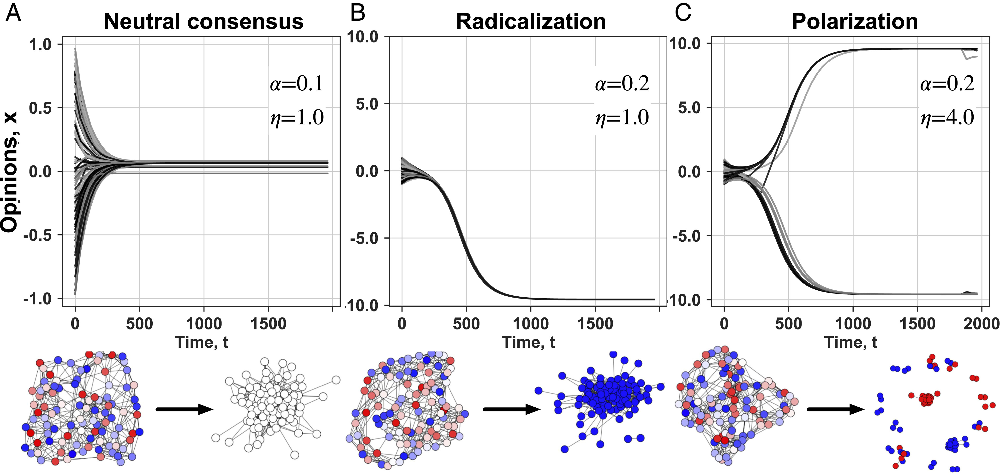
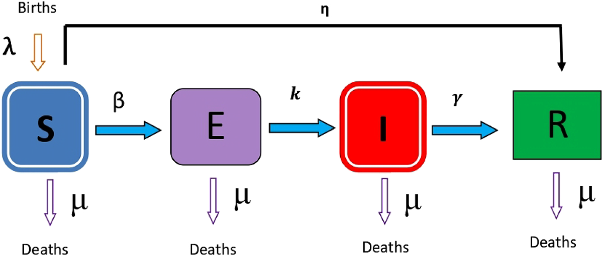

---
# You can also start simply with 'default'
theme: seriph
# random image from a curated Unsplash collection by Anthony
# like them? see https://unsplash.com/collections/94734566/slidev
background: https://cover.sli.dev
# some information about your slides (markdown enabled)
title: Welcome to Slidev
info: |
  ## Slidev Starter Template
  Presentation slides for developers.

  Learn more at [Sli.dev](https://sli.dev)
# apply unocss classes to the current slide
class: text-center
# https://sli.dev/features/drawing
drawings:
  persist: false
# slide transition: https://sli.dev/guide/animations.html#slide-transitions
transition: slide-left
# enable MDC Syntax: https://sli.dev/features/mdc
mdc: true

---

# 行動科学概論

社会科学におけるモデル入門

呂沢宇

  Press Space for next page <carbon:arrow-right />

  <a href="https://github.com/lvzeyu/social_modeling_lecture" target="_blank" class="slidev-icon-btn">
    <carbon:logo-github />
  </a>

<!--
The last comment block of each slide will be treated as slide notes. It will be visible and editable in Presenter Mode along with the slide. [Read more in the docs](https://sli.dev/guide/syntax.html#notes)
-->

---
transition: fade-out
---

# 授業の概要

社会科学の観点からモデルとモデリングの基本的な概念および方法論について学ぶ

- 📝 モデルとモデリングの考え方を把握する.
    - そもそも**モデル**ってなに?
    - モデリングで何かできるのか
- 🏙️ 社会科学における**社会シミュレーション**という手法の位置付け
    - 人間行動と社会シミュレーションとは?　→　Agent-Based Models(ABMs)を中心に紹介
    - 社会科学における社会シミュレーションの理論基盤 → コールマン：ミクローマクロ　リンク
    - シミュレーションモデルの表現と記述
    - シミュレーションの基本要素と構成
- 🧑‍💻 モデルを用いて社会現象や人間行動の分析に応用する能力を身につける.
    - ある社会現象を理解・解釈する際には適切なモデルを選出
    - 分析対象の特徴に応じて既存の(基盤)モデルを適切に改装
 
 

<!--
Here is another comment.
-->

---
transition: fade-out
---

# 授業の構成

社会科学における典型なモデルを学ぶ

- **社会の自己組織化**
    - 個々の人々や集団が独立に行動することで、結果的に社会全体の秩序や構造が形成される
    - （人種による隔離を説明する）シェリングの住み分けモデル ([Schelling, 1971](https://www.suz.uzh.ch/dam/jcr:00000000-68cb-72db-ffff-ffffff8071db/04.02%7b_%7dschelling%7b_%7d71.pdf); [Erez Hatna & Benenson, 2012](https://www.jasss.org/15/1/6.html))

  

 
 

<!--
Here is another comment.
-->

---
transition: fade-out
---

# 授業の構成

社会科学における典型なモデルを学ぶ

- **社会における意見ダイナミックのモデリング**
    - Threshold model ([Granovetter, 1978](https://www.journals.uchicago.edu/doi/10.1086/226707); [Watts, 2002](https://www.pnas.org/doi/10.1073/pnas.082090499))
    - Voter Model
    - Bounded Confidence Model([Rainer & Krause, 2002](https://www.jasss.org/5/3/2.htmls))
    - 他に発展的なモデル（特にオンラインにおけるの意見分極化について）

  

 
 

---
transition: fade-out
---

# 授業の構成

社会科学における典型なモデルを学ぶ

- **ネットワークモデル**
    - ネットワークの基本
        - ネットワーク科学の詳細は、[Barabásiの本](https://www.kyoritsu-pub.co.jp/book/b10003149.html)に参照してほしい
    - Small Worlds Model ([Watts & Strogatz, 1998](https://www.nature.com/articles/30918); [Watts, 1999](https://www.journals.uchicago.edu/doi/10.1086/210318))
    - Scale-free Networks ([Albert-László Barabási & Albert, 1999](https://www.science.org/doi/full/10.1126/science.286.5439.509))

  

 
 

---
transition: fade-out
---

# 授業の構成

社会科学における典型なモデルを学ぶ

- **社会における伝播・感染現象**
    - SEIRモデル
    - SEIRモデルによる社会実装 ([Chang et al., 2020](https://www.nature.com/articles/s41586-020-2923-3))

  

 
 

---
transition: fade-out
level: 2
---

# 授業の資料について

- 授業の資料はオンラインで公開する
   - [本日の資料](https://lvzeyu.github.io/social_modeling_lecture/lecture1/)
   - リンクはGoogle Classroomでお知らせます
   - 資料のソースコードは[Github](https://github.com/lvzeyu/social_modeling_lecture)で公開されています
- 参考資料と参考文献は授業中適宜提示
- 授業中取り上げられるモデルの一部を実装するコードも公開する予定
   - ただし、今回の授業の目的は概念上の理解と把握になり、コードへの理解が求められていない

---
transition: fade-out
level: 2
---

# 成績評価

- **出席（50%)**
    - 授業中議論へ積極的に参加する方は適宜加点する
- **授業期間中の課題（25%)**
   - 授業内容の理解を確認するための課題
- **最終課題（25%): 社会モデリングをテーマとしての発表**
   - 発表10分+質疑応答5分　→ 受講者の人数によって適宜調整する
   - 以下の選択肢から形式を選定し、発表資料を作成してください
       - 社会モデリングに関する論文の紹介：論文の内容を理解する上で、モデルの構造と特徴を聴者に伝えるように工夫してください。
           - 可能であればモデルの実装と結果の再現が望ましい。
       - 既存モデルの改装と拡張：既存モデルに基づいて、自分が興味を持つ対象をモデリング構想を発表しなさい。
           - 基本的には、構想の説明だけで構いませんが、可能であればモデルの実装が望ましい。

