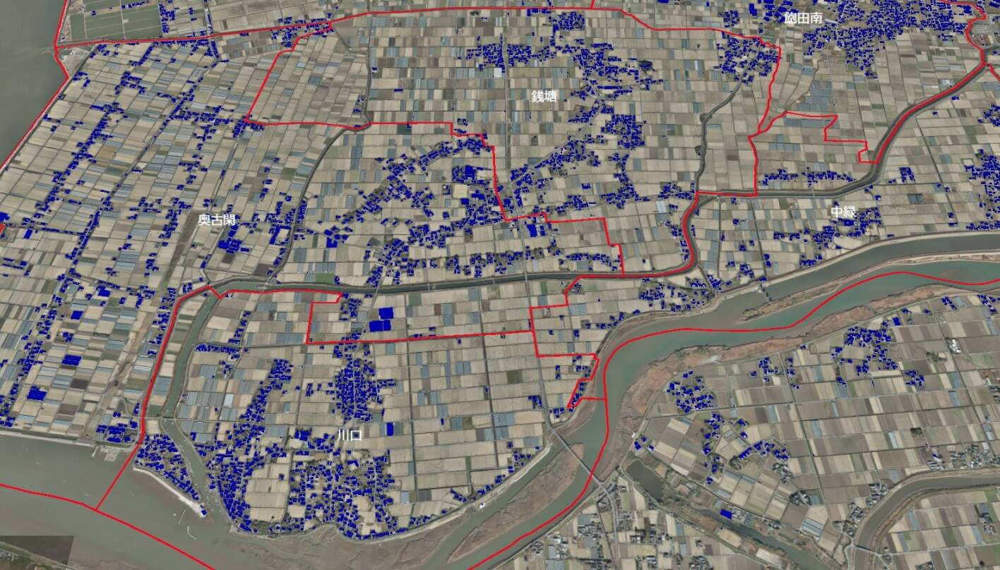
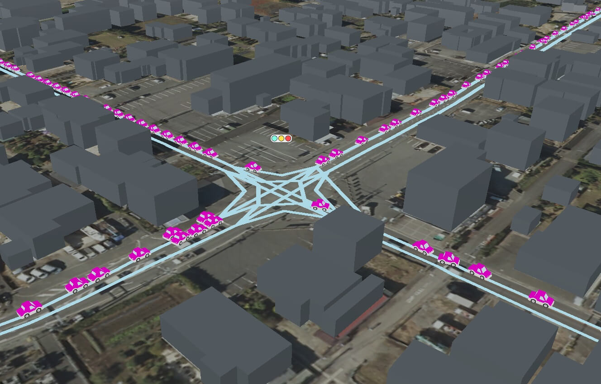

---
# You can also start simply with 'default'
theme: seriph
addons:
  - slidev-component-pager
# random image from a curated Unsplash collection by Anthony
# like them? see https://unsplash.com/collections/94734566/slidev
background: https://cover.sli.dev
# some information about your slides (markdown enabled)
title: Welcome to Slidev
info: |
  ## Slidev Starter Template
  Presentation slides for developers.

  Learn more at [Sli.dev](https://sli.dev)
# apply unocss classes to the current slide
class: text-center
# https://sli.dev/features/drawing
drawings:
  persist: false
# slide transition: https://sli.dev/guide/animations.html#slide-transitions
transition: slide-left
# enable MDC Syntax: https://sli.dev/features/mdc
mdc: true

---

## 行動科学概論
 
# 社会科学におけるモデル入門

モデリングの概要

### 呂沢宇

  Press Space for next page <carbon:arrow-right />

  <a href="https://github.com/lvzeyu/social_modeling_lecture" target="_blank" class="slidev-icon-btn">
    <carbon:logo-github />
  </a>

<!--
The last comment block of each slide will be treated as slide notes. It will be visible and editable in Presenter Mode along with the slide. [Read more in the docs](https://sli.dev/guide/syntax.html#notes)
-->

---
transition: fade-out
---

# データ分析とモデル

人間に認知限界とデータ分析

- 人間は様々の情報を処理して世の中を理解・制御している
    - 対象となるものの振る舞いが複雑すぎると、直感的な理解や制御が及ばない場合がある
> 対象から情報(**データ**)を取得して、それを分析することによって、その対象がどのようなメカニズム・ルールで働いているのかを客観的に理解・制御しようとするのが**データ分析**である。

  データを眺める以上の分析が必要ならモデルの出番

---
transition: fade-out
---

# モデルの役割

なぜモデルなのか

- モデルでは、対象のデータの生成ルールを模擬したものである。
    - 実際の分析対象では、自由にデータを生成したり、内部条件を変えて操作したりすることは普通できません
- 同じような振る舞いをするモデルを作ってしまえば、様々の用途がある
    - 形式では、数学やコンピュータープログラムなどの形式言語を書けるようなものである
    - 考えを伝えや理解するため
    - 予測や可能性を掘り下げる

<!--
Here is another comment.
-->

---
transition: fade-out
level: 1
---

# モデルのタイプ

  <!-- 左侧图像 -->
  

    

      
    

    
現実を再現するモデル

  

  <!-- 右侧图像 -->
  

    

      
    

    
物理現象のモデル

  

---
transition: slide-up
level: 2
---

# モデルのタイプ

- **具現化のアプローチ(Embodiment Approcah)**
    - モデルには重要な構成要素が含まれ、できるだけ実際の現象を忠実に再現することを目的とする
    > 気象モデル: 天候を予測するための数値シミュレーションでは、大気の流れ、温度、湿度などの重要な変数を考慮し、風速や降水量の予測を行う    

- **アナロジーアプローチ(Analogy Appraoch)**
    - 現実のシステムを抽象化し、別のよく理解されたシステムとの類似性を活用することで、モデリングを行う
    > 例：情報の拡散は病気のようにモデリングできる；生物の進化論で制度や文化の進化に応用

---
transition: slide-up
level: 2
---

# モデルのタイプ

具現化のアプローチ

  - 現象の再現性と説明力の向上し、現実問題への応用に直結する志向  

  - **例: 避難行動モデル**  
    - 災害発生時避難行動をモデル化することで、誰が、いつ、どこへ、どのルートで避難するのかを予測  
    - 防災行動計画の立案に支援する

  <v-switch>
    <template #1>
      
    </template>
    <template #2>
      
    </template>
    <template #3>
      
    </template>
    <template #4>
      
    </template>
  </v-switch>

---
transition: slide-up
level: 2
---

# モデルのタイプ

アナロジーアプローチ

- 特定の対象を**直接的にモデル化することは難しい**場合、**すでに理解されている別のシステム**と類似点を見出し、それを活用してモデリングを行う

> 問題：牛の革の量を推定するために、牛の体表面積を求めなさい

- **扱いにくい問題**：牛は複雑な形状をしており、体の各部位ごとの曲率や凹凸が存在するため、正確な体表面積の計算が難しい
- **既に理解しているシステム**：球体の表面積は公式で簡単に計算できる
- 牛全体をひとつの球体とみなす
    - 牛の代表的な寸法（例えば、体長や幅）から「平均的な半径$r$」を定める
- 球体の表面積公式で牛全体の革面積の近似値とする
- 切断ロスや余裕部分、部分的な重なりなどを考慮し、後に補正係数を適用する

---
transition: slide-up
level: 2
---

# アナロジーアプローチ

簡単的なモデルでも色々な問題に応用できる：囚人のジレンマを例として

- 囚人のジレンマモデル
    - **ゲーム理論**における有名な非協力ゲーム
    - 2人の囚人が**協力**するか**裏切る**かを選択する状況

|  | **囚人Bが協力** | **囚人Bが裏切る** |
|---|---|---|
| **囚人Aが協力** | (−1, −1) | (−3, 0) |
| **囚人Aが裏切る** | (0, −3) | (−2, −2) |

- **協力**: 2人とも1年間の懲役
- **裏切り**: 裏切った方は釈放、裏切られた方は3年間の懲役
- **相互裏切り**: 2人とも2年間の懲役

---
transition: slide-up
level: 2
---

# アナロジーアプローチ

簡単的なモデルでも色々な問題に応用できる：囚人のジレンマを例として

|  | 囚人Bが協力 | 囚人Bが裏切る |
|---|---|---|
| **囚人Aが協力** | (−1, −1) | (−3, 0) |
| **囚人Aが裏切る** | (0, −3) | (−2, −2) |

- 各囚人は**個別の最適戦略**として「裏切る」選択をする
  - もし囚人Bが協力すると考えるなら、囚人Aは「裏切る」ことで0年の懲役となり有利
  - もし囚人Bが裏切ると考えるなら、囚人Aが「協力」すると3年、裏切ると2年の懲役となるため「裏切る」方が有利
  - どちらのケースでも「裏切る」方が懲役が短くなるため、囚人Aは合理的に「裏切る」を選択
  - 囚人Bも同様に考えるため、結果として両者が「裏切る」を選び、(−2, −2) となる
- もし**協力**していれば (−1, −1) の方が良かったのに(社会的最適)、達成できない

  個々の合理的選択が全体として非効率な結果を招くことを説明できる

---
transition: slide-up
level: 2
---

# アナロジーアプローチ

簡単的なモデルでも色々な問題に応用できる：囚人のジレンマを例として

色々な社会現象を囚人のジレンマのように表現し、アナロジーアプローチで分析することができる

- 企業間の価格競争
    - 競合する企業同士が価格を下げることで市場シェアを拡大しようとする場合、双方が値下げを行うと利益が減少
    - 一方のみが値下げすると、その企業が市場シェアを獲得できる
    - 両社ともに値下げを選択し、結果として双方の利益が減少する

- 環境問題における国際協力
- 日用品の買い占め

<!--
各国が環境保護のために協力することが望ましいものの、各国は自国の経済成長を優先し、環境対策を怠る可能性があります。全ての国が協力すれば環境改善が期待できますが、一部の国が協力を怠ると、全体の環境対策が効果を失うことになります。
災害時などにおいて、個人が必要以上に物資を買い占めると、他の人々が必要な物資を入手できなくなります。全員が冷静に行動すれば物資は行き渡りますが、他者が買い占めることを恐れて自らも買い占めに走ると、結果として全体の物資不足が深刻化します。
-->

---
transition: slide-up
level: 2
---

# アナロジーアプローチ

アナロジーアプローチの観点からのモデリングの注意点

- 異なる社会現象でも共通のメカニズムで考えられる
- 典型的なモデルでは多様な社会現象の説明に活用できる
    - 典型的なモデルの本質的な考え方を把握
    - モデルの転移可能性に常に意識
- 対象や文脈に応じて拡張する必要性
    - 例:繰り返しゲームへの拡張
        - 国家間の協力や企業間競争の分析には、単発の意思決定だけでなく、繰り返しの対話がある状況（長期的な競争・協力関係）に拡張する

---
transition: fade-out
level: 2
---

# モデリングの二つの原理

- KIDS原理：Keep It Descriptive, Stupid

    - 現実世界の複雑さを忠実にモデル化することを優先する
    - 目的：実際の社会現象のリアリティと妥当性を確保する

-  KISS原理：Keep It Simple, Stupid
    - できるだけ単純なモデルを構築する
    - 目的：モデルの理解しやすさ、透明性、汎用性を高める
       - 「分析志向」のシミュレーションでは重視される
       - 関連する学術領域の理論との比較と接合が容易となる

  KISSとKIDSは対立概念ではなく補完的な関係にある

---
transition: fade-out
level: 1
---

# モデリングの目的

推論

- **推論**とは、現実世界の現象や仕組みを抽象化して、数理的・形式的なモデルを用いて未知の情報を**導き出す**ことを意味する。
    - 対象物の特徴や構造を明確にする
    - モデル内の要素がどのように相互作用し、どのようにまとまることを記述(定義)する
    - どのような条件からどのような結果を生み出されるのか、それはなぜなのかを導き出す。

- 形式論理による推論は、正確な関係を導き出せることだけでなく、ときには直感に反するような予想外の関係を見つけ出すこともできる

- 論理は主張が正しくなる条件を明らかにする
   - 同じ問題に対して相反する論述は、どちらでも正しそうに見えるそう場合もある
   - モデルは前提を設けた上で定理を証明する
        - 相反する予測結果や説明がバラバラだったり定理は、前提が異なるため

---
transition: fade-out
level: 2
---

# モデリングの目的

理解

**理解**: 経験的な現象に(検証可能な)説明を与える

- モデルは経験的現象に明快で論理的説明を与える
    - モデル構造から説明する方法では、モデルを作るときに仮定して良いと思われる経験事実・観測事実からボトムアップ的に論理を構成する

- モデルは、直感と一致する結果も反直感的な結果もともに説明できる

需要と価格の関係モデル：需要が増えると価格が上がる

- 商品需要のが上昇すると、短期的に価格も上昇する
- 長期的に見れば、需要の増加は価格を低下させることもある: 需要の増加は、大量生産の効果のため価格の低下を引き起こす

---
transition: fade-out
level: 2
---

# モデリングの考察

モデルによる予測と探索

- モデルは、個別の事象も全体的傾向も予測できる
- モデルの予測と説明には密接な関係がある
    - 説明が予測を補強する
    - 予測が説明を検証する
    - 説明なしで予測できる場合もある
        - 深層学習モデル

- モデルは直感や可能性を探るために使われる
    - モデルを通じて、まだ観測されていないパターンや動作の可能性を探る
    - モデルのパラメータに仮想的に現実の状況とはあえて異なる値を入れるものの振る舞いをシミュレートする

<!--
仮想的に現実とは異なるパラメータ（例えば、道路の容量を意図的に小さく設定する、特定の時間帯の交通量を極端に増加させる）を与えることで、渋滞がどのように発生し、どのように拡大するかを観察できます。これにより、モデルの挙動や実際の交通状況に対する理解が深まります。
-->

---
transition: fade-out
level: 2
---

# モデリングの例

自然渋滞の問題

- モデルはデータを説明できるということは、モデルを作るときに仮定したモデル構造が正しかった(可能性が高い)

- 自然渋滞：高速道路では、事故でもないのに自然に渋滞が発生する
    - なぜ自然渋滞が発生するのか?

  
  

> 
濃い黒色のクルマは、自分の前にスペースがなかったために、1秒前の時点から動けなかったクルマを表している。

> 
道路上のクルマの数が増えて密度が高くなると、動けないクルマが出てくる。つまり、渋滞が発生することになる。

---
transition: fade-out
level: 2
---

# モデリングの例

自然渋滞のモデリング

> 車間が詰まってくるほど遅い速度に調整

> 車間距離が十分に長ければ一定の最高速度に調整

- それぞれの車の動き（加速度）を方程式で表してみる(モデル化)
   - 最適速度モデル：ドライバが車間距離に応じてアクセル・ブレーキ(車の加速度)を操作する様子を数式で定義する

$$
\frac{dv_i}{dt} = a \left( V(h_i) - v_i \right)
$$

- $v_i$ : 車両 $i$ の速度
- $h_i = x_{i-1} - x_i$ : 前方車両 $i-1$ との車間距離
- $x_i$ : 車両 $i$ の位置
- $V(h)$ : 最適速度関数（ここで、$h_i$に応じて何らかの形で車両が取りたい速度を決めると思って良い）
- $a$ : 速度調整の応答係数（運転者の反応速度に関係）

---
transition: fade-out
level: 2
---

# モデリングの考察

モデルによる推論と説明

- 自然渋滞のモデリングに従って、仮想的な車たちを動かしてみることができる[(demo)](https://kaityo256.github.io/ov_model/)
    - 結果的には、モデルの中でも自然に渋滞が発生
    - モデルで仮定した数理構造(車の速度の変化させた)から対象としている現象を再現することができる
    - このモデルをさらに分析すると、「渋滞が発生する時には、車の速度の変動が後ろの車に伝わっていくにつれて拡大する」という論理的な説明や、渋滞が発生する混雑条件などが明らかになる

  

  

---
transition: fade-out
level: 2
---

# モデリングの考察

モデルによる推論と説明

- **推論**: モデルで仮定した数理構造(車の速度の変化させた)から対象としている現象を再現することができる
    - モデルを用いると、どのような車間距離や交通密度のもとで渋滞が自発的に発生するかを推論できる
        - 「なぜ原因がないのに渋滞が発生するのか？」という問いに対する因果的理解を提供する
    - 「モデルは自明なことを言い直しているだけ」?
        - モデルの推論が、「条件$A$が満たされれば結果$B$が伴う」というように、**条件付き**の形を取っている

- **説明**: 個々のドライバーがわずかにブレーキを踏むことが、後続車に波及して渋滞を生むメカニズムで説明できる
    - 渋滞を「個人レベルの行動の連鎖が集団的な非直感的なパターンを生む現象」として説明できる
        - 直感的には、事故や信号の故障など明確な外的原因による渋滞が発生するが想定される(はず)
    - ミクロ（ドライバーの行動）からマクロ（交通流の集団挙動）への因果構造

---
transition: fade-out
level: 2
---

# モデリングの考察

モデルによる予測と探索

- モデルを用いると、現時点での交通密度が一定のしきい値を超えた場合、渋滞がどの地点でどのように発生・波及するかをシミュレーションで予測できる
- 異なる車種や運転手と反応速度の違いを仮定してモデルを動かすと、意外な渋滞パターンや緩和戦略が発見される
    - 「現実では試すことが難しい条件」を仮想的に試す思考実験の道具としてモデルを使う
    -  自動運転車が数台入るだけで渋滞波が大幅に減少する可能性がモデルから示唆されている（[Stern et al., 2018](https://www.sciencedirect.com/science/article/pii/S0968090X18301517)）
<!--
仮想的に現実とは異なるパラメータ（例えば、道路の容量を意図的に小さく設定する、特定の時間帯の交通量を極端に増加させる）を与えることで、渋滞がどのように発生し、どのように拡大するかを観察できます。これにより、モデルの挙動や実際の交通状況に対する理解が深まります。
-->

---
transition: fade-out
level: 1
---

# まとめ

モデルの軸

基本的は、モデルは二つの軸で整理することができる

- 目的：「分析」ー「設計」
    - 「分析志向」:ある現象に対して、その現象が生じるメカニズムを明らかにし新たな理論を構築しよう
    - 「設計志向」:ある現象に対して、ある介入を実施したりシステムに導入することで状態がどのように変わりうるのかを予測する

- 対象: 「具体」ー「抽象」
    - 「具体的志向」:特定の社会現象(例えば対象のデータが現実的に収集できるレベル)を対象にする
    - 「抽象的志向」:観察される現象一般を統一的に扱うとする

  モデルは極にのみ存在するものではない

---
transition: fade-out
level: 2
---

# まとめ

注意: 説明力があるモデル $\neq$ 真のモデル 

- 現象が説明されたとして、そのモデルを構成するすべでの要素が正しいとは言えません
    - モデルの構成には、現実の単純化・理想化が含まれており、説明力があっても一部の前提が現実から乖離している可能性がある
        - モデルの定義に不適切な要素が含まれると、結果の解釈のしやすさやモデルの妥当性に悪い影響を与える
    - モデル構造から説明する方法では、モデルを作るときに仮定して良いと思われる経験事実・観測事実からボトムアップ的に論理を構成する
        - どのような仮定を置くのかに注意する必要がある
        - 単純化しすぎていないか
        - 他の解釈可能性を排除していないか

---
transition: fade-out
level: 2
---

# まとめ

モデルの思考に慣れるように

- 抽象化：本質的な要素を抜き出す
- 前提を明示する: 「何を仮定するか」によって、モデルの構造も結果も変わることを意識する
- 因果を構造でとらえる: 結果から逆に構造を推測したり、「なぜそうなるのか」を関係で捉える

---
transition: fade-out
level: 2
---

# 練習問題

- 練習問題1
    - 雨の日に電車が遅れるのはなぜか?

- 練習問題2
    - ある保育園では、迎え時間に遅れてくる保護者が増えてきたことから、遅刻に対して罰金を課すルールを導入しました。それによって遅刻の問題を解決できると思いますか？

