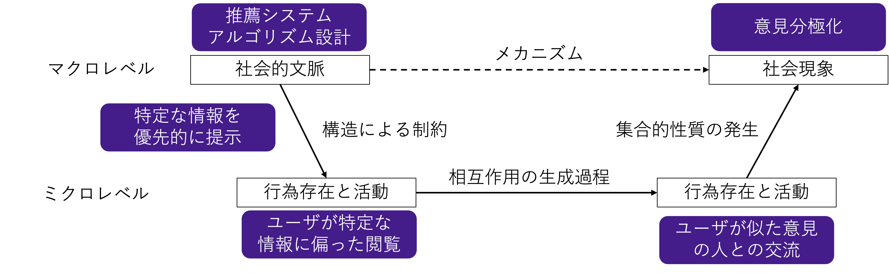

---
# You can also start simply with 'default'
theme: seriph
addons:
  - slidev-component-pager
# random image from a curated Unsplash collection by Anthony
# like them? see https://unsplash.com/collections/94734566/slidev
background: https://cover.sli.dev
# some information about your slides (markdown enabled)
title: Welcome to Slidev
info: |
  ## Slidev Starter Template
  Presentation slides for developers.

  Learn more at [Sli.dev](https://sli.dev)
# apply unocss classes to the current slide
class: text-center
# https://sli.dev/features/drawing
drawings:
  persist: false
# slide transition: https://sli.dev/guide/animations.html#slide-transitions
transition: slide-left
# enable MDC Syntax: https://sli.dev/features/mdc
mdc: true

---

## 行動科学概論
 
# 社会科学におけるモデル入門

社会と人間行動のモデリング

### 呂沢宇

  Press Space for next page <carbon:arrow-right />

  <a href="https://github.com/lvzeyu/social_modeling_lecture" target="_blank" class="slidev-icon-btn">
    <carbon:logo-github />
  </a>

<!--
The last comment block of each slide will be treated as slide notes. It will be visible and editable in Presenter Mode along with the slide. [Read more in the docs](https://sli.dev/guide/syntax.html#notes)
-->

---
transition: slide-up
level: 2
---

# 社会学とは

- 社会学とは、人間の社会的行動や社会の構造、制度、関係性を研究する学問です
    - 個人と個人、集団と集団、あるいは個人と集団など、社会生活のなかでの人間同士の関係のあり方
- 社会学の主要な目的は社会現象や人間の集団行動、制度、文化の背後にあるメカニズムを解明することにあります
    - 説明的課題：ある現象がどのようなメカニズムで生じるのかを明らかにする
    - 規範的課題：ある現象をどのような方法で改善できるのかを明らかにする
    - 多くの社会科学研究は、規範的な問題意識から出発し、それを解決するためには必ず説明的課題をクリアしなければならい、という構図になる

---
transition: slide-up
level: 2
---

# 社会学とは

社会学の分析範囲

- ミクロレベル(個人・相互行為のレベル)
    - 社会というものの基本的な構成要素としての個人の行為及び個人間の関係に注目する
        - 社会的意味を持つ個人の行為：利己的行為 $&$ 利他的行為
        - 社会的意味を持つ個人間の関係：親密な関係 $&$ 敵対的関係
- メゾレベル（中範囲の社会集団や組織）
    - 複数の人々の間の関係（相互作用）とそこから生じてくる集団としてのまとまりや振る舞い
       - 家族、学校、会社なの集合体や農村や都市などの地域共同体を含む様々な「社会的に構築される集団」

- マクロレベル(社会全体)
    - 社会全体、国家、世界システムといった大規模な社会構造や変動

---
transition: slide-up
level: 2
---

# 社会学とは

社会学の分析枠組み

- 社会学について、分析対象をどのような枠組みで捉えることによって分類することもできる
    - 社会システム理論、機能主義、構造主義、象徴的相互作用論など多くの社会理論
- 行為のメカニズム
    - 行為は意味を持つものとして理解され、行為者の動機・信念・価値指向に着目する
        - 人々の行為が、それぞれの動機（目的、欲求）に基づいた選択されたメカニズム
- 過程のメカニズム
    - 社会の状態が変化する過程、および個人の状態と社会の状態が相互作用しながら変化する過程
- 構造メカニズム
    - 人々の行為や関係が規則や制度に規制されるメカニズム

---
transition: slide-up
level: 2
---

# 社会シミュレーションの位置づけ

経験的社会科学の方法論

経験的社会科学は、観察やデータ収集に基づいて社会現象を理解・説明しようとするアプローチである

- 社会調査や実験などを通じて社会事象の一側面を反映できるデータのもとに、重回帰分析などの多変量解析を用いて，変数間の関連の解明を目指す経験的な社会科学
    - 1960 年代のアメリカを中心に始まった社会調査手法と大規模データの「革命」によって，高度な計量分析による社会学が隆盛した

- 情報技術の進展により、SNS、センサーデータ、行政記録など、多様なビッグデータが収集可能となった
    - (計算社会科学は)ビックデータを用いて社会現象と人間行動に関わる各要素を分析する

---
transition: slide-up
level: 2
---

# 社会シミュレーションの位置づけ

経験的社会科学への批判

- 変数間の統計的関連を明らかにするが、その背後にある因果的メカニズムの説明が不十分[^1]
    - 例：「本人の学歴$X$が本人の地位$Y$と関連していたという知見を報告する研究」
        - 「本人の学歴がなぜ本人の地位と関連するのか」という因果的説明を提供することができない
        - 学歴がどのように職業的機会、文化的資本、ネットワーク資源などを通じて社会的地位に影響するのか、といった中間メカニズムが明示されない

> 学歴が高いことにより、より多くの職業的機会が与えられる

> 高学歴者は、より多くの文化的資本（言語能力、知的嗜好など）を持つ

> 学歴を通じて人的ネットワークが形成され、職業選択に有利に働く

 
 [^1]: ただし、高度の統計手法による限定的に因果関係を説明することができる

---
transition: slide-up
level: 2
---

# 社会シミュレーションの位置づけ

経験的社会科学への批判

- 単一個人の行動を属性や環境から説明することが社会現象の説明が不十分である可能性
    - 「社会現象を個人行動の単純な集計」という考え方が問題視されている
        - サーベイ調査は無作為抽出に基づいており、各観測値は個人に関して独立だと想定される
        - しかし、社会現象は他者との相互作用を通じて形成されることが多い

> 投票行動やデモ参加などは、周囲の人々の行動や社会的ネットワークの影響を受ける傾向が強い。
 
 - 「属性がXである人がデモに参加しやすいという知見を報告するタイプの研究」
     - 「デモに参加する」という行動を特定な属性に繋がる知見
 - その属性を持つ人はネットワーク内での結びつきが強く、周囲の影響を受けやすいため参加した」可能性がある

---
transition: slide-up
level: 2
---

# 社会シミュレーションの位置づけ

分析社会学の提起

- 社会構造や制度、文化的規範といったマクロ要因が、個人の認知・態度・選好などのミクロ的要素に影響を与える
- 個人の認知、信念、欲求、社会関係等に基づいて、具体的な行為（action）や相互作用が形成される
- 多数の個人行動が積み重なり、集団的帰結として新たなマクロ現象を生成する

  

  

---
transition: slide-up
level: 2
---

# 社会シミュレーションの位置づけ

分析社会学の提起

  

  

