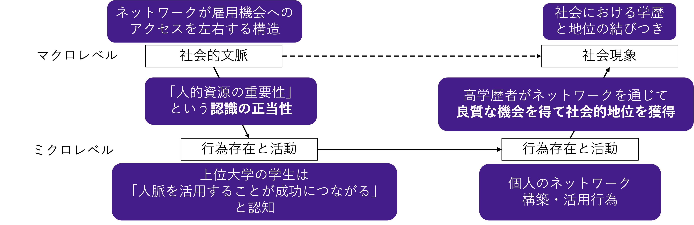
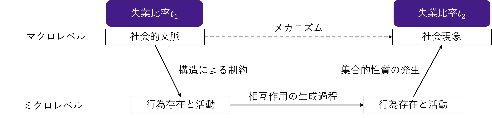

---
# You can also start simply with 'default'
theme: seriph
# random image from a curated Unsplash collection by Anthony
# like them? see https://unsplash.com/collections/94734566/slidev
background: https://cover.sli.dev
# some information about your slides (markdown enabled)
title: Welcome to Slidev
info: |
  ## Slidev Starter Template
  Presentation slides for developers.

  Learn more at [Sli.dev](https://sli.dev)
# apply unocss classes to the current slide
class: text-center
# https://sli.dev/features/drawing
drawings:
  persist: false
# slide transition: https://sli.dev/guide/animations.html#slide-transitions
transition: slide-left
# enable MDC Syntax: https://sli.dev/features/mdc
mdc: true

---

## 行動科学概論
 
# 社会科学におけるモデル入門

社会と人間行動のモデリング

### 呂沢宇

  Press Space for next page <carbon:arrow-right />

  <a href="https://github.com/lvzeyu/social_modeling_lecture" target="_blank" class="slidev-icon-btn">
    <carbon:logo-github />
  </a>

<!--
The last comment block of each slide will be treated as slide notes. It will be visible and editable in Presenter Mode along with the slide. [Read more in the docs](https://sli.dev/guide/syntax.html#notes)
-->

---
transition: slide-up
level: 2
---

# 先週の振り返り

<v-clicks depth="1">

- モデルの基本概念：複雑の対象ある程度に抽象化することで理解・分析を可能にする道具
    - モデルの思考を理解する
        - 抽象化：本質的な要素を抜き出す
        - 前提を明示する: 「何を仮定するか」によって、モデルの構造も結果も変わることを意識する
        - 因果を構造でとらえる: 結果から逆に構造を推測したり、「なぜそうなるのか」を関係で捉える

- モデルの目的と種類
    - 「分析」ー「設計」
    - 「具体」ー「抽象」

</v-clicks>

---
transition: slide-up
level: 2
---

# 社会学とは

- 社会学とは、人間の社会的行動や社会の構造、制度、関係性を研究する学問です
    - 個人と個人、集団と集団、あるいは個人と集団など、社会生活のなかでの人間同士の関係のあり方
- 社会学の主要な目的は社会現象や人間の集団行動、制度、文化の背後にある**メカニズム**を解明することにあります
    - 説明的課題：ある現象がどのようなメカニズムで生じるのかを明らかにする
    - 規範的課題：ある現象をどのような方法で改善できるのかを明らかにする
    - 多くの社会科学研究は、規範的な問題意識から出発し、それを解決するためには必ず説明的課題をクリアしなければならい、という構図になる

  「メカニズムの説明」が社会学の核心問題

---
transition: slide-up
level: 2
---

# 社会シミュレーションの位置づけ

経験的社会科学の方法論

経験的社会科学は、観察やデータ収集に基づいて社会現象を理解・説明しようとするアプローチである

- 社会調査や実験などを通じて社会事象の一側面を反映できるデータのもとに、重回帰分析などの多変量解析を用いて，変数間の関連の解明を目指す経験的な社会科学
    - 1960 年代のアメリカを中心に始まった社会調査手法と大規模なサーベイ調査の「革命」によって，高度な計量分析による社会学が隆盛した

- 情報技術の進展により、SNS、センサーデータ、行政記録など、多様なビッグデータが収集可能となった
    - (計算社会科学は)ビックデータを用いて社会現象と人間行動に関わる各要素を分析する

<!--
- 社会学には色々な方法論がありますが、ここで実証主義的な視座を取り上げます。
- 社会学における実証主義は、社会現象を自然科学と同様に観察・測定可能な対象として捉え、経験的なデータに基づいて法則的な説明を試みる立場である。
実証主義思想に基づき、社会現象も客観的に観察可能であり、再現性のある因果関係や規則性を発見できると考えられた
- この実証主義的な視座は、20世紀中葉の社会学において大きな影響力を持ち、特にアメリカを中心に経験的社会科学として発展した
-->

---
transition: slide-up
level: 2
---

# 社会シミュレーションの位置づけ

経験的社会科学への批判

<v-clicks depth="3">

- 変数間の統計的関連を明らかにするが、その背後にある因果的メカニズムの説明が不十分[^1]
    - 例：「本人の学歴$X$が本人の地位$Y$と関連していたという知見を報告する研究」
        - 「本人の学歴がなぜ本人の地位と関連するのか」という因果的説明を提供することができない
        - 学歴がどのように職業的機会、文化的資本、ネットワーク資源などを通じて社会的地位に影響するのか、といった中間メカニズムが明示されない
        - かりに媒介となる変数 $Z$ を投入して $X → Z → Y$ の関係が明らかになったところで，それでは「なぜ $X$ が $Z$ を引き起こし，$Z$ が $Y$ を引き起こすのか」については答えられない

</v-clicks>

<v-clicks depth="2">

> 学歴が高いことにより、より多くの職業的機会が与えられる

> 高学歴者は、より多くの文化的資本（言語能力、知的嗜好など）を持つ

> 学歴を通じて人的ネットワークが形成され、職業選択に有利に働く
</v-clicks>

 [^1]: ただし、高度の統計手法による限定的に因果関係を説明することができる

<!--
- 変数主義に対する批判：「変数間の静的な関連性」から、「社会的過程の構成的理解」へと視点を転換する
-->

---
transition: slide-up
level: 2
---

# 社会シミュレーションの位置づけ

経験的社会科学への批判

<v-clicks depth="3">

- 単一個人の行動を属性や環境から説明することが社会現象の説明が不十分である可能性
    - 「社会現象を個人行動の単純な集計」という考え方が問題視されている
        - サーベイ調査は無作為抽出に基づいており、各観測値は個人に関して独立だと想定される
        - しかし、社会現象は他者との相互作用を通じて形成されることが多い
</v-clicks>

<v-clicks depth="3">

- **例：「属性がXである人がデモに参加しやすいという知見を報告する研究」**
     - 「デモに参加する」という行動を特定な属性に繋がる知見
     - 投票行動やデモ参加などは、周囲の人々の行動や社会的ネットワークの影響を受ける傾向が強い。 
 - その属性を持つ人はネットワーク内での結びつきが強く、周囲の影響を受けやすいため参加した」可能性がある

> ネットワークの観点で、「若年層は高齢者に比べて投票率が低い」をどのように説明することができる？
</v-clicks>

<!--
さらに、社会調査を用いることで行われる実証的な社会科学研究で絵は次のような根本的な限界がある：

- 無作為抽出に基づくサーベイ調査では、各個人の応答は独立していると仮定される。
- しかし、実際の社会現象においては、個人の意思決定や行動は周囲の人々の影響や社会的ネットワークの構造によって大きく左右される

> 例えば、属性がXである人がデモに参加しやすいという知見を報告する研究

- 若年層は投票経験が少なく、政治的関心を共有するネットワークが弱いため、社会的圧力や模倣行動が生じにくい。
高齢者層は、地域社会や家族・近隣との結びつきが強く、「周囲も投票するから自分も投票する」という社会的規範が形成されやすい

- ミクロの相互作用はどうしても正確的に把握することができない
- 一応測定自体は可能ですが
    - 自己報告の限界：行動や影響に関する質問は、社会的望ましさバイアス（social desirability bias）や記憶バイアスの影響を受ける可能性があります。
    - ネットワーク構造の測定困難性：本格的なネットワーク構造（ノード・エッジ・中心性など）を測るのは難しい
-->

---
transition: slide-up
level: 2
---

# 社会シミュレーションの位置づけ

分析社会学の提起

- 社会構造や制度、文化的規範といったマクロ要因が、個人の認知・態度・選好などのミクロ的要素に影響を与える
- 個人の認知、信念、欲求、社会関係等に基づいて、具体的な行為（action）や相互作用が形成される
- 多数の個人行動が積み重なり、集団的帰結として新たなマクロ現象を生成する

  

  

<!--
- 分析社会学（Analytical Sociology）は、社会現象を表面的な変数間の相関ではなく、その背後にある因果的メカニズムを構成的に明示することを目的とした理論的・方法論的アプローチである。

- この立場では、マクロな社会構造とミクロな個人行動との間にある連関の動態を解明することが重視される。
    - マクロ → ミクロ：構造的制約の導入
    - ミクロ → ミクロ：行為と相互作用の形成。個人の信念・欲求・認知に基づく行動（action）は、他者との相互作用を通じて複雑な社会的パターンを生み出す。
    - ミクロ → マクロ：帰結としての社会現象
-->

---
transition: slide-up
level: 2
---

# 社会シミュレーションの位置づけ

分析社会学の提起

  

  

<!--
学歴と地位の関連を説明するために、「ネットワークが雇用機会へのアクセスを左右する構造」があるというマクロレベルの構造を出発点として考えたい。
-->

---
transition: slide-up
level: 2
---

# 社会シミュレーションの位置づけ

分析社会学の提起

  

  

<!--
- 欲求経由の影響:「周囲に失業者が多い → 働く意欲が低下 → 現状に満足 → 求職をしなくなる」
- 信念経由の影響: 「周囲に失業者が多い → 求職しても無駄だという信念 → 求職をあきらめる」
政策策定に支援する
    - 欲求ベース → モチベーション向上、報酬強化の施策が有効
    - 信念ベース → 情報提供や成功事例の提示が有効
-->
---
transition: slide-up
level: 2
---

# 社会シミュレーションの位置づけ

統計的説明とメカニズムによる説明の分離

- 1：説明項・被説明項を明確に定義
- 2：質的・量的調査で説明したい現象を記述
- 3：行為理論・社会条件・構造的依存関係を明示
- 4：生成的モデルを作成
- 6：シミュレーションの結果と現実の帰結を比較
- 7：シミュレーションに現実のデータを入れてチェックする

<arrow
    v-after
    x1="580"
    y1="170"
    x2="680"
    y2="170"
    color="#3E1586"
    width="3"
    arrowSize="1" />

  計量分析　

<arrow
    v-after
    x1="580"
    y1="270"
    x2="680"
    y2="270"
    color="#3E1586"
    width="3"
    arrowSize="1" />

  社会シミュレーション

<!--

説明項・被説明項を明確に定義する：例：なぜ若年層の投票率が低いのか？ → 被説明項：投票率、説明項：年齢、政治的関心、社会的ネットワークなど
質的・量的調査によって現象を記述する：経験的社会科学の方法を用いて、当該現象の実態や傾向を把握する。
行為理論・社会条件・構造的依存関係を明示する：行為者がどのような前提（信念・欲求・情報など）のもとで行動するかという行為理論を導入

- 「経験的社会科学」と「分析的・理論的な社会科学（社会シミュレーションや分析社会学など）」は、対立するものではなく、互いに補完し合う関係にあります
- 社会学の研究枠くみ
　　- 説明項・被説明項を明確に定義する：例：なぜ若年層の投票率が低いのか？ → 被説明項：投票率、説明項：年齢、政治的関心、社会的ネットワークなど
　　- 質的・量的調査によって現象を記述する：経験的社会科学の方法を用いて、当該現象の実態や傾向を把握する。
　　- 行為理論・社会条件・構造的依存関係を明示する：行為者がどのような前提（信念・欲求・情報など）のもとで行動するかという行為理論を導入
- 経験的社会科学：データに基づく記述と関連の把握・実際のデータに基づく再現性のある知見の蓄積
- 社会シミュレーション：社会現象がいかにして生起するか、その背後にある仕組みを理論的に構築・説明すること
-->

---
transition: slide-up
level: 2
---

# Agent-Based Model (ABM)

ABMの概要

- 再帰性をもつミクロ‐マクロ問題が対象となる
- 個別のエージェントが単純なルールに従って行動し、それらが相互に影響を与え合うことで、集団レベルのパターンや社会的帰結がどのように生じるを記述・シミュレーションするモデリング手法

| 要素       | 説明                                                                 |
|------------|----------------------------------------------------------------------|
| エージェント | エージェントは意思決定を行い自律的に行動する主体であって、他のエージェントおよび環境と相互作用をする                            |
| 環境       | エージェントが存在・行動する空間。物理的・社会的特徴を含む。                |
| 相互作用    | エージェント同士、またはエージェントと環境との関係。                        |
| 更新ルール  | 各ステップでの状態変化を決める規則。                                     |

<!--

- エージェントとは、ABMにおける基本単位であり、自律的に意思決定し、行動し、環境や他のエージェントと相互作用する行為主体を指します
    - エージェントは人間だけでなく、組織、機械なども含めて、目的に応じて柔軟に定義されます。
    - エージェントとは、「周囲の状況を見て、自分なりのルールに従って判断し、他者と関わることができる存在」です。
        - 自律性	自分自身のルールや状態に基づいて行動を選択する。外部から完全にコントロールされない。
        - 状況認識	周囲の環境や他のエージェントの状態を認識し、それに反応することができる。
        - 適応性・学習性	行動経験に応じてルールを変更したり、過去の結果を踏まえて意思決定を改善できる

    - 人間は、自律性・状況認識・学習・意思決定ルールの観点で、エージェントの諸要件を高度に備えた存在である。

    - 「組織」や「機械（人工物・AIなど）」がエージェントの要件にも満たせる
-->

---
transition: slide-up
level: 2
---

# Agent-Based Model (ABM)
ABMの具体例

-  [自然渋滞モデル](https://www.netlogoweb.org/launch#https://www.netlogoweb.org/assets/modelslib/Sample%20Models/Social%20Science/Traffic%20Basic.nlogo)をABMの一種として理解することができる

| 要素       | 説明                                                                 |
|------------|----------------------------------------------------------------------|
| エージェント | 各車両がエージェント:車両は「現在位置」「速度」「加速度」などの属性を持ち、決まったルールに従って行動する。                            |
| 環境       | 車両が走行する1次元の道路  [^1]             |
| 相互作用    | 各車両は特定なルールで動く[^2]                       |
| 更新ルール  | 一斉にステップを進めることで、車列全体の変化（渋滞波など）が観察可能になる                                     |

 [^1]:  自然渋滞モデルの環境を変更する例：[Traffic Grid](https://www.netlogoweb.org/launch#https://www.netlogoweb.org/assets/modelslib/Sample%20Models/Social%20Science/Traffic%20Grid.nlogo)
 [^2]:  自然渋滞モデルの相互作用を変更する例：[Traffic 2 Lanes](https://www.netlogoweb.org/launch#https://www.netlogoweb.org/assets/modelslib/Sample%20Models/Social%20Science/Traffic%202%20Lanes.nlogo)

<!--

- 環境：エージェントが行動する舞台や制約の枠組みを提供する
- 相互作用：エージェントが他者の行動や状態を参照・影響を受ける仕組み。

- 「Traffic Grid」モデルは、都市の格子状道路網における交通の流れをシミュレートするものです。このモデルでは、信号機の配置や制御方法、道路のサイズなど、環境要因を変更することで、交通渋滞やグリッドロック（交差点での完全な交通停止）などの現象を再現できます。​
    - 信号機の制御方法：手動制御から自動制御への切り替えにより、交通の流れや渋滞の発生パターンが変化します。
    - 道路網のサイズ：道路の縦横の数（GRID-SIZE-X, GRID-SIZE-Y）を変更することで、都市の規模や複雑さを調整できます。

- 「Traffic 2 Lanes」モデルでは、車両が2車線の道路を走行し、前方の車両との距離や速度に応じて加減速や車線変更を行います。
    - このモデルでは、エージェント（車両）の相互作用ルールを変更することで、交通の流れや渋滞の形成に対する影響を分析できます。​
-->
---
transition: slide-up
level: 2
---

# Agent-Based Model (ABM)

社会シミュレーションにおけるエージェントの意思決定

<v-clicks depth="3">

- 意思決定モデルとは、「情報の入力から判断、選択、行動に至る一連の過程」を、明示的な構成要素とプロセスでモデル化したもの
    - 情報の入力: 意思決定の前提となる外部情報や内的状態
        - 例：環境情報、他者の行動、過去の経験など
    - 意思決定者は目標を追求する：望ましい意思決定の結果とは何か
    - 意思決定ルール: どのように選択肢を比較・選択するかのメカニズム
    - 実際に選ばれた行動

- 人間の意思決定のモデリングは、(ざっくり) **合理的行為者(rational actor)** と **ルールベース行為者(rule-based actor)** に分けられる

</v-clicks>

<!--

- エージェントの意思決定モデルは、社会シミュレーションにおいて、各エージェントが「どのように情報を受け取り、どのようなルールで判断し、最終的にどのような行動をとるのか」を構成的・形式的に記述するための枠組みである
- これは単なる「行動ルール」ではなく、認知・判断・選択のプロセスを段階的に明示化することで、よりリアルな社会的行動の再現と理解を可能にする。

- 社会シミュレーションにおいて、エージェントの意思決定モデルは単なる「行動の定式化」ではない。
- それは、「社会現象を個人の認知・判断・行為から構成的に説明する」ための理論と実装の接点である
-->

---
transition: slide-up
level: 2
---

# 合理的行為者モデル

合理的行為者モデルの概要

<v-clicks depth="3">

- 合理的行為者モデルは、取り得る一連の行動(選好)に対して定義される数学的な効用関数(効用関数)によって表現され、自身の利得関数に基づき最適な行動を選択することを前提とする
    - 効用関数関数によりモデルは分析可能、検証可能で扱いやすいものになる
- 異なる状態$S$の選好は効用関数$U(S)$で捉えられる
    - $U(S_i) > U(S_j)$なら、$S_i$を$S_j$より好む
    - $U(S_i) = U(S_j)$なら、二つの状態$S_i$を$S_j$は無差別である
- **期待効用の最大化**: 合理的行為者は、可能な選択肢の中から、効用を最大化する行動を選ぶと仮定されます 

$$
\arg\max_{S \in \mathcal{S}} U(S)
$$

</v-clicks>

<!--
意思決定システムの例として合理的行為者モデルを紹介
- 合理的行為者モデルとは、意思決定を行う個人（または組織）が「明確な目標を持ち、その目標を最大限に達成するために最適な選択をする」
    - ゲーム理論:他者の行動を予測した上で、自らの最適な戦略を選択する
        - 認知（状況認識）: 各プレイヤー（囚人）は、自分の選択肢（黙秘・自白）と、それぞれの選択がもたらす結果の可能性を認識します。
        - 判断（効用の評価）:各プレイヤーは「刑期の短さ＝効用の高さ」として効用を評価
        - 選択（合理的な行動の実行）: 相手の選択がどうであれ、自分が「自白」した方が効用が高いため、合理的行為者は常に「自白」を選ぶ
- この選好は完全（任意の2状態を比較できる）かつ推移的である
- 食事の例：効用が同じなら何を食べても同じ・食事選好における推移性
-->

---
transition: slide-up
level: 2
---

# 合理的行為者モデル

合理的行為者モデルの例：なぜ他人を信頼するのか

日常生活で騙される可能性があるにもかかわらず人を信頼するのはなぜ

<v-clicks depth="2">

- 信頼する人と信頼される人の二人がいるとする
    - 信頼する人は自分の相手を信頼するか信頼しないか決める
    - 信頼される人は信頼されるとき応えるか裏切るか決める
- 信頼しない場合は、現状のままなので、信頼する人の利得は0である
    - ここで利得をお金や商品などから得られる利益でイメージしなさい

</v-clicks>

  

---
transition: slide-up
level: 2
---

# 合理的行為者モデル

合理的行為者モデルの例：なぜ他人を信頼するのか

日常生活で騙される可能性があるにもかかわらず人を信頼するのはなぜ

<v-clicks depth="2">

- 信頼する人が相手を信頼した場合、信頼された人には「信頼を応える」と「信頼を裏切る」という二つの選択肢がある
    - 信頼を応える場合、信頼した人は$G$の利得を得る
    - 頼を裏切る場合、信頼した人は$L$の損失をこうむる(利得$-L$)
- 信頼する人は相手が信頼に応えてくれるか信頼を裏切るか確かではない
    - 信頼に応えてくれる確率$p$
    - 信頼を裏切る確率$1-p$
</v-clicks>

  

---
transition: slide-up
level: 2
---

# 合理的行為者モデル

合理的行為者モデルの例：なぜ他人を信頼するのか

信頼の条件を特定：いつ信頼すれば良い

<v-clicks depth="2">

- 信頼する人は期待利得を最大化すると仮定する
    - 期待利得とは、行為者がある選択肢を選んだ場合、その選択肢から生じうる結果から得られる利得とその結果が生じる確率を掛け合わせるものを指す 

- 信頼するの期待利得

$$
pG+(1-p)(-L)
$$

</v-clicks>

  

---
transition: slide-up
level: 2
---

# 合理的行為者モデル

合理的行為者モデルの例：なぜ他人を信頼するのか

信頼の条件を特定：いつ信頼すれば良い

- 信頼するの期待利得が信頼しない場合の期待利得より大きければ、信頼する人は相手を信頼する

$$
pG+(1-p)(-L)>0
$$

$$
p>\frac{L}{G+L}
$$

$$
p>\frac{1}{\frac{G}{L}+1}
$$

<v-clicks depth="2">

- $G$が大きくにあると、不等式を満たす$p$の値は大きくならなければならない
    - 信頼に応える場合の利得が大きいほど、信頼する人が相手を信頼する可能性が高くなる
- $L$が大きくにあると、不等式を満たす$p$の値は大きくならなければならない
    - 信頼が裏切られた場合の損失が大きいほど、信頼する人が相手を信頼する可能性が低くなる
</v-clicks>

  日常的な常識と一致し、目新しいものではないが、それだけこのモデルが経験的妥当することを示している

---
transition: slide-up
level: 2
---

# 合理的行為者モデル

詐欺師のテクニック

<v-clicks depth="2">

詐欺師のテクニックはモデルの変数である$p$,$G$,$L$に関係する

- 詐欺師は自分がいかに信頼できる人間であることを証明する情報を提示す
    - $p$の値を大きくにする
- 詐欺師は自分を信頼した場合にいかに利益があることを相手に説得する
    - $G$の値を大きくなったと思わせる

- 詐欺師は信頼が裏切られた場合でも損失が小さいことを強調する
    - $L$の値を小さくなったと思わせる
</v-clicks>

---
transition: slide-up
level: 2
---

# 合理的行為者モデル

合理的行為者モデルの存在意義

<v-clicks depth="2">

- 人間の意思決定を効用関数に基づく選択として定式化することで、複雑な行動を明示的・再現可能な数理モデルとして扱えるようになる
    - 人間は「まるで」最適な行動を選択する合理性を持つ仮定には十分な意義がある
        - 知性的なルールに基づく行動は、(ほとんど)最適な行動と区別がつかないことがある
    - **一意性**：最適な行動は一意に定まることが多い、行為者が「最適化しているかのように行動する」前提に立てば、モデルが検証可能になる
    - **一貫性**: 最適な行動は一貫性のあるモデルを作る。行為者が「最適化しているかのように行動する」前提に立てば、人の行動を変えない
    - **ベンチマーク**: 最適な行動は、人間の認識能力の上限のベンチマークになる
        - 「理想的に最適化された行動がどのようなものか」を示す基準を提供する
        - プロスペクト理論: 期待効用理論という合理的行為者モデルを出発点として、その逸脱を定式化している

</v-clicks>
 

---
transition: slide-up
level: 2
---

# 合理的行為者モデル

人間のモデリングから見る合理的行為者モデルの問題点

<v-clicks depth="2">

- 人間は多様で、社会的で、目的を持ち、学び、自律的に変化しうる存在である
    - 限定合理性:人間は完全情報を持たず、計算能力にも限界がある
        - 「最適解を計算して選ぶ」ことは、現実には不可能なことが多い
    - 不完全情報を持つ合理的行為者のような「拡張」モデルでも不十分
        - 行為者は「何らかの効用を最大化する」と仮定するが、現実の人間の目的は常に明確とは限らず、多元的かつ変動的である
        - 単一の効用関数で多元な価値を常に一貫した順位づけに落とし込むことは困難
            - 合理的行為者に関する独立性や推移性などの前提がよく破られている

</v-clicks>

<v-clicks depth="1">

> ある地域で地震が発生し、避難命令が出された。Aさんは公務員であり、地域住民の避難誘導という職務を負っている。一方で、自宅には高齢の親と幼い子どもがいる。
> - 行動1：職場に向かい避難誘導にあたる
> - 行動2：自宅に戻り家族を避難させる
> - 行動3：まず自分の安全を確保してから行動を考える
</v-clicks>
 

<!--
「義務」「家族」「安全」は異なる次元の価値であり、単純に数値化・加算して「どれが一番効用が高いか」を決めることは困難。

仮に効用関数で重み付けしたとしても、状況や心的状態によって価値の優先度は変わる（親の健康状態、職場の緊急性、災害の規模など）。

効用を数値で表しても、選好の非推移性や選好の不安定性が現れる：
-->

---
transition: slide-up
level: 2
---

# 合理的行為者モデル

人間のモデリングから見る合理的行為者モデルの問題点

<v-clicks depth="2">

- 社会的相互作用と構造的影響 
    - 個人の意思決定は、他者との相互作用、集団内の期待、制度的・文化的枠組みなどの社会的文脈に強く依存する
> 失業率の拡大と社会的相互作用
- 適応と学習
    - 人間は、環境からのフィードバックや他者の行動観察を通じて、意思決定戦略を更新し、環境や相互作用に対して動的に適応する学習的存在である>
> Aさんは新卒で入社し、最初は「自分の意見をはっきり言うことが重要」と思っていたが、強く発言したところ、周りの態度が冷たくなった。数回の会議を経て、Aさんは発言の仕方やタイミングを徐々に変え、周囲に受け入れられるようになった
- 目的志向性と意図性
    - 人間行動は単なる反応ではなく、内部的な信念、欲求、意図に基づく目的論的行動で、世界の状態を変化させる能力と意志を有している
>  Aさんは医師になりたいという夢を持っている。そのために勉強に注力し、志望大学に合格するための学習計画を自ら立てている。

</v-clicks>

<!--
みんな仕事を見つけられていない」という情報を耳にすることで、就職活動の成功確率を悲観的に見積もる
「今の時期は仕事がないのが普通だよ」という失業の社会的正当化が形成される。
合理的行為者モデルでは、「個人は就職できる限り職を探す」と仮定しがち。しかし、実際は「周囲の空気・他者の選択・社会的意味」によって、行動基準そのものが変化する。
社会的相互作用を無視すれば、「なぜ失業率が経済指標を上回って悪化するのか」「なぜある地域で急速に失業が拡大するのか」が説明できない。
これは自己強化的な相互作用によるマクロ現象であり、単純な個人の最適化行動だけでは説明不可能

合理的行為者モデルでは選好は固定されているため、「学習によって価値観や行動基準が変わる」ことを表現できない
合理的行為者モデルでは、常に最初から最適な選択をすると仮定されるため、学習のプロセスそのものが想定されていない

人間は新しい状況に応じて、自らの目的そのものを問い直し、再定義することがある。
合理的行為者モデルでは、目的は固定的な外生変数であり、内発的に形成・変容するプロセスを表現できない。
意図的行動は、単なる効用最大化ではなく、「自分は何をしたいのか、なぜそれをすべきか」という意味生成の過程を伴う。
合理的行為者モデルは、選好が意味づけを伴って形成されるプロセスを無視する

マクローミクロリンクでは、個々の単純な行動ルールの相互作用が、**非予測的な創発的現象（emergence）**を生む。

このような非線形・非均衡的な現象（例：集団分極、社会運動の拡大、流行の急拡大）は、解析的に事前に導出することが困難。
-->

---
transition: slide-up
level: 2
---

# ルールベースモデル

ルールベースモデルの概要

<v-clicks depth="2">

- ルールベースモデルは、経験・状況・社会的文脈などに応じた「ルール」に従って行動することを想定する
    - IF（条件）→ THEN（行動）という構文によって表現される
    - ルールの適用や選択が学習や環境変化に応じて更新されうる

- 合理的行為者モデルとルールベースモデルには共通している部分もあるが、何を根本的な前提とするのかは異なる
    - 合理的行為者モデルは「目的から逆算する計算モデル」
    - ルールベース行為者は、自分の持っているルールの集合の中から条件に合致するものを選び、行動する(行動生成モデル)
        - ルールによる行動が「結果として合理的に見える」ことはあっても、それが合理性の前提で導かれたものではない

</v-clicks>
 

<!--
ルールベースモデルでは、「一定の選好にもとづいて行動する」のではなく、「こういう状況ではこうする」「他人がこうしたら自分もこうする」など、状況や文脈に応じた行動規則が行動を導きます

ルールベースモデルは、「人間は常に合理的に最適解を選ぶ」という強い仮定を捨て、現実的な意思決定の仕組み——限定合理性・状況依存・学習・相互作用——に基づいて行動を記述する。
-->

---
transition: slide-up
level: 2
---

# ルールベースモデル

ルールベースモデルの例

<v-clicks depth="2">

>　毎週木曜日の夜、住人（例えば100人）は、エル・ファロル(El Farol)という人気のバーに行こうかどうかを決めます。
> - バーは混みすぎると楽しくありません。具体的には、その夜バーに来る人が全体の60%（この例では60人）未満であれば、来た人は皆楽しめます。しかし、60%以上になると、混雑して楽しめなくなります。
> - 各住人は、事前にその夜何人の人がバーに来るか正確には分かりません。

- 固定ルールモデル
    - 個人が初期に割り当てられた1つの固定予測ルールを持ち、それに基づいて毎週の行動（行く／行かない）を決定する
    - 例えば、「60人以上の来店者がいるときには、次の週には行かない。その場合、次の次の週にいく」というルールに全員に従うものとする
    - 混雑（>60人）や過疎（<60人）が永続的に続くこともある

</v-clicks>

<!--
適応ルールはなぜ重要なのかを説明
-->

---
transition: slide-up
level: 2
---

# ルールベースモデル

ルールベースモデルの例

<v-clicks depth="2">

- 適応ルールモデル
    - 個人は複数の予測戦略（ルール）のリストを持つ
        - 「先週バーが混んでいなかったら、今週は行く」
        - 「過去3週間のうち2回以上混んでいたなら、今週は行かない」
        - 「過去N週間の平均来場者数がX%以下なら行く」
    - 各週、その中から「過去に一番うまく予測できたルール」を使って予測する　(ルールを学習的に選択していく)
        - 「ルールごとの予測精度」にスコア（評価値）を与え、そのスコアが高いルールを優先して選ぶ
    - 最終的には、来場者数は60人（閾値）程度に収束する([demo](https://www.netlogoweb.org/launch#https://www.netlogoweb.org/assets/modelslib/IABM%20Textbook/chapter%203/El%20Farol%20Extensions/El%20Farol.nlogo))

</v-clicks>

<!--
-->

---
transition: slide-up
level: 2
---

# Agent-Based Model (ABM)

ルールベースモデルはABMに相応しい

<v-clicks depth="2">

(再掲)ABMは、個別のエージェントが単純なルールに従って行動し、それらが相互に影響を与え合うことで、集団レベルのパターンや社会的帰結がどのように生じるを記述・シミュレーションするモデリング手法
- エージェントの異質性・多様性を表現できる
    - ルールベースモデルでは、各エージェントに異なるルール集合を割り当てることが容易であり、多様性に富む個体行動を自然に記述でき

- 自律的な意思決定と反応行動を表現できる
    - ルールベースモデルでは、「特定の条件を満たしたとき、ある行動を実行する」という形で、個体の認知・判断プロセスを直接モデル化できる
</v-clicks>

<!--
-->

---
transition: slide-up
level: 2
---

# Agent-Based Model (ABM)

ルールベースモデルはABMに相応しい

<v-clicks depth="2">

- 社会的相互作用を組み込める
    - ルールベースモデルは、「他者の行動や状態」を条件としてルールに組み込めるため、模倣・規範・信念の伝播・同調などの社会的相互作用を柔軟に表現できる
- 構造・環境への適応や学習
    - ルールベースモデルは、固定ルールだけでなく、「適応ルールモデル」によって、構造・環境からの影響によるルールの更新が可能であり、適応的に行動を扱える
- 創発的秩序
    - ルールベースモデルは、個々の単純なルールの組み合わせによって、予測不可能で多様なマクロ結果を導出することができ、創発的な秩序を発見する可能性がある

</v-clicks>

<!--
-->

---
transition: slide-up
level: 2
---

# まとめ

<v-clicks depth="1">

- （分析）社会学では、ミクローマクロリンクの理論図式に基づく社会現象のメカニズムを理解することを提唱している
    - 変数主義への批判

- ミクローマクロリンクの理論図式に相応しいの手法として、ABMによる社会シミュレーションが提起される
    - 多数の行為者（エージェント）がルールにもとづいて行動し相互作用する環境をシミュレート
- ABMには、ルールベースモデルの取り込むの必要性
    - 合理的行為者モデルとルールベースモデルの比較
- 来週の授業
    - ABMの構造と構成要素の詳細
    - ABMの設計
    - ABMの実装

</v-clicks>

