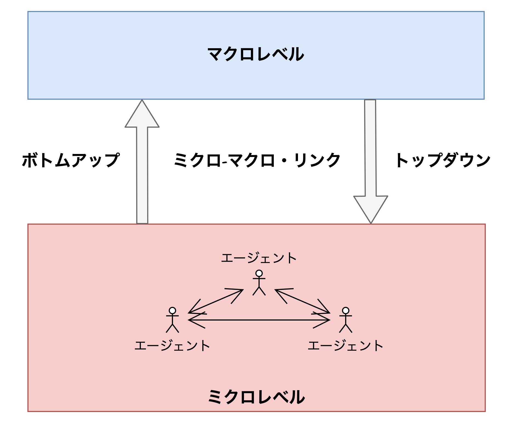

---
# You can also start simply with 'default'
theme: seriph
# random image from a curated Unsplash collection by Anthony
# like them? see https://unsplash.com/collections/94734566/slidev
background: https://cover.sli.dev
# some information about your slides (markdown enabled)
title: Welcome to Slidev
info: |
  ## Slidev Starter Template
  Presentation slides for developers.

  Learn more at [Sli.dev](https://sli.dev)
# apply unocss classes to the current slide
class: text-center
# https://sli.dev/features/drawing
drawings:
  persist: false
# slide transition: https://sli.dev/guide/animations.html#slide-transitions
transition: slide-left
# enable MDC Syntax: https://sli.dev/features/mdc
mdc: true

---

## 行動科学概論
 
# 社会科学におけるモデル入門

Agent Based Model (ABM)の紹介

### 呂沢宇

  Press Space for next page <carbon:arrow-right />

  <a href="https://github.com/lvzeyu/social_modeling_lecture" target="_blank" class="slidev-icon-btn">
    <carbon:logo-github />
  </a>

<!--
The last comment block of each slide will be treated as slide notes. It will be visible and editable in Presenter Mode along with the slide. [Read more in the docs](https://sli.dev/guide/syntax.html#notes)
-->

---
transition: slide-up
level: 2
---

# Agent Based Model (ABM)の基本概念

<v-clicks depth="2">

- エージェントベースモデル（Agent-Based Model, ABM）は、複雑なシステムを解析するための手法であり、**システム全体の振る舞いをエージェント個別の要素の行動や相互作用を通じてモデリング**する。
    - エージェントの行動ルールを定義し、ロレベル（エージェント単位）の行動が積み重なることで、マクロレベル（システム全体）の現象を創発させる手法である。
    - マクロレベルの現象の原因をミクロレベルのエージェントの行動にまで遡って分析するのに役立つ。
</v-clicks>

  

---
transition: slide-up
level: 2
---

# Agent Based Model (ABM)の基本概念

ABMの特徴

<v-clicks depth="1">

- **相互作用の構造**：ABM はエージェント間の相互作用から，どのような社会状態が帰結するのかを探求する
    - エージェントが行為を選択する際にどのエージェントを参照するのかということや，どのエージェントと実際にゲームを行うのかということは結果を左右する重要な要素である

- **エージェントの意思決定ルール**: ABM では，エージェントが自身の意思決定ルールに従って行為を選択する
    - 多くの場合，エージェントによって，その意思決定ルールが異なる．エージェントの意思決定ルールにどの程度多様性をもたせるのか，ということも結果を左右する

- **適応過程**: ABM では，多くの場合，エージェントが自身の行為の帰結や周囲のエージェントの影響により，その意思決定ルールを変更する

- **状態の再帰性**: $t$時点の全エージェントの行為が集積したものを$t$時点の社会状態と呼ぶとすれば，$t+1$時点の各エージェントの行為選択は，$t$時点の社会状態からも影響を受ける
    - 1 時点の社会状態の帰結ではなく，各エージェントと社会状態の再帰的な影響過程の長期な帰結を問う

</v-clicks>

<!--
ABMの特徴と主な着目点
-->

---
transition: slide-up
level: 2
---

# ABMの要素と構成

エージェント

<v-clicks depth="2">

- **エージェントの属性(properties)**
    - エージェントが持つ内部状態・特徴・個性を表す情報
    - エージェントがどう行動するか、どう相互作用するかを決める基盤となるもの

- 自然渋滞モデルにおけるエージェントの属性

| 属性名 | 説明 |
|:--------|:-----|
| 位置 (position) | 道路上の位置（空間座標） |
| 速度 (velocity) | 現在の走行速度 |
| 加速度 (acceleration) | 現在の加速度（速度の変化率） |
| 安全車間距離 (desired headway) | 他車との理想的な車間距離 |

</v-clicks>

<!--
ABMの構成要素について説明します
-->

---
transition: slide-up
level: 2
---

# ABMの要素と構成

エージェント

<v-clicks depth="1">

- **エージェントの行動(Actions)**
    - 各エージェントが自身の属性や、環境・他エージェントとの相互作用に基づいての振る舞い

- エージェントの行動では様々の種類がある
    - 移動行動: 空間上の位置を変える
    - 状態変化行動: 内部の属性を変化させる
    - 相互作用行動: 他のエージェントとの交流や影響のやりとり
    - 意思決定行動: 状況に応じた選択を行う

</v-clicks>

<!--
- 前の車との距離が十分なら 加速
- 距離が詰まってきたら 減速

- 車両は時間の経過とともに道路上を前進し、位置が更新される
- エージェントは自身の速度や加速度を逐次変化させます
- 「加速するか減速するか」という判断が、車間距離と理想速度との比較に基づいて決定されます
-->

---
transition: slide-up
level: 2
---

# ABMの要素と構成

エージェント

<v-clicks depth="1">

- エージェントの「属性（properties）」や「行動（actions）」を定義することによって、異なる種類のエージェント（heterogeneous agents）を設計・区別することができる
    - 異なる属性や行動ルールを持たせることで現実世界の多様なアクターを再現できる
        - 人々の社会経済的属性や価値観などは異なる
    - 異なる種類のエージェントに異なる機能や役割を割り当てることで、制度や役割構造をモデル化できる
        - 社会における異なる職業の人々は異なる役割を果たしている

- 多くのABMでは、現実の複雑性を再現するためにheterogeneous agentsが用いられている

</v-clicks>

<!--
ABMのAgentでは複数種類のエージェントを設定することが可能です
-->

---
transition: slide-up
level: 2
---

# ABMの要素と構成

環境

<v-clicks depth="2">

- ABMの環境は、エージェントが存在し、行動し、相互作用する空間である
    - 環境がもつ状態やルールが、エージェントの行動や相互作用に影響を与える
    - エージェントの行動が環境を変えることもある

- 環境は静的にも動的にも設計でき、空間・ネットワーク・属性ベースなど多様な形態を持つ
    - 空間型環境: 2次元や3次元のグリッドまたは現実の地図データに基づく空間にエージェントが存在する
        - [シェリングの分居モデル](https://www.netlogoweb.org/launch#https://www.netlogoweb.org/assets/modelslib/Sample%20Models/Social%20Science/Segregation.nlogo)
        - [Traffic Grid](https://ccl.northwestern.edu/netlogo/models/TrafficGrid)
    - ネットワーク型環境: 環境はノード（点）とエッジ（線）で構成されるネットワーク構造である
        - [Virus on a Network](https://www.netlogoweb.org/launch#https://www.netlogoweb.org/assets/modelslib/Sample%20Models/Networks/Virus%20on%20a%20Network.nlogo)
</v-clicks>

<!--
ネットワーク型環境は、エージェント・ベースド・モデル（ABM）において、エージェント間の相互作用を「関係構造」としてモデル化するための枠組みです。物理的な空間上の位置ではなく、**誰と誰がつながっているか（構造的な接続）**が、行動や情報の流れ、影響の伝播に重要な意味を持ちます。
-->

---
transition: slide-up
level: 2
---

# ABMの要素と構成

相互作用

| 相互作用の種類 | 説明 |
|:---|:---|
| エージェント－自己相互作用  | エージェントが自分自身の内部状態に基づいて行動や状態変化を行う|
| 環境－自己相互作用  | 環境が自律的に状態変化を起こす |
| エージェント－エージェント相互作用 | 異なるエージェント同士が影響を与え合い、行動や状態を変化させる|
| 環境－環境相互作用| 環境内の異なる要素同士が影響を及ぼし合い、環境構造や状態が変化する |
| エージェント－環境相互作用| エージェントが環境を変化させ、その変化した環境がまたエージェントにフィードバックを与える |

---
transition: slide-up
level: 2
---

# ABMの要素と構成

スケジュール（Schedule）
<v-clicks depth="2">

- ABMにおけるスケジュール（Schedule）は、エージェントや環境がいつ、どの順番で、どのように行動・更新するかを制御するルールやプロセスを指す
    - エージェントの状態更新や相互作用が「時間と順序」に依存するため、スケジューリングの設計はモデルの振る舞いに大きな影響を与える

- 同期型更新(Asynchronous Updates) vs. 非同期型更新(Synchronous Updates)
    - 全エージェントが現在の状態に基づき同時に行動を決定し、一斉に次の状態に更新する
        - 渋滞モデルの場合：すべての車（エージェント）が同時に、現在の状況（前の車との距離、速度）を見て、同時に移動する
    - エージェントが順番に行動し、行動後すぐに状態を更新する。他のエージェントの変化を見てから次のエージェントが行動する
        - 渋滞モデルの場合：1台ずつ順番に車が動く。次に動く車は、前の車の最新の位置を見ながら動く
</v-clicks>

---
transition: slide-up
level: 2
---

# ABMの表現と記述

ODDプロトコル

- ODDプロトコルは、ABMを体系的に記述・報告するための標準プロトコルとして提案された

| セクション | 項目 | 内容 |
|:---|:---|:---|
| Overview（概要） | Purpose（目的） | モデルの目的と、解決を目指す問いを説明する。 |
|  | Entities, State Variables, and Scales（主体・状態変数・尺度） | エージェント、環境、変数、時間・空間スケールを定義する。 |
|  | Process Overview and Scheduling（プロセス概要とスケジューリング） | 行動や状態更新がどの順序・タイミングで行われるかを概観する。 |

---
transition: slide-up
level: 2
---

# ABMの表現と記述

ODDプロトコル

| セクション | 項目 | 内容 |
|:---|:---|:---|
| 設計概念 | 基本原理 | モデルが依拠する理論やコンセプト |
|  | 適応 | エージェントが環境や経験に応じて行動を変更する仕組み|
|  | 目標 | エージェントの持つ目標や意図を説明 |
|  | 学習 | エージェントが学習によって行動戦略を変えるかどうかを説明 |
|  | 予測| エージェントが未来の状況を予測して行動を決定するかどうか |
|  | 感覚と知覚| エージェントが環境や他者からどの範囲で情報を得るか |
|  | 相互作用 | エージェント同士またはエージェントと環境の相互作用の形態|
|  | 確率性 | モデルに含まれる確率的要素やランダム性について説明する。 |
|  | 集団と停止条件 | エージェント集団やグループ化、モデルの終了条件 |
|  | 観測 | モデルから収集・分析されるデータや指標 |

---
transition: slide-up
level: 2
---

# ABMの表現と記述

ODDプロトコル

| セクション | 項目 | 内容 |
|:---|:---|:---|
| 詳細 | 初期化 | モデルの初期条件設定の方法 |
|  | 入力データ | モデルで使用する外部データがあれば、その内容と利用方法 |
|  | サブモデル | (もしあれば)各プロセスや行動ルールの具体的なアルゴリズムや数式 |

---
transition: slide-up
level: 2
---

# ABMの表現と記述

ODDプロトコル

| セクション | 項目 | 内容（自然渋滞モデルの場合） |
|:---|:---|:---|
| 概要 | 目的 | 外部障害なしで渋滞が自然発生するメカニズムを理解・再現する。 |
|  | 主体・状態変数・尺度 | エージェント：車両（位置、速度、加速度）。時間は離散ステップ、空間は一次元道路。 |
|  | プロセス概要とスケジューリング | 各ステップの開始時に行動順序を決め、決まった順番に従って、各車両が前方車両の現在の位置と速度を観察し、加速や減速を判断して即時に移動・状態更新を行う |
| 設計概念 | 基本原理 | 車間距離と安全運転原理に基づく個別行動の累積により、渋滞現象を創発させる。 |
|  | 適応 | 前方車両との距離に応じて、加速・減速を動的に切り替える。 |
|  | 目標 | 安全に走行しつつ、できるだけ高速で走行しようとする。 |
|  | 学習 | このモデルでは学習はない（単純な反応型）。 |
|  | 予測 | 前方車両の動きに即応するが、将来予測はしない。 |
|  | 感覚と知覚 | 前方車両との車間距離と相対速度を感知できる。 |
|  | 相互作用 | 前方車両との相対位置・速度に応じた行動変化（追従行動）。 |
|  | 確率性 | 加速度や減速度に小さなランダム変動（運転手のばらつき）を入れる場合がある。 |
|  | 集団と停止条件 | 車列全体が安定状態に到達するか、最大ステップに達したら停止。 |
|  | 観測 | 交通流量、平均速度、渋滞の発生頻度や波動のパターンを記録。 |
| 詳細 | 初期化 | 車両の総数、初期位置、初期速度、道路長、最大速度などのシミュレーション初期パラメータを設定する |
|  | 入力データ | 初期パラメータ |
|  | サブモデル | 加速規則、減速規則、安全車間距離ルール、速度上限ルールなどの具体的アルゴリズムを定義。 |

---
transition: slide-up
level: 2
---

# ABMの解析

階層的モデルの解析

<v-clicks depth="2">

- ABMをシミュレーションで実装するでは、いくつかの条件の下で実行したモデルの挙動を観察することである
    - 「どのような条件でどのような現象が発生するのか」：様々なパラメータを条件として制御し、モデルの出力を観察する
- 一つのシミュレーションは複数のパラメータセットによる試行で構成され、一つの試行を**シナリオ**と呼ぶ
    - 確率的な要素を用いる場合、同一のシナリオをシートが異なる乱数を用いて実行し、結果の統計的性質を確認することで各シナリオの結果を解釈する必要がある
- 同じシナリオ内で乱数のシードを変えて行う試行を**エピソート**と呼ぶ
- 一つのエピソードは複数の時間単位で構成され、その時間単位内で相互作用を行い行動や戦略をアップデータする
    - 時間単位を**ステップ**と呼ぶ

</v-clicks>

---
transition: slide-up
level: 2
---

# ABMの解析

階層的モデルの解析：エル・ファロル問題を例として

<v-clicks depth="2">

- [エル・ファロル問題demo](https://www.netlogoweb.org/launch#https://www.netlogoweb.org/assets/modelslib/IABM%20Textbook/chapter%203/El%20Farol%20Extensions/El%20Farol%20Extension%203.nlogo)
- シナリオの作成：許容混雑率、予測戦略の種類と数、履歴の長さ、初期条件(初期のバー利用率やエージェントの戦略割り当て)
- エピソートの解析： 確率的要素（例えばエージェントがランダムに新しい予測戦略を選ぶ、または過去の情報の変動）を含むため、同一シナリオでも異なる乱数シードを用いて複数回シミュレーションを行い、結果のばらつき（平均来店者数、混雑度の分布など）を統計的に解析する必要がある
- 一つのエピソードは、例えば週ごとに一回の意思決定とバーへの来店行動を繰り返す構成となる
    - 週ごとの意思決定サイクルはステップとなる
</v-clicks>

---
transition: slide-up
level: 2
---

# ABMの解析

モデルの検証
<v-clicks depth="2">

- モデル内部の理論的整合性
    - 構築するモデルが依拠する学問分野の先行知見を援用しつつ研究対象のモデル化として不自然な仮定を置いていないかなどを検討
- モデルとモデル外部との接合の妥当性
    - 得られた結果が理解しようとしている社会現象としてあり得るものなのか、意味のある知見を提供しているのかを検証
        - 「反直感的」結果とその説得性のバランスを注意深く検討することが求められる
    - ただし、モデルの志向性によって求められる検証の粒度が異なっている
- 感度分析:シミュレーションの結果は様々なパラメータに依存する
    - 得られた結果が特定のパラメータセットのみ観察されるのか、それぞれのパラメータの変化による結果の頑丈性を検証

</v-clicks>

---
transition: slide-up
level: 2
---

# まとめ

- ABMの実装は、エージェントの属性や行動、環境、相互作用、スケジュールの定義といった中心的な構成要素から成り立っている

- ABMを体系的に記述・報告するには、ODDプロトコルに基づくことが求められる
    - あるモデルを理解する際にも、ODDプロトコルにおいて提示される各項目を確認することが推奨される

-  ABMの解析は、多様なシナリオと繰り返し実行による統計的手法を用いて、モデルの妥当性と頑丈性を検証することが一般である

<v-clicks depth="2">

- **課題**: ODDプロトコルでエル・ファロルモデル(複数戦略リストを持つ場合)を記述・説明しなさい

</v-clicks>

