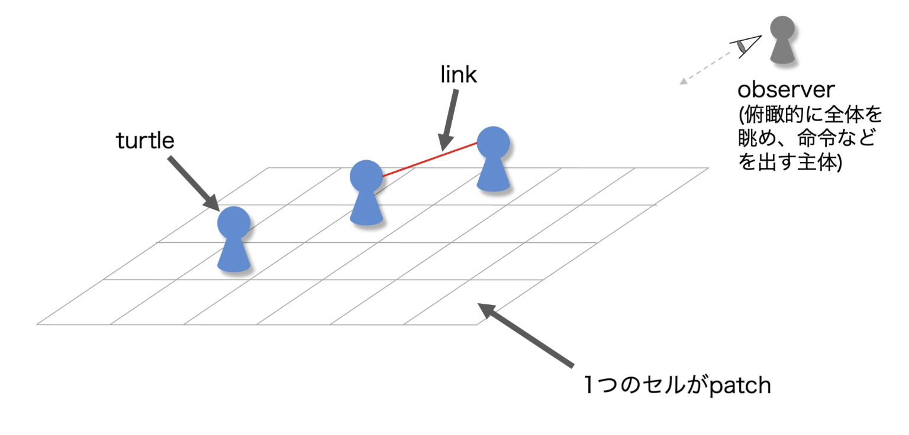

# NetLogo入門

東北大学文学研究科
計算人文社会学

**呂沢宇**   

行動科学概論　_社会科学におけるモデル入門_ <a href="https://lvzeyu.github.io/https:/github.com/lvzeyu/social_modeling_lecture" class="ns-c-iconlink"><mdi-open-in-new /></a>  


---
layout: two-cols-title
columns: is-7
---

::title::
# シミュレーションモデルを実装するツール

プログラミングベースのツール

::left::

- Python、Juliaなどのプログラミング言語を用いてシミュレーションモデルを実装することができる
    - 高い柔軟性と拡張性
- モデリングとシミュレーションの実装に支援するライブラリも多くある
    - ライブラリは、自分で毎回ゼロからすべてを実装するのではなく、あらかじめ用意された機能を呼び出して利用できる仕組みである。これにより、開発を効率化し、複雑な処理も比較的容易に実装できる
    - [Mesa](https://github.com/projectmesa/mesa)

::right::

```python {1|3-10|12-18|all}
from mesa import Agent, Model

class MoneyAgent(Agent):
    def __init__(self, model):
        super().__init__(model)
        self.wealth = 1

    def step(self):
        if self.wealth > 0:
            other = self.random.choice(
                list(self.model.agents))
            other.wealth += 1
            self.wealth -= 1

class MoneyModel(Model):
    def __init__(self, N):
        super().__init__()
        for _ in range(N):
            MoneyAgent(self)

    def step(self):
        self.agents.shuffle_do("step")
```


---
layout: two-cols-title
---

::title::
# シミュレーションモデルを実装するツール

グラフィックツール

::left::

- インタフェースで操作しながらモデルを構築・実行するツール
    - 直感的に扱いやすく
    - 実装の自由度や拡張性は、プログラミングベースのツールより制限される
- [Agent Sheets](http://www.agentsheets.com/)
- [VisualBots](https://github.com/nyje/visual-bots)
- [Repast Simphony](https://repast.github.io/repast_simphony.html)

::right::
 


<style scoped>
.two-cols-header {
  row-gap: 0.5rem !important;
}
</style>


---
class: flex justify-center items-center gap-20 px-40 text-xl
---

<div
  absolute text-3xl
  :class="$clicks < 1 ? 'text-black' : 'translate-y--18 scale-40 text-black/30'"
  transition duration-500 ease-in-out
>
  <span>コードを少し書きながらビジュアルも使えるツールでもある?</span>
</div>


<div flex flex-col items-center>
  <v-clicks>
    <div mt-12>
      <h1 flex flex-col items-center text="4xl!" style="text-align: center; line-height: 1.4;">
        <a href="https://ccl.northwestern.edu/netlogo/" target="_blank" rel="noopener noreferrer" class="flex items-center gap-3 no-underline">
          
          <span style="color: #000000;">NetLogo</span>
        </a>
      </h1>
    </div>
  </v-clicks>
</div>


---
transition: fade-out
---

# NetLogoの画面

<div class="flex justify-center">
  
</div>

---

# インターフェース画面


---
transition: fade-out
---

# NetLogoの動作の仕組み

<div class="grid grid-cols-2 gap-8 mt-8 items-center">
  <div class="flex justify-center">
    
  </div>

  <div>

  - インターフェース画面でボタンを押すことによって、プログラムが実行される
      - `setup` と`go` の2 つのボタンを作成することが規範的な作り方である
          - `setup` で初期化
          - `go` で実行
  - `go procedure` の中から別の`procedure`を呼び出して、より複雑な処理などを行うことになる
      - `ask`文を使って、エージェントに命令するという形式でプログラミングを行う設定を使うことは多い

  </div>
</div>


---

# NetLogoで構築されるモデルの基本要素

<div class="flex justify-center">
  
</div>

- **patch** がグリッド状に敷き詰められ，その上を **turtle** が動く
- **link** は turtle 同士をつなぐもの（有向リンクと無向リンクがある）
- **observer** は turtle, patch, link に命令を出すことができる


---
class: flex justify-center items-center gap-20 px-40 text-xl
---

<div
  absolute text-3xl
  :class="$clicks < 1 ? 'text-black' : 'translate-y--18 scale-60 text-black/30'"
  transition duration-500 ease-in-out
>
  <span>これからNetLogoの文法を説明する</span>
</div>
<div flex flex-col items-center>
  <div
    mt-12
    :class="$clicks < 1 ? 'opacity-0' : $clicks < 2 ? 'opacity-100' : 'translate-y--8 scale-60 opacity-30'"
    transition duration-500 ease-in-out
  >
    <h1 flex flex-col items-center text="4xl!" style="text-align: center; line-height: 1.4;">
      <span style="color: #000000;">一度にすべてを覚えるのは難しい....</span>
    </h1>
  </div>
  <v-click at="2">
    <div mt-6 text-center text-2xl text-gray-600>
      <span>💡 まずは聞き流し、その後は実践を通して理解していく</span>
    </div>
  </v-click>
</div>

---
layout: iframe-left
title: iframe Left Layout
url: https://www.netlogoweb.org/launch#https://www.netlogoweb.org/assets/modelslib/Sample%20Models/Social%20Science/Prisoner's%20Dilemma/Prisoner's%20Dilemma%20Basic.nlogox
scale: 0.5
class: my-cool-content-on-the-right
---


```ts {|1|8-10|13,21-29|15-17|3-19,22-29}{maxHeight:'500px'}
globals [partner-is-silent?]

to setup
  clear-all
  ;;Build the jail cell
  ask patches with [ count neighbors != 8 ] [
    set pcolor gray]

  ;;make the face visible
  create-turtles 1 [set color gray set size 30 set shape "face"]
  ;; set up the prisoner's dilemma
  ifelse partner-silence-known? [
    set partner-is-silent? partner-silent?
  ]
  [
    ;;if partner silence is not known, choose randomly whether or not he is silent.
    ifelse random 2 = 0
    [ set partner-is-silent? true ]
    [ set partner-is-silent? false ]
  ]
end

;;play the game, changing the face depending on the outcome.
to answer
  setup  ;;clears variables away so that setup doesn't need to be pressed every time.

  ;;next the four possible combinations of choices are dealt with.
  ;;the result corresponds to the tables in the interface and Info tabs.
  ;;first check to see if your partner was silent.
  ifelse partner-is-silent? [
      ;;now go through your two possible choices
      ifelse you-silent? [
      ask turtles [set shape "face silent"]
      user-message "You and your partner both remain silent.  You are sentenced to one year imprisonment."
    ] [
      ask turtles [set shape "face devious"]
      user-message "You confess and your partner remains silent. You go free."
    ]
  ]
  ;;your partner confessed.
  [
    ;;again go through your two possible choices
    ifelse you-silent? [
      ask turtles [set shape "face sucker" ]
      user-message "You remain silent, but your partner confesses.  You are sentenced to five years imprisonment."
    ] [
      ask turtles [set shape "face rational"]
      user-message "You and you partner both confess.  You are sentenced to three years imprisonment."
    ]
  ]
end
```


---
transition: fade-out
layout: two-cols-title
---

::title::
# Netlogoの基本文法

変数の代入と演算

::left::

<v-click at="1">

**`set` コマンドで変数に値を代入する**

- `x = 10` のような書き方はできない
- 変数の型（数値・文字列など）を宣言する必要はない
- 文字列は `"..."` で囲む

</v-click>

<v-click at="2">

**四則演算**

- `+ - * /` の前後に**半角スペース**が必要
- 論理演算子：`and`，`or`，`not`

</v-click>

::right::

```text {|1-3|5-8|10-13}
; 変数の代入
set x 10
set y "hogehoge"

; 四則演算
set x 10 + 5
set y 12 * 2 / 4 - 3
set z 10 mod 3

; 論理演算子
if (x > 5 and x < 20) [ ... ]
if (x < 0 or x > 100) [ ... ]
if (not (x = 0)) [ ... ]
```

</br>

<Admonition title="Info" color="teal-light" width="400px">
<span style="font-size: 1.3em;">`;` で始まる行は**コメント**です。NetLogoはその行を無視します。</span>
</Admonition>


---
transition: fade-out
layout: two-cols-title
---

::title::
# 変数の種類

変数の目的による使い分け

::left::

<v-click at="1">

**グローバル変数**（`globals`）
- モデル全体で共有される変数
- どのエージェント・手続きからでも参照・更新できる

</v-click>

<v-click at="2">

**エージェント変数**
- 各エージェントがそれぞれ独立した値を持つ

</v-click>

<v-click at="3">

**ローカル変数**（`let`）
- 特定な処理範囲内だけで有効な一時的な変数

</v-click>

::right::

```text {1|1,6|2-3,8,11|16}
globals [total-count]
turtles-own [energy]
patches-own [fertility]

to setup
  set total-count 100
  create-turtles total-count [
    set energy 50
  ]
  ask patches [
    set fertility random 10
  ]
end

to go
  let avg-energy mean [energy] of turtles
  ask turtles [
    set energy energy - 1
  ]
end
```


---
transition: fade-out
layout: two-cols-title
---

::title::
# Netlogoの基本文法

リストの操作

::left::

<v-click at="1">

**リストの作成**

- `(list ...)` でリストを作成
- インデックスアクセス（`x[0]`）は**不可**

</v-click>

<v-click at="2">

**要素の取り出し**

- `item (番号) (リスト)` で指定した位置の要素を取得

</v-click>

<v-click at="3">

**要素の置き換え**

- `replace-item (番号) (リスト) (値)` で指定位置の要素を更新

</v-click>

::right::

```text {|1-3|5-7|9-11}
; リストの作成
set y (list 1 2 3)
; => [1 2 3]

; 要素の取り出し
let first-item item 0 y
; => 1

; 要素の置き換え
set y replace-item 0 y 99
; => [99 2 3]
```


---
transition: fade-out
layout: two-cols-title
---

::title::
# ask 文

エージェントへの命令を定義する

::left::

<v-click at="1">

**turtle への命令**
- `turtles` — 現在存在する全ての turtle
- `turtle (番号)` — 指定した ID の turtle のみ

</v-click>

<v-click at="2">

**patch への命令**
- `patches` — 全ての patch
- `patch (x) (y)` — 指定した座標の patch のみ

</v-click>

<v-click at="3">

**link への命令**
- `links` — 全ての link
- `link (n1) (n2)` — 指定した2つの turtle 間の link のみ

</v-click>


::right::

```text {|1-6|8-12|14-19}
; turtle への命令
ask turtles [
  fd 1                   ; 1歩前進
  set color red          ; 色を赤に変更
]
ask turtle 4 [ rt 90 ]  ; id=4 の turtle のみ右折

; patch への命令
ask patches [
  set pcolor scale-color green fertility 0 10
                         ; fertility の値で緑の濃淡を設定
]
ask patch 0 0 [ set pcolor white ]  ; 原点の patch のみ白

; link への命令
ask links [
  set color gray         ; 全 link をグレーに
  set thickness 0.5      ; 太さを設定
]
ask link 0 1 [ set color red ]  ; turtle 0-1 間の link のみ赤
```


---
layout: two-cols-title
---

::title::
# 制御構文

::left::

<v-click at="1">

**if 文**

条件が真のときだけブロックを実行する

</v-click>

<v-click at="2">

**ifelse 文**

条件が真のときと偽のときで異なるブロックを実行する

</v-click>

<v-click at="3">

**while 文**

条件が真の場合、ブロックを繰り返し実行する

</v-click>

<Admonition title="ブロック [ ] とは" color="teal-light" width="400px">

`[ ]` で囲まれた部分が**ブロック**です。条件が成立したときに実行する命令をまとめて記述します。

</Admonition>

::right::


```text {|1-5|7-13|15-20}
ask turtles [
  if xcor > 0 [
    set color red
  ]
]

ask patches [
  ifelse pxcor > 0 [
    set pcolor blue
  ][
    set pcolor red
  ]
]

ask turtle 0 [
  while [any? other turtles-here][
    right random 360
    fd 1
  ]
]
```

---
layout: two-cols-title
---

::title::
# 制御構文

::left::

<v-click at="1">

**repeat 文**

指定した回数だけブロックを繰り返し実行する

</v-click>

<v-click at="2">

**foreach 文**

リストの各要素に対してブロックを順番に実行する

</v-click>

<v-click at="3">

**loop 文**

`stop` が呼ばれるまで無限にブロックを繰り返す

</v-click>


::right::

```text {|1-3|5-12|14-22}
ask turtle 0 [
  repeat 10 [fd 1]
]

set tlist (list turtle 0 turtle 1)
foreach tlist [
  x -> ask x [
    right random 360
    fd 1
  ]
]

loop [
  ask turtle 0 [
    if any? other turtles-here [
      right random 360
      fd 1
      stop
    ]
  ]
]
```

---
layout: two-cols-title
---

::title::
# procedureについて


> 他のプログラミング言語の「関数」に相当
::left::

<v-click at="1">

**`to`〜`end`：通常の procedure**

- 名前をつけた命令のまとまり
- `to 名前` で定義し、名前を書くだけで呼び出す

</v-click>

<v-click at="2">

**`to-report`〜`end`：戻り値がある procedure**

- 計算結果を返したいときに使う
- `report` で値を返す

</v-click>

<v-click at="3">

**引数をとる procedure**

- 名前の後ろに `[ 引数名 ]` を書く

</v-click>

::right::

```text {|1-7|9-14|16-20}
; 通常の procedure
to move-turtle
  right random 360
  fd 1
end

ask turtles [ move-turtle ]

; 戻り値がある procedure
to-report double [ x ]
  report x * 2
end

set y double 5  ; y = 10

; 引数をとる procedure
to color-turtle [ c ]
  set color c
end

ask turtles [ color-turtle red ]
```

---
layout: two-cols-title
---

::title::
# Netlogoで囚人的ジレンマモデルの実装

::left::

<v-click at="1">

- **変数の定義**

</v-click>

<v-click at="2">

- **エージェントの設定**
  - `create-turtles` でエージェントを生成・初期化

</v-click>

<v-click at="3">

- **手続きの定義**
  - `to`〜`end` で処理をまとめた手続きを定義
  - `setup` で初期化，`answer` でゲームを実行

</v-click>

<v-click at="4">

- **演算・論理演算子**

</v-click>

<v-click at="5">

- **制御構文**
  - `ifelse` で条件分岐し，パートナーの行動・自分の選択に応じて結果を切り替える

</v-click>

::right::

```ts {|1,13,18,19|6-7,10,33,36,44,47|3-21,24-51|6,17|12-19,29-51}{maxHeight:'550px'}
globals [partner-is-silent?]

to setup
  clear-all
  ;;Build the jail cell
  ask patches with [ count neighbors != 8 ] [
    set pcolor gray]

  ;;make the face visible
  create-turtles 1 [set color gray set size 30 set shape "face"]
  ;; set up the prisoner's dilemma
  ifelse partner-silence-known? [
    set partner-is-silent? partner-silent?
  ]
  [
    ;;if partner silence is not known, choose randomly whether or not he is silent.
    ifelse random 2 = 0
    [ set partner-is-silent? true ]
    [ set partner-is-silent? false ]
  ]
end

;;play the game, changing the face depending on the outcome.
to answer
  setup  ;;clears variables away so that setup doesn't need to be pressed every time.

  ;;next the four possible combinations of choices are dealt with.
  ;;the result corresponds to the tables in the interface and Info tabs.
  ;;first check to see if your partner was silent.
  ifelse partner-is-silent? [
      ;;now go through your two possible choices
      ifelse you-silent? [
      ask turtles [set shape "face silent"]
      user-message "You and your partner both remain silent.  You are sentenced to one year imprisonment."
    ] [
      ask turtles [set shape "face devious"]
      user-message "You confess and your partner remains silent. You go free."
    ]
  ]
  ;;your partner confessed.
  [
    ;;again go through your two possible choices
    ifelse you-silent? [
      ask turtles [set shape "face sucker" ]
      user-message "You remain silent, but your partner confesses.  You are sentenced to five years imprisonment."
    ] [
      ask turtles [set shape "face rational"]
      user-message "You and you partner both confess.  You are sentenced to three years imprisonment."
    ]
  ]
end
```


---

# よく使う命令

**エージェントの生成**

| 命令 | 説明 |
|------|------|
| `create-turtles (数値)` | 指定数の turtle を作成 |
| `hatch` | turtle から新しい turtle を生み出す（親の変数値を受け継ぐ） |

**乱数**

| 命令 | 説明 |
|------|------|
| `random (数値)` | 0 以上・指定値未満の整数をランダムに返す |
| `random-float (数値)` | 0 以上・指定値未満のランダムな浮動小数点数を返す |


---

# よく使う命令


**エージェント集合の操作**

| 命令 | 説明 |
|------|------|
| `any?` | エージェント集合が空でなければ `true` を返す |
| `with` | 条件を満たすエージェントだけを返す |
| `of` | エージェントが持つ変数の値を返す：`[pcolor] of patch 3 5` |
| `one-of` | エージェント集合からランダムに1つ返す |
| `max-one-of` | 変数が最大のエージェントを1つ返す |
| `min-one-of` | 変数が最小のエージェントを1つ返す |
| `other` | 自分自身を除いたエージェント集合を返す |


---

# よく使う命令

**patchに対する操作**

| 命令 | 説明 |
|------|------|
| `neighbors4` | ノイマン近傍の4つの patch を返す |
| `neighbors` | ムーア近傍の8つの patch を返す |
| `in-radius (数値)` | 指定距離以下にある patch（または turtle）の集合を返す |
| `patch-here` | turtle がいる patch を返す |
| `patch-at (dx) (dy)` | 対象の turtle から見て相対座標 (dx, dy) の位置にある patch を返す |


---
layout: two-cols-title
columns: is-6
---

::title::
# El Farolモデルのコード解説

変数の宣言

::left::

<v-click at="1">

**グローバル変数** `globals`

- `attendance`：現在のバーの出席者数
- `history`：過去の出席者数のリスト
- `home-patches` / `bar-patches`：自宅・バーのパッチ集合
- `crowded-patch`：「CROWDED」ラベルを表示するパッチ

</v-click>

<v-click at="2">

**エージェント固有の変数** `turtles-own`

- `strategies`：各エージェントが持つ戦略のリスト
- `best-strategy`：現在最も予測精度の高い戦略
- `attend?`：バーに行くかどうかの意思決定
- `prediction`：今週の出席者数の予測値

</v-click>

::right::

<<< @/elfarol.bash{|1-7|9-14}{maxHeight:'420px'}

---
layout: two-cols-title
columns: is-6
---

::title::
# El Farolモデルのコード解説

`setup` 手続き

::left::

<v-click at="1">

**環境の初期化**

- 左下と右上でパッチを色分けし，自宅エリア（緑）とバーエリア（青）を区別する

</v-click>

<v-click at="2">

**出席履歴の初期化**

- エージェントが戦略を評価するには過去データが必要なので，ランダムな履歴を `memory-size * 2` 分用意する

</v-click>

<v-click at="3">

**エージェントの作成**

- `population` スライダーの値だけ turtle を作成する
- 各エージェントにランダムな戦略を `number-strategies` 個割り当てる

</v-click>

::right::

<<< @/elfarol.bash{|20-26|28-34|43-52}{maxHeight:'420px'}

---
layout: two-cols-title
columns: is-6
---

::title::
# El Farolモデルのコード解説

`go` 手続き

::left::

<v-click at="1">

**意思決定**

- 各エージェントがベスト戦略を使って出席者数を予測する
- 予測値が `overcrowding-threshold` 以下なら `attend? = true`

</v-click>

<v-click at="2">

**移動**

- `attend?` が `true` ならバーへ，`false` なら自宅へ移動する

</v-click>

<v-click at="3">

**出席集計と履歴の更新**

- バーにいる turtle を数えて `attendance` を更新する
- 最新の出席数をリストの先頭に追加し，最も古いものを削除する（`fput` / `but-last`）
- 各エージェントが戦略の評価を更新する

</v-click>

::right::

<<< @/elfarol.bash{|63-66|68-73|75-86}{maxHeight:'420px'}

---
layout: two-cols-title
columns: is-6
---

::title::
# El Farolモデルのコード解説

戦略の評価と予測

::left::

<v-click at="1">

**`update-strategies`**

- 全戦略について，過去 `memory-size` 週の予測誤差の合計を計算する
- 誤差が最小の戦略を `best-strategy` として採用する

</v-click>

<v-click at="2">

**`predict-attendance`**

- 戦略は `memory-size + 1` 個の重みのリスト
- 予測式：$\hat{p}(t) = 100 \cdot c + \sum_{i=1}^{N} a_i \cdot x(t-i)$
  - $c$：定数項（リストの先頭）
  - $a_i$：過去 $i$ 週前の出席への重み

</v-click>

::right::

<<< @/elfarol.bash{|95-111|127-133}{maxHeight:'420px'}


---

# インターフェース画面での変数の設定

- 上部の「Add Widgt」→「スライダー」を選択し，好きな場所でクリックして作成
    - チューザー（chooser）やインプットボックスも同様に作成可能
- グローバル変数名・最小値・最大値などを入力して設定
- ソースコードを編集せずに，シミュレーション実行時に変数を変更できる

<Admonition title="練習課題" color="teal-light" width="800px">

<span style="font-size: 1.3em;">Model LibraryからEl Farolモデルを開く</span>

<span style="font-size: 1.3em;">`population`というパラメータで人数を制御するようにコードを修正する</span>

```text
create-turtles 100 → create-turtles population
```

<span style="font-size: 1.3em;">全体の人数を制御する`population`というパラメータを制御するスライダーを追加する</span>

</Admonition>

---

# 可視化の追加

- 「Add Widgt」→「プロット」を選択し，インターフェース画面に配置
- ダイアログでグラフの名前・軸のラベルを入力
-  **プロットペン**：何の値をプロットするかのコマンドを記述

<Admonition title="練習課題" color="teal-light" width="800px">

<span style="font-size: 1.3em;">出席率（attendance / population × 100）の時間変化を可視化するグラフを追加する</span>

- **Name**：`Attendance Rate`
- **Y axis label**：`%`・**Y min/max**：`0` / `100`
- プロットペンの **Update command**：

```text
plot (attendance / population * 100)
```

</Admonition>


---

# コマンドセンター


- インターフェース画面の**下部**にある入力欄
- コマンドを直接入力して，エージェントに命令を送ることができる

| コマンド | 説明 |
|---|---|
| `repeat 20 [ go ]` | `go` を20回繰り返して実行する |
| `show attendance` | 現在の出席者数をコンソールに表示する |
| `show count turtles-on bar-patches` | バーにいる turtle の数を表示する |
| `show count turtles with [attend?]` | 出席意図を持つ turtle の数を表示する |


---

# モデルの拡張


<v-click at="1">

**① `tolerance`：個体差の導入**

- 基本モデルでは全エージェントが同じ `overcrowding-threshold` を使って意思決定する
- 現実には「少し混んでいても行く」「混む前に避ける」など個人差がある
- `tolerance-sd` スライダーで個体差の大きさを制御する

</v-click>

<v-click at="2">

**② `crowded-count`：混雑頻度指標の追加**

- バーが混雑状態（`attendance > overcrowding-threshold`）になった tick の累計回数
- シミュレーション全体を通じてどれだけ混雑が発生したかを把握できる

</v-click>


---
layout: two-cols-title
columns: is-6
---

::title::
# モデルの拡張

コードの修正①：変数の追加と `setup`

::left::

<v-click at="1">

**変数の追加**

- `globals` に `crowded-count` を追加
- `turtles-own` に `tolerance` を追加

</v-click>

<v-click at="2">

**`setup` の修正**

- `crowded-count` を 0 に初期化
- 各エージェントに `tolerance` を設定
  - `overcrowding-threshold` を中心に標準偏差 `tolerance-sd` の正規分布からサンプリング

</v-click>

::right::

<<< @/elfarol_extend.bash{|1-16|37,55-56}{maxHeight:'450px'}

---
layout: two-cols-title
columns: is-6
---

::title::
# モデルの拡張

コードの修正②：`go` の修正

::left::

<v-click at="1">

**意思決定の変更**

- `overcrowding-threshold`（全員共通）→ 個体の `tolerance` に変更

</v-click>

<v-click at="2">

**指標の更新**

- 混雑時に `crowded-count` を +1

</v-click>

::right::

<<< @/elfarol_extend.bash{|71|85}{maxHeight:'450px'}

---

#  インターフェースの修正

<v-click at="1">

**スライダーの追加**：`tolerance-sd`
- min: `0`　max: `30`　default: `10`

</v-click>

<v-click at="2">

**モニターの追加**: 「Add Widget」→「Monitor」

| Reporter | ラベル |
|---|---|
| `crowded-count` | Crowded Count |

</v-click>


---

# まとめ

- NetLogoは自然現象や社会現象をシミュレーションするためのプログラム可能なモデリング環境
    - GUIベースでシミュレーションを操作できる
    - 直感的なプログラミングが可能
- 豊富なモデルライブラリ: 経済学、生物学、物理学、社会科学など、様々な分野のサンプルモデル（Models Library）が最初から内蔵されており、すぐに試すことができる
- NetLogo の欠点
    - エージェント数を増やすと実行速度が遅くなる．特にワールドのサイズを広げた場合にその影響が顕著となる
    - 手続き指向言語に共通の欠点として，コードの行数が増えてくると次第に難しい面が出てくる
    - NetLogo 言語は独自言語であるため他の汎用言語で書かれたシステムとの連携が難しい