---
# You can also start simply with 'default'
theme: seriph
# random image from a curated Unsplash collection by Anthony
# like them? see https://unsplash.com/collections/94734566/slidev
background: https://cover.sli.dev
# some information about your slides (markdown enabled)
title: Welcome to Slidev
info: |
  ## Slidev Starter Template
  Presentation slides for developers.

  Learn more at [Sli.dev](https://sli.dev)
# apply unocss classes to the current slide
class: text-center
# https://sli.dev/features/drawing
drawings:
  persist: false
# slide transition: https://sli.dev/guide/animations.html#slide-transitions
transition: slide-left
# enable MDC Syntax: https://sli.dev/features/mdc
mdc: true

---

## 行動科学概論
 
# 社会科学におけるモデル入門

シェリングの分居モデル

### 呂沢宇

  Press Space for next page <carbon:arrow-right />

  <a href="https://github.com/lvzeyu/social_modeling_lecture" target="_blank" class="slidev-icon-btn">
    <carbon:logo-github />
  </a>

<!--
The last comment block of each slide will be treated as slide notes. It will be visible and editable in Presenter Mode along with the slide. [Read more in the docs](https://sli.dev/guide/syntax.html#notes)
-->

---
transition: slide-up
level: 2
---

# 研究背景

都市におけるセグリゲーション(人種)

  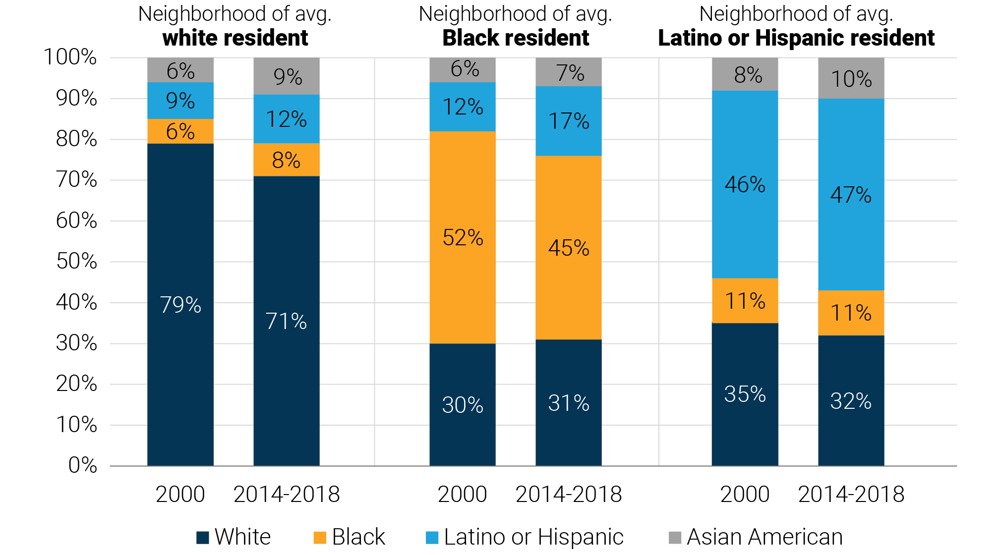

---
transition: slide-up
level: 2
---

# 研究背景

都市におけるセグリゲーション(人種)

  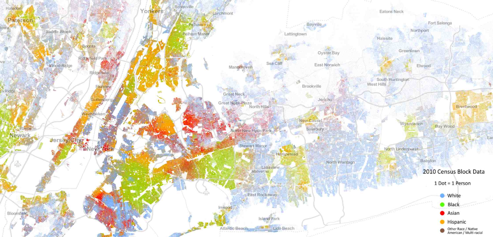

---
transition: slide-up
level: 2
---

# 研究背景

都市におけるセグリゲーション(収入)

  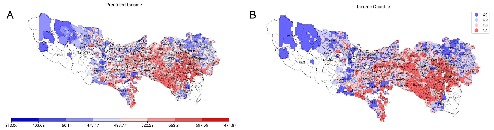

---
transition: slide-up
level: 2
---

# 研究背景

都市におけるセグリゲーション(職業)

  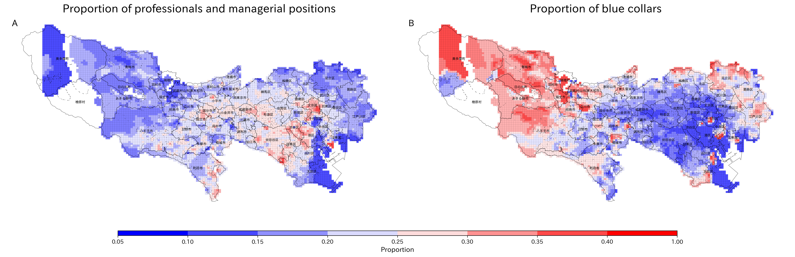

---
transition: slide-up
level: 2
---

# 研究背景

近隣効果

<v-clicks depth="2">

- 近隣効果とは、個人の行動や成長が、居住している地域の環境や他の住民の特徴によって左右されることを論じている

- セグリゲーションによって貧困層が特定の地域に集中すると、教育・就労・治安などの社会資源へのアクセスが制限され、次世代にわたって機会の格差が再生産される

- セグリゲーションによって特定の地区が「危険」「貧困層の巣窟」といった負のイメージでスティグマ化されると、住民は社会的・心理的に疎外され、外部との交流や社会参加が抑制される傾向がある
- [Opportunity Atlas](https://www.opportunityatlas.org/)

</v-clicks>

  

---
transition: slide-up
level: 2
---

# 研究関心

<v-clicks depth="2">

セグリゲーション（居住分離）がどのように形成されるのか

- ❓トップダウン型セグリゲーション：差別的な政策 
    - 政府や行政による制度的・法的な差別、たとえば特定人種や民族に対する住宅差別、ゾーニング規制、公共施設の分離などにより、人為的に居住の分断が生み出されるケース

- ⭐️**ボトムアップ型セグリゲーション：個人の居住選択の積み重ね**
    - セグリゲーションは、明示的な差別政策がなくても、住民の選択行動の集積によって自然に発生する

</v-clicks>

<!--
- 江戸時代の身分制度士農工商（しのうこうしょう）制度、特定地域に強制的に居住させられた。
- 在日朝鮮人に対する住宅政策:公営住宅への入居が制限された時期があり、結果として貧困地域に集住
-->
---
transition: slide-up
level: 2
---

# 研究関心

  

<v-clicks depth="2">

- ボトムアップ型セグリゲーション：個人の居住選択の積み重ね 
    - 社会構造が個人の行動をどのように規定する❓
    - どのような個人の行動の累積によるセグリゲーションに導く❓

 </v-clicks>

---
transition: slide-up
level: 2
---

# モデルの構築

理論前提

<v-clicks depth="2">

- 人間の同質性選好（homophily）
    - Homophily Principle: 個人が自分と似た属性（年齢、性別、教育、価値観など）を持つ他者と関係を築きやすい [(McPherson et al., 2001)](https://www.annualreviews.org/content/journals/10.1146/annurev.soc.27.1.415)
        - 価値観や生活様式が共有できる相手を選ぶことで心理的安定性、信頼性、コミュニケーション効率の向上

- 人間の同質性選好は「どのような人々が周囲に住んでいるか」という居住環境の選好にも強く反映される
    - 「自分と似た人が多く住む地域に居住したい」という選好が生まれる
    
> 孟母三遷: 中国、戦国時代の思想家孟子の母が、孟子の教育のために三度も住居を遷ったとの故事をいう。孟母は初め墓地の近くに居を定めたが、孟子が葬式のまねばかりするので、市場の近くに転居した。すると今度は商売人のまねをして遊ぶので、ここもわが子のためにふさわしい所ではないと、学校のそばに居を移すと、孟子が喜々として礼儀作法のまねをするようになったので、孟母はこここそがわが子のいるべき所だといって、ついにここに住居を定めたと伝える。
 </v-clicks>

<!--
孟母三遷(もうぼさんせん)

- 最初の住まい：墓地の近く → 孟子が葬式ごっこをして遊ぶ → 環境がふさわしくないとして引越し

- 二番目の住まい：市場の近く → 孟子が商人の真似をする → またもや移転

- 最終的な住まい：学問所の近く → 孟子が礼儀作法を真似るように → ここで定住

孟母は、周囲の社会的環境（死者の儀式、商業的価値観、学問と礼節）を比較し、自ら望ましいとする社会的・文化的環境（学問）を選び他の価値観を持つ集団との空間的分離を行った。

これは、今日の都市部における学区選択や教育熱心な家庭の集住と同じメカニズムです。
-->

---
transition: slide-up
level: 2
---

# モデルの構築

シェリングモデルの概要

<v-clicks depth="2">

- **目的**：白人と黒人という2種類の人種が2次元格子状にランダムに配置され、自由に移動できるようにした場合に、住み分けが生じるかどうかを明らかにすることを目的とする
- **要素**: エージェントは住人と呼ばれる。$N$人からなる集団は$r \times r$の2次元格子状に配置される (ただし、$r \times r> N$)
    - 同じ場所に配置できる住人は1人である
    - 各住人は固有番号であるIDと人種(白人と黒人)、配置された場所番号を持つ
  
</v-clicks>

  

<!--
黒人（こくじん）
-->

---
transition: slide-up
level: 2
---

# モデルの構築

シェリングモデルの概要

<v-clicks depth="2">

- **過程**
    - シミュレーションの最初に全ての住人は初期化される
        - ID、人種、場所が割り当てられる
    - シミュレーションでは、複数ラウンドが実行される
        - 各ラウンドにおいて、すべての住人は、満足度関数を計算し、その結果による次の行動を決める
  
    
  
</v-clicks>

  

---
transition: slide-up
level: 2
---

# モデルの構築

シェリングモデルの概要

<v-clicks depth="2">

- **設計**
    - 満足度関数は、近隣に配置されている住人によって決める
        - 近隣はムーア近傍(8近傍)とする
        - 同じ人種である近隣住人数が、閾値$F$より大きい場合は$1$を出力し、それ以外は$0$を出力する
            - $0$であった場合は、その時点で住人が配置されていない場所のリストからランダムに選ばれる場所に移動する
    - 観察指標は、 シミュレーション終了時における2次元格子空間に配置された人種の分布で計算する
  
</v-clicks>

  

---
transition: slide-up
level: 2
---

# モデルの構築

エージェントの設定

  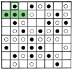

- $F=0.35$
- 同じ人種である近隣住人の比率$\frac{3}{3}=1$ので、現状を維持
    - 住人がある地域しかカウントされない

  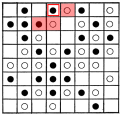

- $F=0.35$
- 同じ人種である近隣住人の比率$\frac{1}{3}$
    - $\frac{1}{3}<0.35$ので、引越しをする

---
transition: slide-up
level: 2
---

# モデルの構築

エージェントの設定

  

  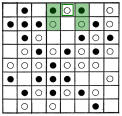

  計算を続ける

---
transition: slide-up
level: 2
---

# モデルの構築

エージェントの設定

<v-clicks depth="2">

- $f<F$ という条件満たす住民は「不満である😕」
- 「不満である😕」住人が配置されていない場所のリストからランダムに選ばれる場所に移動する

- 移動の順番
   - ランダム順序：不満足なエージェントをランダムな順番で選び、順に移動させる
   - 固定順序：エージェントを固定された順番（たとえば行番号やID順）で選び、移動させる

</v-clicks>

  

---
transition: slide-up
level: 2
---

# モデルの構築

シミュレーションの結果

<v-clicks depth="2">

- 全ての住民は「満足している😀」状態になっている
    - これ以上移動が生じないので、シミュレーションを終了する　
- 白人居住地域と黒人居住地域の住み分けが生じてしまうことを明らかにした
</v-clicks>

  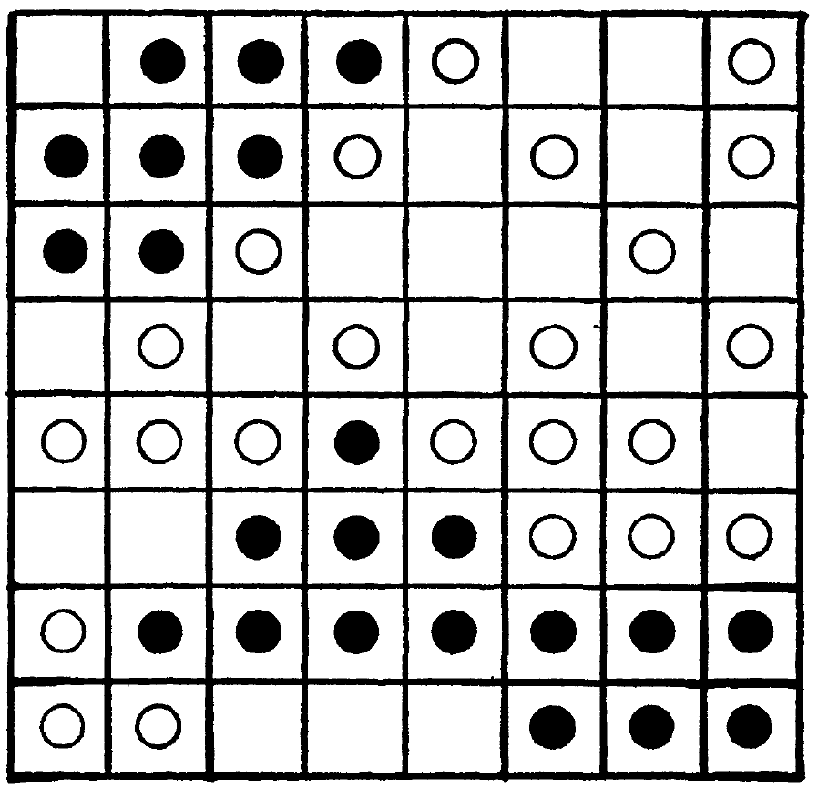

---
transition: slide-up
level: 2
---

# シミュレーションの初期設定

シェリングの分居モデルの初期設定パラメータ

  

<v-clicks depth="2">
 
- [Demo](http://nifty.stanford.edu/2014/mccown-schelling-model-segregation/)
- グリッドサイズ
    -  各マスには「赤エージェント」「青エージェント」「空きマス」のいずれかが配置される
- エージェントの割合 
</v-clicks>

  

---
transition: slide-up
level: 2
---

# シミュレーションの実行

シェリングの分居モデルの初期設定パラメータ

  

<v-clicks depth="2">
 
- [Demo](http://nifty.stanford.edu/2014/mccown-schelling-model-segregation/)
- 空きマスの割合
- 類似性しきい値（Similar threshold）
    - 各エージェントは、自分の近隣に少なくとも何%が自分と同じ属性であれば満足と感じる
    - しきい値が低いのは、「高い寛容性」を意味している
</v-clicks>

  

---
transition: slide-up
level: 2
---

# シミュレーションの実行

シミュレーションの結果比較：寛容性が高いの場合

<v-clicks depth="2">
 
- $F=0.2$
- 全てのエージェント短時間で「満足」な状態になる
- 目立ったセグリゲーションは見られない　

</v-clicks>

  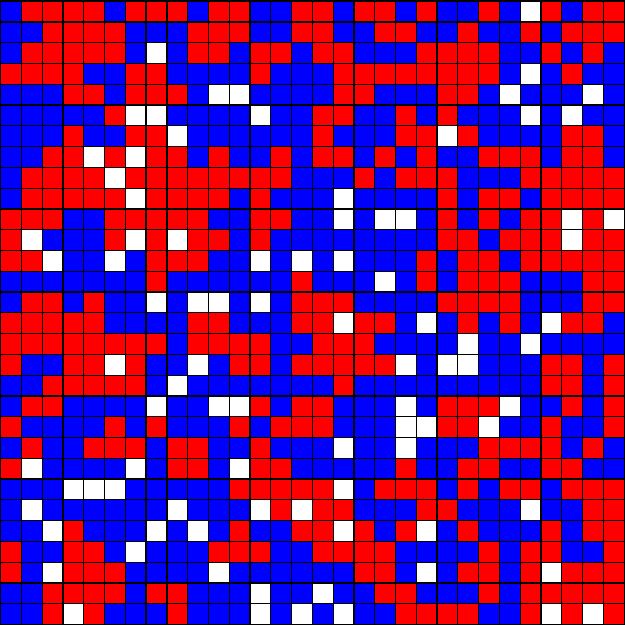

---
transition: slide-up
level: 2
---

# シミュレーションの実行

シミュレーションの結果比較：寛容性が低いの場合

<v-clicks depth="2">
 
- $F=0.6$
- 明確なセグリゲーションが見られた
- 安定の状態までにある程度のiterationsが必要とする
- 空きマスがクラスター間の境界を形成している

</v-clicks>

  

---
transition: slide-up
level: 2
---

# モデルの構築

エージェントの設定

  

  F=0.4

  

  F=0.5

---
transition: slide-up
level: 2
---

# シェリングの分居モデルの解析

Moran's I

$$\Large I = \frac{M \sum_i \sum_j w_{i,j} (x_i - \bar x) (x_j - \bar x)}{(\sum_i \sum_j w_{i,j}) \sum_i (x_i-\bar x)^2}$$

- $M$: 空きマスは含まず、エージェントが存在するセルの総数
- $w_{i,j}$: $i$ と $j$ の間の隣接関係を表す隣接行列
  - $w_{i,j} = 1$ のとき、セル $i$ はセル $j$ の近傍である
- $x_i$: セル $i$ におけるエージェントの「色（属性）」を表す値
  - $x_i = 0$ のとき、そのセルには青のエージェントであり、$x_i = 1$ のとき、そのセルには赤のエージェントである
- $\bar x$: $x_i$ の平均値、すなわち全エージェントのうち青のエージェントの割合（比率）
- Moran’s Iという空間自己相関指標
    - 空間上に分布する値（この場合はエージェントの属性）が、隣接関係においてどの程度類似しているか（空間自己相関）を測定する

<!--
この統計量は、同じ属性を持つエージェントがどの程度空間的に集まって配置されているか、つまり空間的なクラスターの強さを示します。

地点iと j の空間的な重み（例：隣接していれば1、そうでなければ0）
-->

---
transition: slide-up
level: 2
---

# シェリングの分居モデルの解析

Moran's I

モランの I を$\Large I = \frac{M C}{W \sigma}$のような形で再定義すると

$$C = \sum_i \sum_j w_{i,j} (x_i - \bar x) (x_j - \bar x)$$
$$W = \sum_i \sum_j w_{i,j}$$
$$\sigma =  \sum_i (x_i-\bar x)^2$$

- セル（エージェントが存在する場所）をループ処理することで、逐次的に $C$、$W$、$\sigma$ を計算できます

<!--
- $C$：共分散項（空間的な類似度の総和）
    - 各セル $i$ とその隣接セル $j$ の間で、色（属性）値の偏差の積を計算します。
    - $x_i - \bar{x}$ は、セル $i$ の属性が平均からどれだけ離れているかを示します。
    - $w_{i,j}$ によって、隣接しているセルのペアのみをカウントします。

- $W$：重みの総和（隣接関係の全数）
    - 全てのセルのペアに対して、隣接している（$w_{i,j}=1$）ものの数を合計します。
    - モデル全体の隣接関係の数を表します。

- $\sigma$：全体の分散（偏差の平方和）
    - 各エージェントの属性値（0または1）と全体平均 $\bar{x}$ の二乗誤差を合計したもの。
    - データ全体のばらつきを表します。

-->

---
transition: slide-up
level: 2
---

# シェリングの分居モデルの解析

Moran's I の例（1）

<v-clicks depth="2">

- $3\times3$ の格子状のセル
    - 9 セル

- エージェントの配置

  - $x_i = 1$：4つの赤のエージェントが入っている

  - $x_i = 0$：4つの青のエージェントが入っている

  - $\bar x = 0.5$

  - $M=8$: 8つのセルにエージェントが配置されており、残り1つは空きセル

</v-clicks>

  

---
transition: slide-up
---

# Moran's I の例（2）

<v-clicks>

- セル1（青, $x_1=0$）を評価
- $\sigma$への寄与：
  $$\sigma \leftarrow \sigma + (x_1 - \bar x)^2 = (0 - 0.5)^2 = 0.25$$
- 隣接セルは2つ（空きセル除く）

</v-clicks>

  

---
transition: slide-up
---

# Moran's I の例（3）

<v-clicks>

- 隣接セル2（赤）との共分散 $C$ の寄与：
  $$C \leftarrow C + w_{1,2}(x_1 - \bar x)(x_2 - \bar x)$$
  $$C \leftarrow C + 1(0 - 0.5)(1 - 0.5) = -0.25$$
- 異なる属性の隣接ペアは $C$ を減らす（$I$ 減少）

</v-clicks>

  

---
transition: slide-up
---

# Moran's I の例（4）

<v-clicks>

- セル5は空きセル → $C$ には寄与しない  
（空きセルとの関係は無視）

</v-clicks>

  

---
transition: slide-up
---

# Moran's I の例（5）

<v-clicks>

- セル4（青, $x_4=0$）との共分散：
  $$C \leftarrow C + w_{1,4}(x_1 - \bar x)(x_4 - \bar x)$$
  $$C \leftarrow C + 1(0 - 0.5)(0 - 0.5) = +0.25$$
- 同じ属性同士は $I$ を高める

</v-clicks>

  

---
transition: slide-up
---

# Moran's I の例（6）

<v-clicks>

- セル2（赤, $x_2 = 1$）の処理：
- $\sigma$ への寄与：
  $$(1 - 0.5)^2 = 0.25$$
- 隣接セル数：4 
- $C$ の寄与：
  $$C \leftarrow C + 0.25 + 0.25 - 0.25 - 0.25 = 0$$

</v-clicks>

  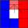

---
transition: slide-up
---

# Moran's I の例（7）: 最終計算

<v-clicks>

- 全体の集計：

  $$M = 8$$  
  $$C = 16 \times 0.25 - 8 \times 0.25 = 2$$  
  $$W = 24$$  
  $$\sigma = 0.25 \times 8 = 2$$

- よって Moran's I は：

  $$\Large I = \frac{M C}{W \sigma} = \frac{8 \times 2}{24 \times 2} = 0.33$$

</v-clicks>

  

---
transition: slide-up
level: 2
---

# Moran's I の最大値の例

<v-clicks>

- 完全に分離された配置において、モランの I は最大値（1）になる  
- 各項の値：

  $$M = 8$$  
  $$C = 24 \times 0.25 = 6$$  
  $$W = 24$$  
  $$\sigma = 0.25 \times 8 = 2$$  

- よって：

  $$\Large I = \frac{M C}{W \sigma} = \frac{8 \times 6}{24 \times 2} = 1$$

</v-clicks>

  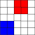

---
transition: slide-up
level: 2
---

# 寛容度とセグリゲーションの関係

<v-clicks>

- 複数回のシミュレーション後に収束した I のボックスプロット  
    - 寛容度の閾値$F$が低いとき、Moran's I は低くなる 
    - $F > 0.2$ から、グリゲーションの程度は急激的に高くなる
    - $F > 0.33$ のとき、明確なセグリゲーションが観察される

</v-clicks>

  

- シミュレーションのパラメータを変更し、異なるシナリオにおけるセグリゲーションの動態を分析する
    - セグリゲーションの発生条件を特定できる
        - ここでは寛容度の閾値$F$に注目したが、空きマスの割合、エージェントの構成比率などのパラメータに対する検証も考えられる
    - 政策介入の効果を評価する

---
transition: slide-up
level: 2
---

# シェリングモデルの一般化：セルオートマトン（Cellular Automaton, CA）

セルオートマトンの基本構造

<v-clicks depth="2">

- Cellular Automataとは、簡単な局所ルールに基づいて、格子状のセルの状態が時間とともに変化していく離散的な計算モデルである  
    - **セルの集合**：1次元（線状）、2次元（格子状）、または3次元の空間にセルが並んでいる ($i=1,...,L$)
    - **セルの状態**: 離散的な値を取る $\theta_{i} (t) \in \{\theta_1,\dots, \theta_n \}$
    - **近傍（neighborhood）**：$\beta_{i}(t)\in\{\beta_1,\ldots,\beta_m\}$ 
    - **相互作用**：各セルは周囲一定範囲内（近傍）のセルと局所的な相互作用を行う
    - **更新ルール**:次期のセルの状態は自身と近傍のセルの今期の状態によって決められる 
        - $$\theta_{i}(t+1)=\mathbf{F}\left[\underline{\theta}(t),\underline{\beta}(t)\right]$$ 

</v-clicks>

---
transition: slide-up
level: 2
---

# シェリングモデルの一般化：セルオートマトン（Cellular Automaton, CA）

セル空間と近傍

- セル空間と近傍の構造は多様である

  

---
transition: slide-up
level: 2
---

# シェリングモデルの一般化：セルオートマトン（Cellular Automaton, CA）

応用例

- 自然現象や社会現象のモデリングに広く用いられます

    - [Heat Diffusion](https://www.netlogoweb.org/launch#https://www.netlogoweb.org/assets/modelslib/Sample%20Models/Chemistry%20&%20Physics/Materials%20Science/Heat%20Diffusion.nlogo)

    - [森林火災モデル（Forest Fire Model）](https://ccl.northwestern.edu/netlogo/models/Fire)
        - セルの状態：木（T）、燃えている（F）、空（E）
        - 木は隣接する火から燃え移る・燃えたセルは空になる

---
transition: slide-up
level: 2
---

# シェリングモデルの拡張

空間構造の拡張

- 従来の格子状の空間から、より現実的な空間表現に拡張する

  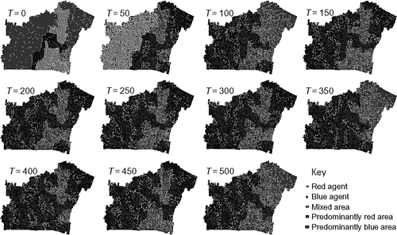
  

    <a href="https://www.tandfonline.com/doi/full/10.1080/13658810903569572#d1e230" target="_blank">
      Crooks（2010）
    </a>
  

  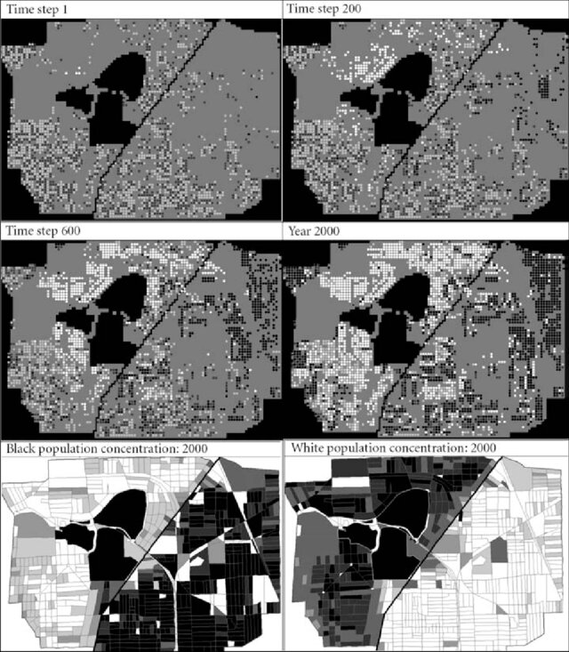
  

    <a href="https://www.tandfonline.com/doi/full/10.1080/13658810903569572#d1e230" target="_blank">
      Yin（2009）
    </a>
  

---
transition: slide-up
level: 2
---

# シェリングモデルの拡張

Agent属性と選好の多様化

- 従来の2グループ（例：白人と黒人）から、より多様なグループ構成に拡張する

  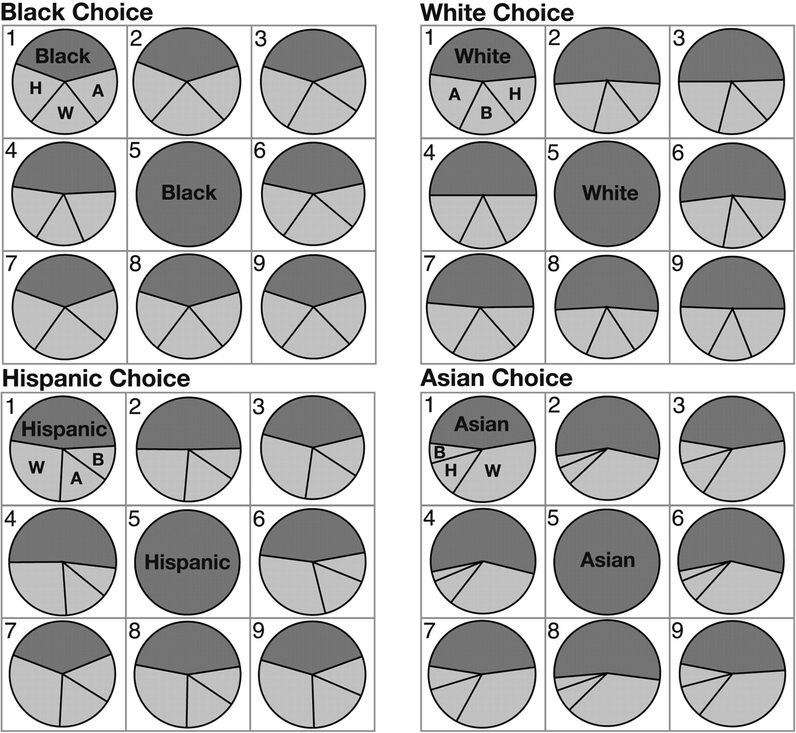

  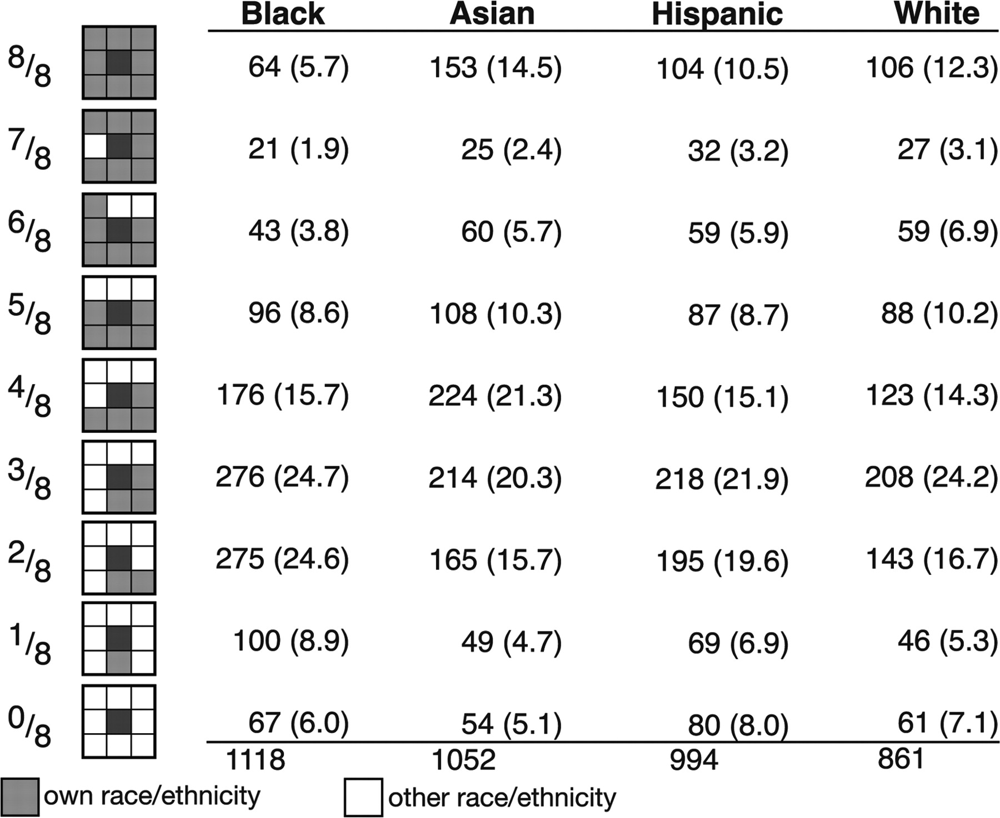
    

    <a href="https://www.pnas.org/doi/full/10.1073/pnas.0708155105" target="_blank">
      Clark & Fossett (2008)
    </a>
  

---
transition: slide-up
level: 2
---

# シェリングモデルの拡張

近隣関係

- エージェントが近隣と見なす範囲を「視野」という概念として定義し、セグリゲーションに対する影響を検討する

<a href="https://journals.sagepub.com/doi/abs/10.1080/0042098032000146849" target="_blank">Laurie and Jaggi（2003)</a>

  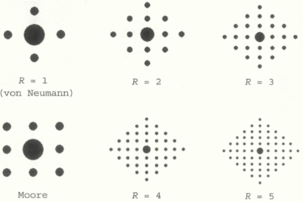

- 川や道路などの自然的・人工的な障壁がエージェントの移動や近隣の認識に与える影響をモデル化  
  <a href="https://www.tandfonline.com/doi/full/10.1080/13658810903569572#d1e230" target="_blank">Crooks (2010)</a>

- 実際の行政区画に基づく近隣を定義  
  <a href="https://www.tandfonline.com/doi/full/10.1080/13658810903569572#d1e230" target="_blank">Yin (2009)</a>

 

