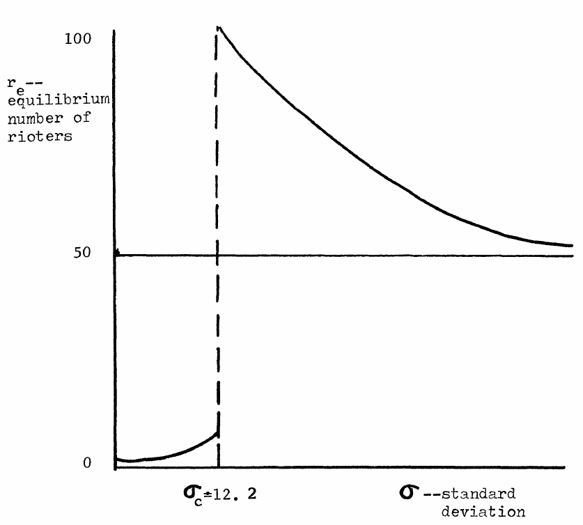

---
# You can also start simply with 'default'
theme: seriph
# random image from a curated Unsplash collection by Anthony
# like them? see https://unsplash.com/collections/94734566/slidev
background: https://cover.sli.dev
# some information about your slides (markdown enabled)
title: Welcome to Slidev
info: |
  ## Slidev Starter Template
  Presentation slides for developers.

  Learn more at [Sli.dev](https://sli.dev)
# apply unocss classes to the current slide
class: text-center
# https://sli.dev/features/drawing
drawings:
  persist: false
# slide transition: https://sli.dev/guide/animations.html#slide-transitions
transition: slide-left
# enable MDC Syntax: https://sli.dev/features/mdc
mdc: true

---

## 行動科学概論
 
# 社会科学におけるモデル入門

Opinion Dynamics: Granovetter's threshold model

### 呂沢宇

  Press Space for next page <carbon:arrow-right />

  <a href="https://github.com/lvzeyu/social_modeling_lecture" target="_blank" class="slidev-icon-btn">
    <carbon:logo-github />
  </a>

<!--
The last comment block of each slide will be treated as slide notes. It will be visible and editable in Presenter Mode along with the slide. [Read more in the docs](https://sli.dev/guide/syntax.html#notes)
-->

---
transition: slide-up
level: 2
---

# 背景

More Is Different (量が多いことは質の違いを生む)

<v-clicks depth="2">

- 「More Is Different」は１９７２年にAndersonがScience誌に発表した[エッセイ](https://solid-mater.com/entry/more)のタイトルである。

> P. W. Anderson．１９７７年のノーベル物理学賞受賞者にして、最も創造性の高い物理学者と呼ばれるなど、二十世紀を象徴する理論物理学者である

- 還元主義(Reductionist)という考え方
    - この世界の全てはある基本法則に基づいて決められている
        - 物理学の基本的な粒子(素粒子)を理解すれば、物理、化学や生物学全ての現象が自動的に理解可能になる

- 還元主義に対する批判
    - スケールの違いによる本質的な違い: 「量的な差異（More）」は単なる量の増加ではなく、「質的な差異（Different）」をもたらす
    - 創発（Emergence）の重要性: 個々の要素の単純な相互作用が、より高次のレベルで「質的に新しい現象」を生み出すことがあり、それらは要素の性質から直接的に予測・説明できない
</v-clicks>

---
transition: slide-up
level: 2
---

# 背景

Complexity Science (複雑系科学)

<v-clicks depth="2">

- 自然や社会の様々な現象や構造には，多数の分散した構成要素の相互作用によって継続的に発展する「複雑系」としての性質がある
    - 多数の小さな要素とそれを含む大きな要素の関係に現れる「**創発**」
    - 系の時間的発展の中に現れる「**自己組織化**」
    - 現象の数理モデル・計算モデルを創り計算機内で動かして理解する「**構成的手法**」を用いて，複雑系を理解する
        - 要素間の相互作用がシステムの挙動を決めるため、個々の要素だけを見ても全体の挙動を完全には予測できない
</v-clicks>

  

---
transition: slide-up
level: 2
---

# 背景

複雑系としての人間社会

<v-clicks depth="2">

- 社会科学が対象とする複雑現象には非線形な相互作用が存在し，系全体として創発的な振舞いを示す
- Interaction-induced collective behavior: 相互作用の強さやパターンによって、個々の行動の単純な総和とは異なる「集団レベルの現象」が創発する
    - 自然渋滞モデル；個々の車の小さなブレーキや速度調整が積み重なることで、渋滞パターンが発生する
    - Schelling's model: 個々のエージェントのわずかな非寛容さが相互作用を繰り返すうちに、都市やコミュニティ全体の大規模なセグリゲーションを生む。
- Diversity-induced collective behavior: 個々人の属性や性質の「ばらつき（多様性）」が存在することで、全体としてのマクロな挙動が創発される
    - **Granovetter's threshold model**: 個々人の属性（意見や閾値）の差による、社会運動や流行が発生しやすくなる現象を説明
</v-clicks>

---
transition: slide-up
level: 2
---

# Threshold model

単純な意思決定から見る集団的行動

<v-clicks depth="3">

デモや抗議運動などに参加することを例で考えなさい
- 個人が単純な二値的（binary）的な意思決定を行う：「デモに参加する」／「デモに参加しない」
    - 社会的影響（Social Influence）：個人の態度や行動が、他者からの影響によって変化する（説得、同調、服従など）
- 各個人の持つ「閾値（threshold）」という概念が導入される
    - 「自分以外に何人以上の人がデモに参加していれば、自分も参加する」という基準

</v-clicks>

  

---
transition: slide-up
level: 2
---

# Threshold model

Diversity-induced collective behavior

<v-clicks depth="3">

- 研究関心：人々の選好（＝閾値）の分布が集団行動にどのように影響する
    -  個々人の選好を知っていても、直接的には集団全体の振る舞いを予測できないはず
        - 一人ひとりの選好を単純に合計するではなく、他者の行動との相互作用を通じて非線形的に影響している
    - 「代表的な平均的個人（mean member）」の特性だけではなく、集団内の異質性（heterogeneity）や多様性（diversity）がどのように全体の行動に影響を与えるかを把握する

</v-clicks>

---
transition: slide-up
level: 2
---

# Threshold model

モデルの仮定

<v-clicks depth="3">

集団行動への参加決定は、コストと利得という二つの要素によって決められる

- 参加に伴うコスト
    - デモへの参加による逮捕・拘束のリスク
    - 時間や経済的なコスト

- 参加に伴う利得
    - デモ成功による制度的変化

</v-clicks>

---
transition: slide-up
level: 2
---

# Threshold model

モデルの仮定

  <!-- 左側のテキスト部分 -->
  

    <v-clicks>
      <ul>
        <li><strong>Net benefit = 利得（Benefit）− コスト（Cost）</strong></li>
        <li>個人が集団行動に参加するかどうかは、Net benefit によって決まる。
          <ul>
            <li><code>Net benefit &gt; 0</code> の場合、個人は行動に参加する。</li>
            <li><code>Net benefit ≤ 0</code> の場合、個人は行動に参加しない。</li>
          </ul>
        </li>
      </ul>
    </v-clicks>
  

  <!-- 右側の画像部分 -->
  

    
  

---
transition: slide-up
level: 2
---

# Threshold model

モデルの動き

<v-clicks depth="3">

- エージェント数：100人  
- 閾値（threshold）は 0〜99 の一様分布（整数）  
- 最初のエージェントが行動を開始し、それをトリガーに次々と参加  
- 各ステップで1人ずつ行動に参加し、最終的に全員が参加する  

</v-clicks>

  

カスケード(cascade): 階段状に水が流れ落ちていく滝のように、ある個人または少数の個体の行動や選択の影響が連鎖的に他者へと広がっていく現象

---
transition: slide-up
level: 2
---

# Threshold model

モデルの動き

<v-clicks depth="3">

- 基本設定はバージョン1と同じ  
- ただし、閾値が $1$ と $3$ のエージェントが $2$ に変更された  
- 最初のエージェントは行動を開始するが、他の誰も続かず終了  
    - 一部のエージェントの閾値が少し高くといった小さい変更だけで、連鎖がが途中で止まってしまった
</v-clicks>

  

<v-clicks depth="3">

- カスケードを生み出すには、十分な数の低閾値エージェントが必要
    - 行動が広がるか否かは、平均的な傾向ではなく、「どこに低閾値の人がいるか（分布の構造）」に強く依存する　→　マイクロな条件の重要性
</v-clicks>

---
transition: slide-up
level: 2
---

# Threshold model

閾値の分布

<v-clicks depth="3">

- $r(t)$ は時点 $t$ におけるアクティブなエージェント数
    - 例えば、デモに参加している人の数
     - $r(0)$：初期の「先導者（instigator）」の数

- $F(x)$ は閾値の累積分布関数を表す
  $$
  F(x) = P(\Theta_i < x)
  $$
    - 潜在的参加者を表す

- シミュレーションの均衡状態：
  $$
  r_e = F(r_e)
  $$  

</v-clicks>

  

<!--
- 横軸: 行動に参加している人の割合（例: デモに参加している人の割合）
- 縦軸（y軸）: 閾値がx以下の人の割合、つまり「今の参加率で参加する人の割合」→ その割合を見て「自分も行動に参加しよう」と判断する人の割合（つまり潜在的参加者）
- 曲線：累積分布関数F(x)は、各値x 以下の閾値を持つ人の割合を表します。
    - 
- F(x)が急激に上昇する箇所では、「ちょっと参加者が増えるだけで参加したがる人が一気に増える」
    - 初期の参加者（インスティゲーター）の役割が非常に重要
- 参加率と実際に参加する人の割合が一致する点が均衡点になります
    - この点では、参加する人の割合と、行動しようとする人の割合が一致しています。したがって、これ以上参加者は変化しません。これが**システムの安定状態（equilibrium）**です。
-->

---
transition: slide-up
level: 2
---

# Threshold model

閾値の分布

<v-clicks depth="3">

- 仮定：閾値は平均 $\mu$、標準偏差 $\sigma$ の正規分布に従う 
    - エージェント数は常に100人、$\mu = 25$ で設定される
- $r_e$：平衡時のアクティブなエージェント数  

</v-clicks>

  

---
transition: slide-up
level: 2
---

# Threshold model

閾値の分布

<v-clicks depth="3">

- 臨界値より小さいの際には、ほとんどの人が「25人くらいが行動しないと、自分は動かない」と思って、閾値が非常に低い人がほとんど存在しなくなるるため、誰も続かない
    - 標準偏差が小さいため、「5人でも行動する」「10人でも行動する」という極端に閾値の低い人がほぼ存在しない
    - 集団があまりに均質すぎると、誰も最初にリスクをとらず、変化が起きない

</v-clicks>

  

  

---
transition: slide-up
level: 2
---

# Threshold model

閾値の分布

<v-clicks depth="3">

- 臨界値に近いの場合、閾値分布がちょうどよい多様性を持つため、少数のインスティゲーターの行動が、低い閾値を持つエージェントを引き込み、次々と参加者が増えていくことで、カスケードが発生する

- 臨界値に等しいの場合は、社会全体に行動が拡大し、100人全員が最終的に行動に参加

</v-clicks>

  

  

---
transition: slide-up
level: 2
---

# Threshold model

閾値の分布

<v-clicks depth="3">

- 臨界値より大きいの場合、閾値のばらつきが大きくなりすぎる。
    - 非常に低い閾値の人（たとえば「2人でも行動する」）と非常に高い閾値の人（たとえば「90人以上が行動しないと自分は動かない」）が混在

- 初期の参加者は一部の人を動かすが、それが途中で途切れやすい

</v-clicks>

  

---
transition: slide-up
level: 2
---

# Threshold model

閾値の分布

<v-clicks depth="3">

- 多様性の重要性:適度な多様性があることで、集合的行動が広がる
    - 平均閾値が同じでも、分布が違えば集団行動は全く異なる

- 転換点の特定
    - 特定な臨界値を境に、劇的な変化が起こりうる

- [Demo](https://rf.mokslasplius.lt/granovetters-threshold-model/)
</v-clicks>

  

---
transition: slide-up
level: 2
---

# Threshold model

閾値モデルの拡張

- Granovetter（1978）の閾値モデルでは、「各個人は、他の全員の行動を見て、それに応じて自分の行動を決める」という完全情報・完全接続の社会を想定している

- 局所ネットワークにおける閾値モデルの適用
    - 各個人は、社会全体の行動率ではなく、自分の「局所的な近隣（近くの人々）」の中での行動率に応じて行動する([Centola & Macy 2007](https://www.journals.uchicago.edu/doi/10.1086/521848);[Siegel 2009](https://onlinelibrary.wiley.com/doi/full/10.1111/j.1540-5907.2008.00361.x);[Watts 2002](https://www.pnas.org/doi/10.1073/pnas.082090499))
    

---
transition: slide-up
level: 2
---

# Threshold model

閾値モデルの拡張

- エージェントの観察範囲は、ネットワーク構造によって決まる ([Siegel 2009](https://onlinelibrary.wiley.com/doi/full/10.1111/j.1540-5907.2008.00361.x))

  

---
transition: slide-up
level: 2
---

# Threshold model

閾値モデルの拡張

- 局所ネットワークの（同質性）特徴は、集合的行動の結果を大きく左右する([Mustafa Yavaş & Gönenç Yücel 2014](https://journals.sagepub.com/doi/10.1177/0894439313512464))

  

  

---
transition: slide-up
level: 2
---

# Threshold model

閾値モデルの応用

- 閾値モデルは、様々のコンテイション(contagion)に関する社会現象の説明に用いられている
    - 社会運動・抗議行動
    - 技術革新・製品普及　([Valente 1996](https://www.sciencedirect.com/science/article/pii/0378873395002561))
    - 政策受容([GILARDI & WASSERFALLEN, 2019](https://ejpr.onlinelibrary.wiley.com/doi/full/10.1111/1475-6765.12326))
    - 誤情報の伝播([Törnberg, 2018](https://journals.plos.org/plosone/article?id=10.1371/journal.pone.0203958))

---
transition: slide-up
level: 2
---

# Threshold model

閾値モデルの応用

- **閾値モデルは転換点（tipping point）の重要性を示した**；一定の割合以上の少数派が存在すれば、一見安定しているように見える社会的規範でもコンテイションを通じて覆される可能性がある
    - 性別役割に対する社会的期待
    - ゴミ分類という規範の受容
    - 禁煙活動
    - 流行語の普及

---
transition: slide-up
level: 2
---

# Threshold model

閾値モデルの応用

[Centola et al., (2018)](https://www.science.org/doi/full/10.1126/science.aas8827): 転換点（tipping point）という示唆に基づく実証研究
- 問題関心：社会的規範の転換がどの時点で起こるかを実験で再現・検証しよう

- 実験設計
    - 参加者グループに写真を提示
        - ある人物の写真を見せて、その人物の「名前」を決めてもらう
        - 複数ラウンドを通して話し合いを行い、グループ内で共通の名前（=社会的合意）を形成させる
    - 異なる意見を持つ「confederates」を投入
        - 合意が形成されたあと、一貫して「違う名前」を主張するconfederatesをグループに加える
    - インセンティブは「協調すること」のみ
        - お金や正解の有無はなく、できるだけ他人と同じ名前を答えることが望ましいというルールだけが与えられる(社会的影響の要因)

---
transition: slide-up
level: 2
---

# Threshold model

閾値モデルの応用

- 協力者の割合が10～20%程度では、影響は限定的で、多数派の意見は維持される傾向
- 協力者（少数派）の割合が約25%に達すると、それまで形成されていた多数派の合意が崩れ始める
    - 最終的には少数派が提示した新しい名前が、グループ全体の新たな合意になる

- 「粘り強い少数派からの変化」は閾値モデルによる提示する理論的な示唆だけでなく実験でも実証可能であると示した

  

