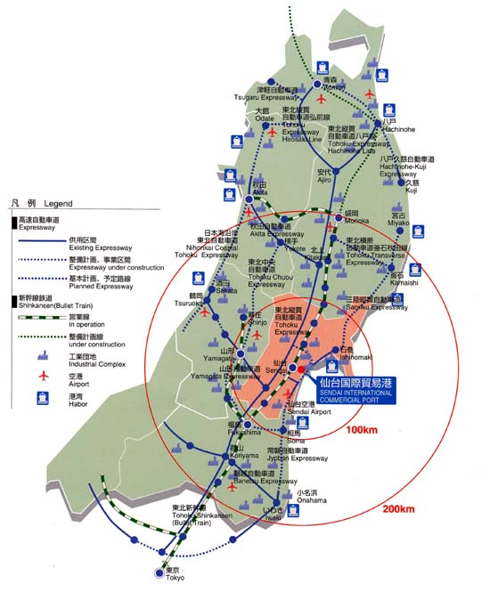
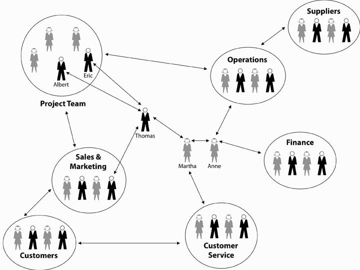
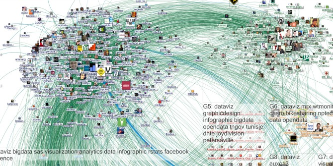
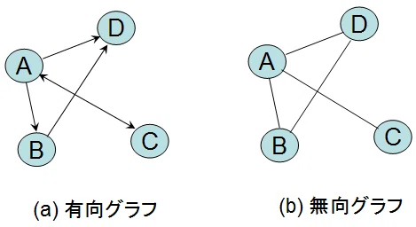
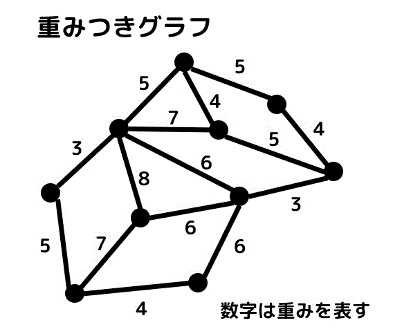
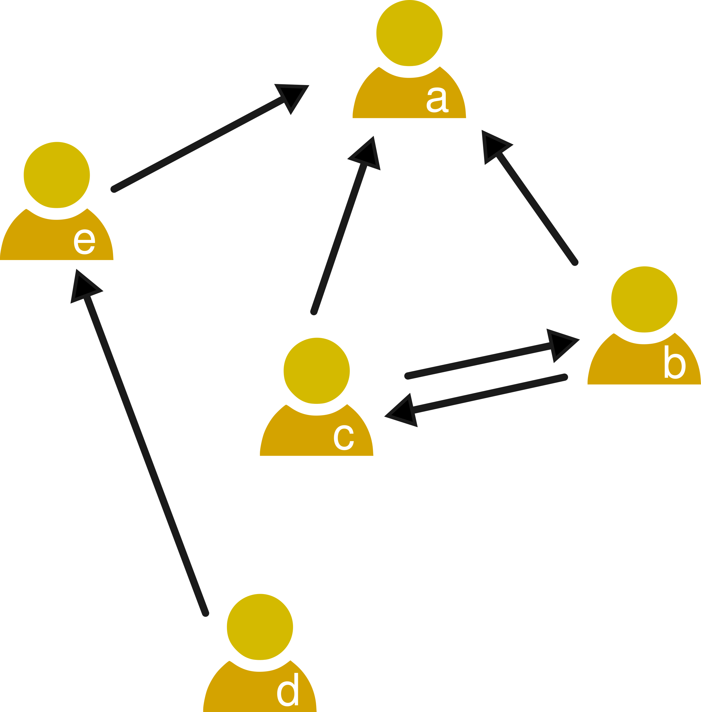
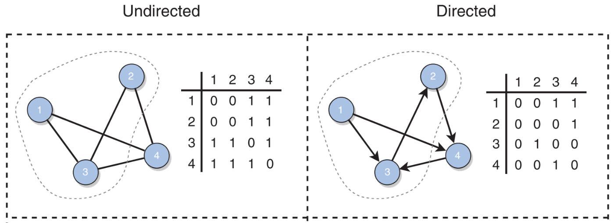
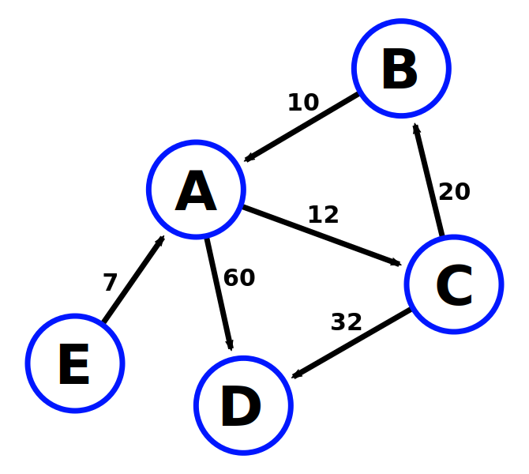

---
# You can also start simply with 'default'
theme: seriph
# random image from a curated Unsplash collection by Anthony
# like them? see https://unsplash.com/collections/94734566/slidev
background: https://cover.sli.dev
# some information about your slides (markdown enabled)
title: Welcome to Slidev
info: |
  ## Slidev Starter Template
  Presentation slides for developers.

  Learn more at [Sli.dev](https://sli.dev)
# apply unocss classes to the current slide
class: text-center
# https://sli.dev/features/drawing
drawings:
  persist: false
# slide transition: https://sli.dev/guide/animations.html#slide-transitions
transition: slide-left
# enable MDC Syntax: https://sli.dev/features/mdc
mdc: true

---

## 行動科学概論
 
# 社会科学におけるモデル入門

ネットワークの概要

### 呂沢宇

  Press Space for next page <carbon:arrow-right />

  <a href="https://github.com/lvzeyu/social_modeling_lecture" target="_blank" class="slidev-icon-btn">
    <carbon:logo-github />
  </a>

<!--
The last comment block of each slide will be treated as slide notes. It will be visible and editable in Presenter Mode along with the slide. [Read more in the docs](https://sli.dev/guide/syntax.html#notes)
-->

---
transition: slide-up
level: 2
---

# ネットワークの紹介

ネットワーク

<v-clicks depth="2">

- ネットワークとは？

> 相互に接続された、または相互に関係する連なり、グループ、システム

  

  

> ネットワークとは、ノードと呼ばれる相互接続された実体と、エッジと呼ばれる、それらを接続するもの集合を表現したもの

</v-clicks>

---
transition: slide-up
level: 2
---

# ネットワークの紹介

社会ネットワーク

<v-clicks depth="2">

- 社会ネットワークとは、社会を構成する個人、組織、情報、物資などの「要素」が、相互に何らかの「関係性」を持ってつながっている構造のことである。
    - ノード（点）:個人や組織などのアクター（人や集団）
    - エッジ（線）:アクター間の関係（友情、協力、信頼、影響力など）

</v-clicks>

  

  

---
transition: slide-up
level: 2
---

# ネットワークの紹介

ネットワーク科学

<v-clicks depth="2">

> 現代社会では、テキスト・画像・音声・動画といった非構造化データが膨大に生成されている

- ネットワークは、単純なものから複雑なものまで汎用的な形式で表現するための手法である
    - 異なる種類のデータを同一の処理手法によって扱うことができるように
</v-clicks>

| データの種類       | ネットワークへの変換方法                       | 
|------------------------|-----------------------------------------------|
| 学術論文・引用関係      | 論文をノード、引用関係をエッジにする           | 
| GPS移動履歴・接触記録   | 人をノード、接触があった時間帯にエッジを引く   | 
| メールログ・組織構造    | 人をノード、メールの送受信をエッジにする       | 
| 商品購入履歴・商品カテゴリ | ユーザーと商品をノードにして二部ネットワーク化 | 

---
transition: slide-up
level: 2
---

# ネットワークの要素

基本的な定義

<v-clicks depth="2">

> ネットワークとは、ノードと呼ばれる相互接続された実体と、エッジと呼ばれる、それらを接続するもの集合を表現したもの
- ネットワーク関係する異なる分野では、しばしば独自の専門用語を用いている
    - ネットワークをグラフ(graph)と呼ぶ
    - ノードをバーテックス(vertex)と呼ぶ
    - エッジをリンク(link)と呼ぶ

- ネットワークは、ノードの総数$N$とエッジの総数$L$によって特徴つけられる
   - $N$システムを構成する個々の要素の数を表すため、ネットワークのサイズと呼ぶ
</v-clicks>

---
transition: slide-up
level: 2
---

# ネットワークの要素

基本的な定義

<v-clicks depth="2">

- エッジには様々種類があり、それによってネットワークが定義される

    - 有向ネットワーク: ノード間の関係に方向性があるネットワーク。
        - SNSのフォロー関係：AがBをフォローしていても、BがAをフォローしているとは限らない
    - 無向ネットワーク:ノード間の関係に方向性がないネットワーク
        - 電話の通話履歴

</v-clicks>

  

---
transition: slide-up
level: 2
---

# ネットワークの要素

基本的な定義

<v-clicks depth="2">

- エッジには様々種類があり、それによってネットワークが定義される

    - 重みなしネットワーク: 各エッジが単に「つながっているかどうか」だけを示し、関係の強弱は表さないネットワーク
    - 重み付きネットワーク:各エッジに「強さ」や「回数」「距離」などの数値的な重み（weight）が付加されたネットワーク
        - 連絡頻度ネットワーク：AとBの間のエッジに、やりとりしたメール数

</v-clicks>

  

---
transition: slide-up
level: 2
---

# ネットワークの記述

<v-clicks>

- グラフ（ネットワーク）は、タプル $G = (n, m)$ で表される  
  - $n$ は頂点（ノード）の集合  
  - $m \subseteq n \times n$ は辺（リンク）の集合  
  - $n \times n$ はデカルト積（すべての可能なリンクの集合）

- 辺は順序対 $(i, j)$ として表され、これはノード $i$ からノード $j$ へのリンクを意味する。図の例は次のように表される：  
  - $n = \{a, b, c, d, e\}$  
  - $m = \{(b, a), (c, a), (e, a), (d, e), (c, b), (b, c)\}$
</v-clicks>

  

---
transition: slide-up
level: 2
---

# ネットワークの記述

隣接行列(Adjacency Matrix)

<v-clicks>

- 数学形式でネットワークを記述するためには、$N \times N$の隣接行列で、各要素は対応する行や列でインデックス付けされたノード間のリンクを表す

- ノード $j$ からノード $i$ へリンクがある場合
   - $A_{ij}=1$
- ノード $i$ とノード $j$ の間にリンクがない場合
   - $A_{ij}=0$
</v-clicks>

$$
A_{ij} =
\begin{bmatrix}
A_{11} & A_{12} & A_{13} & A_{14} \\\\
A_{21} & A_{22} & A_{23} & A_{24} \\\\
A_{31} & A_{32} & A_{33} & A_{34} \\\\
A_{41} & A_{42} & A_{43} & A_{44}
\end{bmatrix}
$$

---
transition: slide-up
level: 2
---

# ネットワークの記述

隣接行列(Adjacency Matrix)

  

---
transition: slide-up
level: 2
---

# ネットワークの記述

隣接行列(Adjacency Matrix)

  

  

---
transition: slide-up
level: 2
---

# ネットワークの基本統計量

<v-clicks depth="2">

- ネットワーク科学で扱うネットワークは数万規模に及ぶことが多い
    - 一つひとつのノードとリンクを確認することは難しい
    - ネットワークの特徴を説明できる指標で理解する
</v-clicks>

