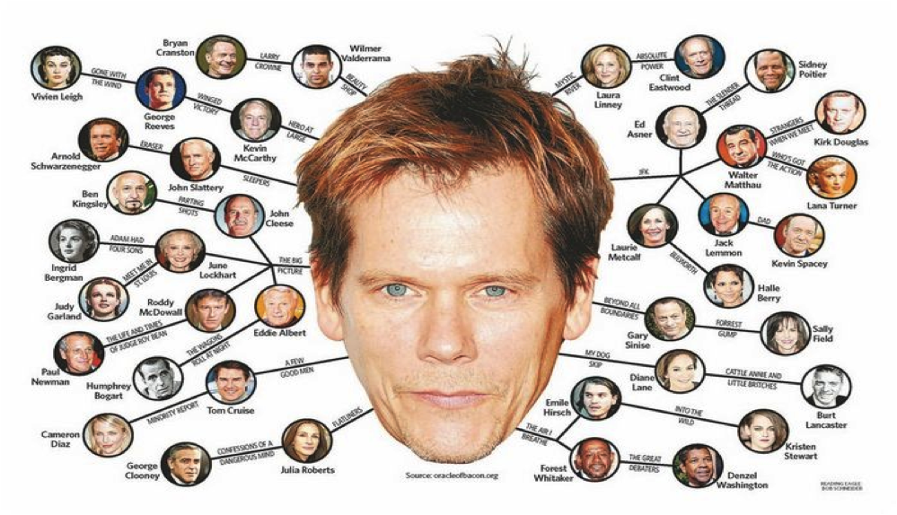
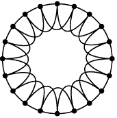

---
# You can also start simply with 'default'
theme: seriph
# random image from a curated Unsplash collection by Anthony
# like them? see https://unsplash.com/collections/94734566/slidev
background: https://cover.sli.dev
# some information about your slides (markdown enabled)
title: Welcome to Slidev
info: |
  ## Slidev Starter Template
  Presentation slides for developers.

  Learn more at [Sli.dev](https://sli.dev)
# apply unocss classes to the current slide
class: text-center
# https://sli.dev/features/drawing
drawings:
  persist: false
# slide transition: https://sli.dev/guide/animations.html#slide-transitions
transition: slide-left
# enable MDC Syntax: https://sli.dev/features/mdc
mdc: true

---

## 行動科学概論
 
# 社会科学におけるモデル入門

ネットワークモデル

### 呂沢宇

  Press Space for next page <carbon:arrow-right />

  <a href="https://github.com/lvzeyu/social_modeling_lecture" target="_blank" class="slidev-icon-btn">
    <carbon:logo-github />
  </a>

<!--
The last comment block of each slide will be treated as slide notes. It will be visible and editable in Presenter Mode along with the slide. [Read more in the docs](https://sli.dev/guide/syntax.html#notes)
-->

---
transition: slide-up
level: 2
---

# 社会ネットワーク

社会ネットワークの特徴

  

<!--
- 平均次数が小さく
- 高いクラスタ係数が多い
-->

---
transition: slide-up
level: 2
---

# 社会ネットワーク

社会ネットワークの特徴

様々の社会ネットワークにはいくつかの共通した性質がある
<v-clicks depth="2">

- 経路が短い
    - あるノードから他のノードへ数ステップで移動できる
- クラスタ係数が高い
    - 閉じた三角型の関係が多い
- ノードやリンクの変数（次数やリンクの重みなど）の分布が不均一になっている

> ネットワークの特徴がどのように現れるかについての直感や仮説を取り込んでモデルを構築し、そのモデルに従って構築されたネットワークと現実のネットワークを比較することで、何かモデルによって再現できて、何か再現出来ないにかを確認する

→ **ネットワークモデル**によって現実世界のネットワークがどのようなメカニズムで成り立っているのかについての知見を得ることができる
</v-clicks>

<!--
- これは、ある人の友人同士もまた友人であるというような、**閉じた三角関係（三者閉包）**が多いことを意味します。この性質は、親密な社会集団や信頼関係が構築されやすい環境を反映しています。
- ネットワーク構造が**不均一（heterogeneous）**であることです。すべての人が同じ数の友人や接点を持っているわけではなく、**一部のノードに多くのリンクが集中（ハブ的存在）**していたり、リンクの重みに差があるといった特徴が見られます。このような偏りは、影響力の集中や情報伝播の偏在など、社会的な機能にも強く影響します。

こうした特徴がなぜ現れるのかを理解するためには、「ネットワークモデル」の構築が必要です。
直感や社会的メカニズムに基づいてルールを定め、そのルールでネットワークを生成し、現実のネットワークと比較することで、モデルの妥当性や限界を検証できます。
この比較により、私たちは以下のような問いに答えることができます：
-「どのような仮定があれば、現実の構造が再現されるのか？」
-「何がモデルで再現できて、何が再現できないのか？」
-「現実のネットワークには、どのような形成メカニズムがあると考えられるか？」
-->

---
transition: slide-up
level: 2
---

# ランダムネットワーク

ランダムネットワークの概要

孤立したノードが多数あり、そこにリンクを張ることによってネットワークを構築することを考えよう

<v-clicks depth="2">

- [ランダムに1つずつリンクを追加していくとどうなる？](https://www.networkpages.nl/CustomMedia/Animations/RandomGraph/ERRG/AddoneEdgepATime.html)
   - 接続されるのノードベアの数が増える
   - 接続された部分ネットワークが形成される
   - ある時点で、どのノードからどのノードへもリンクをたどっていくことができるようなネットワークになる

- 比較的に小規模な部分ネットワークのみで構成されるネットワークから、ほとんどすべてのノードを含む巨大ネットワークに成長し、変化は徐々に起こる

</v-clicks>

---
transition: slide-up
level: 2
---

# ランダムネットワーク

Erdos-Renyi (ER)モデル

Erdos-Renyi (ER)モデルは、ノード数$N$とリンク生成確率$p$の二つのパラメータを持つモデルである。$G(N, p)$

- ノード数：$N$ 個のノードがある。
- リンク生成確率：各ノードのペアに対して、確率 $p$ でリンクを生成。
- 各エッジの有無は独立に決定される。

<v-clicks depth="2">

- あるリンク生成確率$p$のランダムネットワークを構築することは、偏ったコインを繰り返し投げて、表が何回出るか数えることと類似している
    - 偏ったコインが確率$p$で表を出すとすると、$t$回投げて表が出る回数の期待値は$pt$である
    - 表が出る回数の期待値は、偏ったコインを一回投げた時に表が出る確率とコインを投げた回数に比例している

</v-clicks>

---
transition: slide-up
level: 2
---

# ランダムネットワーク

短経路

> 全てのノードの次数が10であると仮定しよう

> あるノードから出発すると、そのノードには10個のノードが隣接している

> これらの隣接ノードのそれぞれからさらに10個の隣接ノードに到達できる

- 到達可能なノードの数はステップ数に応じて指数関数的に増加する(異なるノードの隣接ノードがたまたま一致するケースを一旦無視)
    - ランダムネットワークは非常に短い経路長を持つ
- **短経路**：ランダムネットワークにおいて、あるノードから他の任意のノードに到達するための最大距離がネットワークの大きさに比べて小さい性質

<!--
- 短経路性は、ネットワーク上での情報伝達や拡散を非常に効率的にする。

- ランダムネットワークは、リンクがランダムに分布しているがゆえに、ハブや経路の偏りに依存せず、全体へのアクセスが速い。

- 現実の社会ネットワークでも、この性質は多くの場面で見られる
-->

---
transition: slide-up
level: 2
---

# ランダムネットワーク

リンク数

<v-clicks depth="2">

- ランダムネットワークにおけるリンク数の期待値は、リンク生成確率$p$とノードペアの数に比例する
    - リンクが存在しうるペアの数　$\binom{N}{2}=\frac{N(N-1)}{2}$
- ランダムネットワークのリンク数の期待値：$<L>=\frac{pN(N-1)}{2}$
- ネットワークの平均次数は、リンク数の２倍をノード数で割った値
    - ランダムネットワークの平均次数の期待値: $<k>=p(N-1)$

</v-clicks>

  ランダムネットワークモデルが現実世界のネットワークに当てはまるには、リンク生成確率pを小さく設定する必要がある

---
transition: slide-up
level: 2
---

# ランダムネットワーク

次数分布

<v-clicks depth="2">

- ランダムネットワークの次数分布
    - あるノードが$k$個の隣接ノードを持つ確率について考えよう

- コインの問題と等価である：表が確率$p$で出る偏ったコインで合計$N-1$回を投げるとき
    - $k$回表が出る確率は二項分布に従う：$P(k; N-1, p) = \binom{N-1}{k} \cdot p^k \cdot (1 - p)^{N - 1 - k}$
        - $N - 1$: 試行回数（コインを投げる回数）
        - $k$: 表が出る回数
        - $p$: 表が出る確率
        - $\binom{N-1}{k}$: 表が $k$ 回出る並び方の数（組合せ）$\frac{(N-1)!}{k! \cdot (N-1 - k)!}$ 
</v-clicks>

<!--
| 数式記号                     | 意味                                                                 | 具体例（例：$N = 100$, $p = 0.05$）             |
|-----------------------------|----------------------------------------------------------------------|--------------------------------------------------|
| $N - 1$                     | 試行回数（ノード$i$が他のノードとリンクできる回数）                    | $99$                                              |
| $k$                         | 成功回数（ノード$i$が実際にリンクを持つ数 = 次数）                     | 例：$k = 5$                                       |
| $\binom{N-1}{k}$            | $N-1$回中$k$回成功する場合の**組合せの数**                              | $\binom{99}{5} \approx 7,500,000$通り            |
| $p^k$                       | 選ばれた$k$個のノードとのリンクが**すべて成功**する確率                 | $(0.05)^5 = 3.125 \times 10^{-7}$（非常に小さい）|
| $(1 - p)^{N - 1 - k}$       | 残りの$N - 1 - k$個とは**リンクが形成されない**確率                    | $(0.95)^{94} \approx 0.006$（かなり小さい）      |

1. **順列の数**（順番を考慮）：
   順番ありの選び方 = $\frac{(N-1)!}{(N-1-k)!}$
  

2. **順番の違いを除く**（順番は関係ない）：
  $\binom{N-1}{k}$ = $\frac{(N-1)!}{k! \cdot (N-1-k)!}$

$\binom{5}{2} = 10$ は、5 個のものから 2 個を**順番を考えずに選ぶ方法**が 10 通りあることを意味します。

たとえば、{A, B, C, D, E} から 2 個選ぶ組合せは以下の 10 通り：

- AB, AC, AD, AE  
- BC, BD, BE  
- CD, CE  
- DE
-->

---
transition: slide-up
level: 2
---

# ランダムネットワーク

次数分布

<v-clicks>

- a.ランダムネットワークにおける次数の確率分布は、平均次数$<k>$付近に高いビークをもち、どの両側で急速に減衰するベル型の曲線になる
- 多くの現実ネットワークはかなり異なる分布になる
    - b.世界の航空網ネットワーク
    - c.現実ネットワークとンダムネットワークとの比較
</v-clicks>

  

---
transition: slide-up
level: 2
---

# ランダムネットワーク

クラスター係数

<v-clicks>

- クラスタ係数は、あるノード $i$ における隣接ノード同士の接続の程度を示す指標である
- あるノードの隣接ノード同士がつながっている確率は、共通の隣接ノードがあるかどうかに依存せず、どのペアでも同じであるため$p$とあなる
    - 個々のノードの局部的なクラスターは多少ずれることはあるが、全てのノードの平均値は$p$でよく近似できる

- ランダムネットワークで現実のネットワークのような疎なネットワークを記述する場合、$p$を非常に小さいの値になる
    - このようなランダムネットワークのクラスター係数は非常に小さい
    - 現実のネットワークでは高いクラスタ係数をもつことは多い
</v-clicks>

  不整合性を解決するためには、より洗練されたネットワークモデルが必要となる

---
transition: slide-up
level: 2
---

# スモールワールドモデル

<v-clicks depth="2">

- 現実のネットワークはランダムネットワークとは異なる特徴を持つ
    - 平均経路は短いが、クラスター係数は実際のネットワークより大幅に小さいの値になる
- クラスタリングと短距離は矛盾する性質?
    - クラスター係数が高いネットワークでは、局所的に三角形が多く、密なつながりがある
    - ローカルな接続は密だが、他のクラスタとの接続が少なくなりがち →　ネットワーク全体では平均距離が伸びやすい？
- スモールワールドモデル（Watts–Strogatzモデル）
    - 短い経路長と大きなクラスター係数の両方の特徴を同時に持つネットワークを生成する
</v-clicks>

<!--
一見すると、次の2つの性質は矛盾しているように見えます：

クラスタ係数が高い：
→ 「友人の友人も友人である」ような三角形が多い
→ 局所的には密な構造が形成される

平均経路長が短い：
→ ネットワーク全体に速くアクセス可能

ところが、高クラスタリングのネットワークでは、ローカルな結びつきが強いため、他のグループ（クラスタ）と繋がるリンクが少ない。
その結果、ネットワーク全体としての平均経路長が長くなってしまうことがあります
-->

---
transition: slide-up
level: 2
---

# スモールワールドモデル

Six degrees of separation

- 共演ネットワークにおいて、 任意の俳優とKevin Baconを結ぶ最短経路を見つける[ゲーム](https://oracleofbacon.org/)

  

---
transition: slide-up
level: 2
---

# スモールワールドモデル

Six degrees of separation

<v-clicks depth="2">

- ６次の隔たり：世界のどんな２人も短い知人の連鎖で繋がっている
    - 社会ネットワークの直径は小さく、平均経路長はさらに短い
    - 「6」という数字は、Frigyes Karinthyという小説家が最初に使い
> 5人程度の仲介者がいれば、地球上の誰にでも連絡を取れる:世界中の人々は、たった数人の知人を介せば誰とでもつながっているかもしれない。ローマ教皇でも、アイスランドの漁師でも
- 実証的なアプローチ：1967年の心理学者スタンレー・ミルグラムの「スモールワールド実験」
    - 見知らぬ人同士が、どれくらいの“社会的距離（知人関係のつながり）”で結ばれているのかを測定しよう
    - アメリカ中西部に住む実験参加者に、マサチューセッツ州ボストンに住むターゲット人物に届くよう、知人への手紙送信を依頼する
        - 自分がターゲットを直接知っていない場合、「ターゲットに近そうな知人」を1人選んで、その人に手紙を送る
        - 手紙を受け取った人も同様に、「さらにターゲットに近そうな知人」に手紙を回していく
</v-clicks>

---
transition: slide-up
level: 2
---

# スモールワールドモデル

Six degrees of separation

<v-clicks>

- 最終的に成功してターゲットに届いた手紙は42通(26%)
- 平均経路長は6ステップ強である
- [電子メール実験による拡張](https://psycnet.apa.org/record/2003-99982-035)
   - 160カ国以上の60,000人以上の参加者がインターネット経由で実験に参加
   - 最終的にターゲットに届いたチェーンは 24,163本中384本（成功率わずか1.6%）であったが、成功したチェーンの平均ステップ数は約4.01
- [Facebookの友人関係](https://arxiv.org/abs/1111.4570)
   - 7億2100万人の友人関係ネットワークの平均経路長は4.74であった
</v-clicks>

  

---
transition: slide-up
level: 2
---

# スモールワールドモデル

スモールワールドモデルの構築

<v-clicks>

- リング状の規則ネットワーク
    - ノード数 $N$ のネットワークを作る（例：$N = 20$）
    - 各ノードは、隣接する $k$ 個のノードとつながるようにする
        - 例えば、$k=4$ なら、自分の左右2個ずつ、合計4つのノードと接続
- 確率 $p$ でランダムにエッジの再配線
    - エッジの片方（または両方）の接続先を、ネットワーク全体の中からランダムに選び直す
    - 自己ループや重複は避ける

</v-clicks>

  

---
transition: slide-up
level: 2
---

# スモールワールドモデル

スモールワールドモデルの構築
<v-clicks depth="2">

- 再配線確率は$p$、ネットワーク内のリンクの総数は$L$である場合、再配線されるリンク数の期待値は$pL$である
    - $p=0$の場合は、初期状態に対応する（何も起こらない）
    - $p=1$の場合は、基本的に全てのリンクはランダムに再配線され、ランダムネットワークに等価する
- $p$は小さすぎず、大きすぎないとき
    - 平均経路長を短くするのに十分なショートカットがある
    - ほとんど三角形の構造を破壊するほど多くない
        - クラスタ-係数は高いのまま
</v-clicks>

  pを選ぶことによって、現実の社会ネットワークと似たネットワークを再現することができる

---
transition: slide-up
level: 2
---

# スモールワールドモデル

スモールワールドモデルの構築

  

---
transition: slide-up
level: 2
---

# スモールワールドモデル

スモールワールドモデルの構築

<v-clicks>

- リング状の規則ネットワーク（初期状態）
    - 平均クラスタリング係数 $C(0) \approx	 \frac{3}{4}$
        - 比較的に高いクラスタリング状況をもつ構造になる
    - 平均経路長 $L(0) =	\frac{N}{2k}$
        - ノード数 $N$ に比例して長くなる
        - 比較的にに長い経路長になっているため、伝播には多くのステップが必要

</v-clicks>

  

<!--
$$
C(0) \approx \frac{3}{4}
$$

- 各ノードが近隣のノードと接続されているため、**三角形（友人の友人も友人）**が多数形成される。
- その結果、クラスタ係数は高く、**局所的なまとまりが強いネットワーク構造**となる。

$$
L(0) = \frac{N}{2k}
$$

- $N$：ノード数、$k$：各ノードの次数（接続数）
- この式から、**ノード数 $N$ に比例して経路長が伸びる**ことが分かる。
- つまり、**離れたノードに到達するには多くのステップが必要**となり、情報の伝播には時間がかかる。

- $N = 1000$, $k = 10$ のとき：

$$
L(0) = \frac{1000}{2 \times 10} = 50
$$

→ **平均して 50 ステップ**でしか他のノードに到達できない。

-->

---
transition: slide-up
level: 2
---

# スモールワールドモデル

スモールワールドモデルの構築

<v-clicks>

- 再配線確率$p$を変化させる時に、平均最短経路長$L(p)$と平均クラスター係数$C(p)$の変化
    - $p = 0$（規則的な格子）では、$C$ が高く $L$ も高い。

    - $p$ を少し増やす（$0 < p < 1$）と、$C$ は高いままなのに、$L$ が急激に下がる。

    - $p = 1$（完全にランダム）では、$L$ は小さいが $C$ も低くなる。
- [Demo](https://www.netlogoweb.org/launch#http://ccl.northwestern.edu/netlogo/models/models/Sample%20Models/Networks/Small%20Worlds.nlogo)

</v-clicks>

  

<!--
平均経路長は短く、クラスター係数が大きくなる範囲
-->
 

---
transition: slide-up
level: 2
---

# スモールワールドモデル

スモールワールドモデルの拡張

[Networks, Dynamics, and the Small‐World Phenomenon. Duncan J. Watts. American Journal of Sociology (1999)](https://www.journals.uchicago.edu/doi/pdf/10.1086/210318)

<v-clicks depth="2">

- ノード数 $n$ のリング状ネットワークから開始  
- 全てのノードペア $(i,j)$ に対して（順序はランダム）：
  - 共通の友人の数 $m_{i,j}$ を計算
  - 接続傾向 $R_{i,j}$ を計算
  - 確率 $R_{i,j}$ に基づき接続
- 接続確率の基本構造
  - $R_{i,j}$ は、共通の友人がいない場合でも、低い確率 $p$ で接続が起こり得る
  - $m_{i,j}$ の増加に伴い、$R_{i,j}$ は増加
</v-clicks>

  

---
transition: slide-up
level: 2
---

# スモールワールドモデル

スモールワールドモデルの拡張

  

- $R_{i,j}$：エージェント $i$ と $j$ が接続する傾向
- $m_{i,j}$：共通の友人の数
- $p$：共通の友人がいない場合の接続基礎確率
- $k$：ネットワークの平均次数
- $\alpha$：$m_{i,j}$ に対する $R_{i,j}$ のカーブの鋭さ

<!--
- 共通の友人が平均以上（$m_{i,j} \ge k$）
    - 接続確率 $R_{i,j} = 1$（必ずつながる）
    - 社会的には「友達の友達がたくさんいるから当然仲良くなる」
- 共通の友人が少しだけいる（$0 < m_{i,j} < k$）
    - 接続確率は 共通の友人の割合に応じて滑らかに増加
    - $\alpha$ が大きいほど、共通の友人が少ないときの接続確率はより低くなる（＝三者閉包の効果が強い）
    - 正規化された共通友人数の影響
        - 共通友人数の相対比率
        - **$\alpha$ の効果**（三者閉包の強さ）：
        - $\alpha = 1$：直線的に増加
   　　　- $\alpha > 1$：S字カーブ → 多くの共通友人がないとつながりにくい
   　　　- $\alpha < 1$：なだらか → 少数でも接続しやすい
  　- **$(1 - p)$ の意味**：
        - 接続確率の最大変動幅を決める（$p$ から $1$ まで）
    - **$+ p$ の意味**：
        - 共通友人がいない場合でも、わずかに接続する可能性を残す
- 共通の友人がいない（$m_{i,j} = 0$）
    - 基本的な確率 $p$ のみに依存（ランダムな出会い）
    - 例：SNSで全く共通の友人がいない人を偶然見つけてフォローする

-->

---
transition: slide-up
level: 2
---

# スモールワールドモデル

スモールワールドモデルの拡張

  

<!--
## α とネットワーク特性の関係

この図は、指数パラメータ $\alpha$（共通友人による接続傾向の強さ）と、以下の2つのネットワーク特性の関係を示しています：

- ● **Scaled Length**（平均経路長の正規化値）
- □ **Scaled Clustering**（クラスタリング係数の正規化値）

横軸：$\alpha$（三者閉包傾向の強さ）  
縦軸：それぞれの指標のスケーリング値（1が基準）

### グラフの読み取り

#### ● 平均経路長（黒丸）

- $\alpha \approx 0$（＝ランダムネットワークに近い）では経路長が短い
- $\alpha$ が増加するにつれて経路長が一時的に増加し、その後急激に減少
- $\alpha \gtrsim 5$ で経路長は最短レベルで安定（ネットワークが「局所クラスター化」）

#### □ クラスタリング係数（白四角）

- $\alpha \approx 0$ では低く（ランダムに近い）
- $\alpha$ の増加とともに上昇し、最大値に達した後、再び減少
- これは過度に保守的なネットワーク（極端な ordered state）に近づいていることを示す

### 結論：スモールワールド性が最大となる領域

- $\alpha \approx 2$〜$4$ の範囲で、
  - クラスタリング係数が高く
  - 平均経路長が十分短い
- この領域が **スモールワールドネットワークの最適領域** であり、現実の社会ネットワークの構造と類似している

### 社会的含意

- **小さい $\alpha$**：開放的で偶然的なつながりが多く、クラスタリングが低い
- **中程度の $\alpha$**：三者閉包が適度に働き、効率的かつまとまりのあるネットワークが形成される
- **大きい $\alpha$**：保守的になりすぎ、クラスター内に閉じた非効率な構造となる

-->

---
transition: slide-up
level: 2
---

# まとめ

<v-clicks depth="2">

- スモールワールド現象、すなわち「高い局所的クラスタリング」と「短い距離」の共存が、特殊な状況下でのみ見られる稀な現象ではなく、完全に秩序だったネットワークでも完全にランダムなネットワークでもない
    - 少数のランダムな「再配線」だけで、規則的なネットワークが劇的に短い平均経路長を獲得し、なおかつ高いクラスター性を維持できることを示した
    - スモールワールド現象が、多くの現実世界のネットワーク、特に社会ネットワークが持ちうる普遍的な構造特性である可能性を強く示唆した
- スモールワールドというネットワーク構造の概念は、多岐にわたる社会現象の分析に対して、新しい強力な説明的枠組みを提供する
> イノベーションの普及においては、初期の採用者が形成するクラスター内での集中的な情報交換と、異なるクラスター間を結ぶ「ショートカット」を介した広範な情報伝播が、普及プロセス全体を加速させる可能性がある
> 弱い紐帯の強さ：異なる社会集団を結びつける弱い紐帯が、新しい情報や機会へのアクセスを提供する上で重要である
</v-clicks>

<!--
- 情報やイノベーションがどのようにして社会に普及していくのか、デマや噂がなぜ急速に広まることがあるのか、あるいは社会運動がどのようにして組織化され、動員力を獲得するのかといった問いに対して、スモールワールド構造は、その背後にあるメカニズムを解明する鍵となりうる 。これらの現象は、しばしば非線形的で予測困難な振る舞いを示すが、スモールワールドネットワークというレンズを通して分析することで、そのダイナミクスの理解が深まる。例えば、イノベーションの普及においては、初期の採用者が形成するクラスター内での集中的な情報交換と、異なるクラスター間を結ぶ「ショートカット」を介した広範な情報伝播が、普及プロセス全体を加速させる可能性がある。   

- マーク・グラノヴェッターが提唱した「弱い紐帯の強み」という概念は、異なる社会集団を結びつける弱い紐帯が、新しい情報や機会へのアクセスを提供する上で重要であることを示した。ワッツのモデルは、このような少数の「弱い紐帯」的な長距離リンクが、ネットワーク全体の平均経路長をどのように劇的に短縮し、結果として「スモールワールド」という構造を生み出すのかを、数学的かつシミュレーションを通じて具体的に示した点で画期的であった。これらの少数の非局所的な繋がりが、ネットワーク全体のトポロジーとダイナミクスに大きな影響を与える可能性を示唆している。

-->