---
# You can also start simply with 'default'
theme: seriph
# random image from a curated Unsplash collection by Anthony
# like them? see https://unsplash.com/collections/94734566/slidev
background: https://cover.sli.dev
# some information about your slides (markdown enabled)
title: Welcome to Slidev
info: |
  ## Slidev Starter Template
  Presentation slides for developers.

  Learn more at [Sli.dev](https://sli.dev)
# apply unocss classes to the current slide
class: text-center
# https://sli.dev/features/drawing
drawings:
  persist: false
# slide transition: https://sli.dev/guide/animations.html#slide-transitions
transition: slide-left
# enable MDC Syntax: https://sli.dev/features/mdc
mdc: true

---

## 行動科学概論
 
# 社会科学におけるモデル入門

ネットワークモデル

### 呂沢宇

  Press Space for next page <carbon:arrow-right />

  <a href="https://github.com/lvzeyu/social_modeling_lecture" target="_blank" class="slidev-icon-btn">
    <carbon:logo-github />
  </a>

<!--
The last comment block of each slide will be treated as slide notes. It will be visible and editable in Presenter Mode along with the slide. [Read more in the docs](https://sli.dev/guide/syntax.html#notes)
-->

---
transition: slide-up
level: 2
---

# 振り返りとこれからの内容

<v-clicks depth="2">

- ネットワークの基本概念
    - ノートとリンクによる複雑な対象を比較的に単純な構造で表現する
    - 次数、最短経路長、クラスター係数などの指標でネットワークの特徴を理解する
- ネットワークモデル
    - ネットワークの特徴がどのように現れるかについての直感や仮説を取り込んでモデルを構築し、そのモデルに従って構築されたネットワークと現実のネットワークを比較することで、何かモデルによって再現できて、何か再現出来ないにかを確認する
        - ネットワークモデルによって現実世界のネットワークがどのようなメカニズムで成り立っているのかについての知見を得ることができる
    - WSモデル: 適切なランダム性$p$を設定することで、短い最短経路長と大きいクラスター係数という二つ望ましい特徴を持つネットワークを生成することが可能である
    - **Barabasi-Albertモデル：スケールフリーな構造を再現するためのモデル**

</v-clicks>

---
transition: slide-up
level: 2
---

# Power Laws

現実世界におけるPower Laws

Power Laws（べき乗則）とは、ある量の分布が「一部の巨大な値が稀に存在し、大多数は小さな値に集中する」という特性を持つことである

  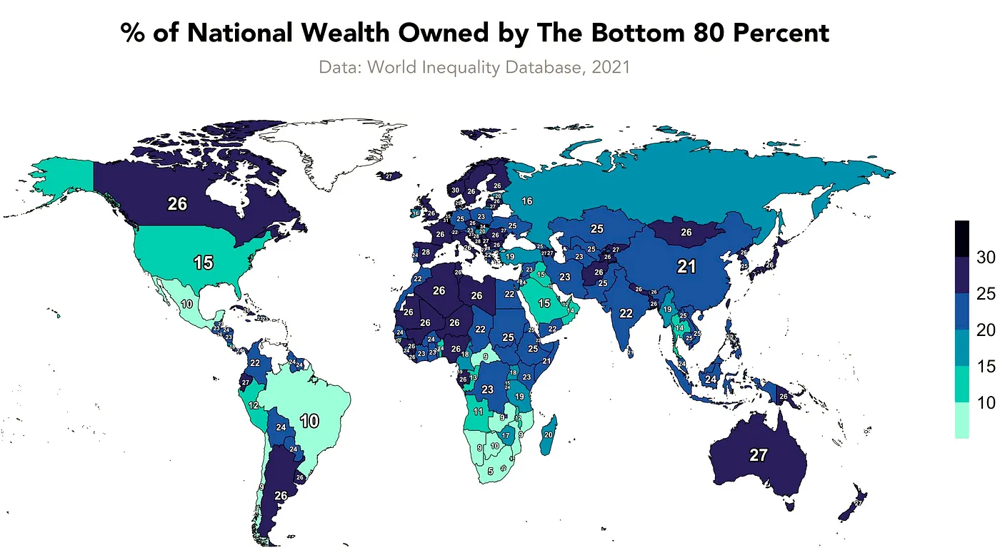

  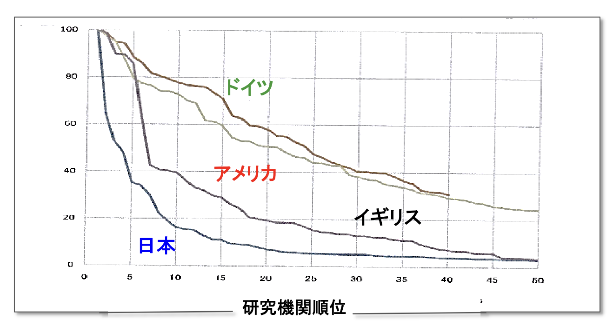

---
transition: slide-up
level: 2
---

# Power Laws

現実世界におけるPower Laws

スケールフリーネットワーク(Scale-free Network)：ノードの次数分布（1つのノードが持つリンク数）がPower Lawsに従うネットワーク

  

  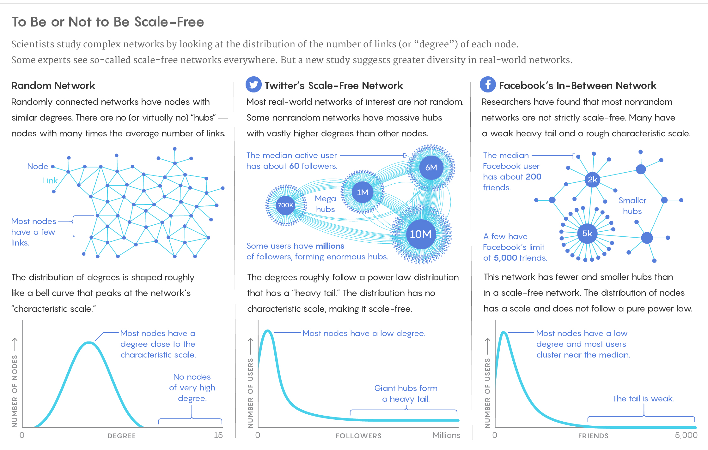

---
transition: slide-up
level: 2
---

# 次数分布に着目するネットワークモデル

Configuration Model

ある次数分布が与えられたとき、その次数分布と同じ次数分布を持つネットワークをどのように構築する❓

<v-clicks depth="2">

- Configuration Network
    - (a) 各ノードに対して、ノードの次数に対応する数のスタブを割り当てる
        - スタブとは、そのノードを端点とし、まだ接続されていないぶら下がったリンクのことである
    - スタブのペアをランダムに選択し、スタブ同士の結合によるノード間にリンクを引く
    - 全てのスタブがペアを作り、結合されるまでに手順を繰り返す

</v-clicks>

  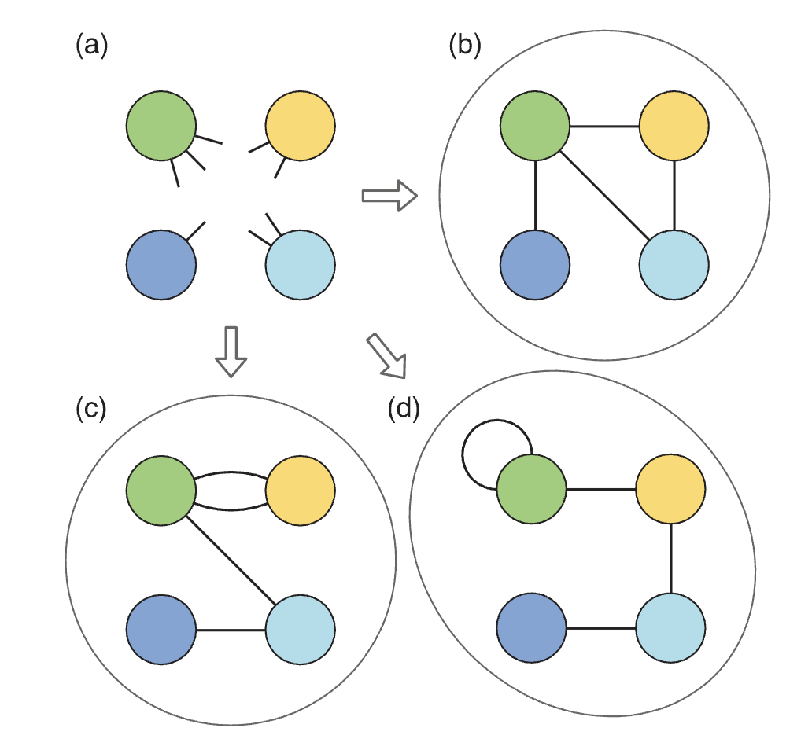

---
transition: slide-up
level: 2
---

# 次数分布に着目するネットワークモデル

Configuration Model

ある次数分布が与えられたとき、その次数分布と同じ次数分布を持つネットワークをどのように構築する❓

<v-clicks depth="2">

- 各ノードに接続されたスタブの数はそのノードの次数に等しいので、各ノードは最終的に望ましい次数を持つことになる
    - 二つのノード間に複数のリンクがあるネットワークには $(c)$自己ループがあるネットワー$ク$(d)$を生成する可能性もあるので、場合による制御する必要がある

</v-clicks>

  

---
transition: slide-up
level: 2
---

# 次数分布に着目するネットワークモデル

既存モデルに対する考察

<v-clicks depth="2">

- 今までは基本的に静的ネットワークモデルであった
    - ネットワークの全てのノードは最初から存在し、それらのノード間のリンクを追加したり張り替えたりして、ネットワークを構築してきた
- 一方、現実のネットワークはノードやリンクが時間とともに現れたり消えたりすることが多いく、**動的**である
    - SNSに新しいユーザが増加し、全体的なネットワーク規模が成長する傾向がある
- 動的モデルでネットワークの成長をモデルする
    - 小さなネットワークを初期状態として考え、その後ノードが一人ずつ追加される
    - 追加されるノードは、モデルに特有の何らかのルールに基づいてネットワークを構築していく
</v-clicks>　

---
transition: slide-up
level: 2
---

# 次数分布に着目するネットワークモデル

既存モデルに対する考察

  

<v-clicks depth="2">

- ハブ(hub): ネットワーク内で次数degreeが極めて高いノード
    - ハブはネットワーク構造の中で非常に重要な役割を果たし、情報や影響の伝播において中心的な存在になる
- Configurationではハブを持つように事前に設定することでハブを生成自体は可能であるが、どの過程を経てハブが発生するのか説明できない　
    - 接続先ののノードがランダムに選ばれるからである
</v-clicks>　

---
transition: slide-up
level: 2
---

# Barabasi-Albertモデル

モデルの発想

  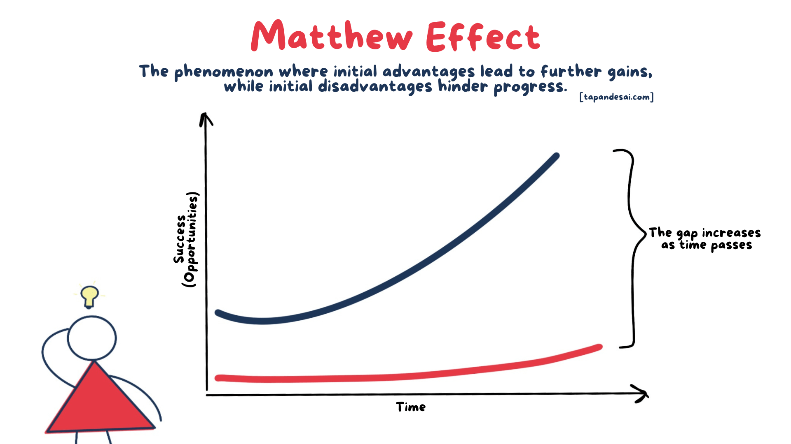

<v-clicks depth="2">

- ハブがどのように生成されるのか❓
  - マタイ効果:「金持ちはより金持ちに、貧乏人はより貧乏に」
      - 学術:有名な研究者の論文は、内容にかかわらず引用されやすくなる
      - SNS:フォロワーの多い人の投稿は拡散されやすく、さらにフォロワーが増える
  - **優先的選択**：ノードが新たなリンクを形成する際、既に多くのリンク（高次数）を持つノードに接続しやすい
</v-clicks>　

---
transition: slide-up
level: 2
---

# Barabasi-Albertモデル

モデルの構造

<v-clicks depth="2">

- （最初に \( m_0 \) 個のノードを用意し、それらの間を完全に接続する完全ネットワークからスタートする）
- 各ステップにおいて新しいノードを1つ追加し、既存のノードの中から選んでリンクを張る
- 新しいノードは、既存ノードの次数に比例した確率で接続先を選ぶ
    - $P(i) = \frac{k_i}{\sum_j k_j}$
- ステップを繰り返して、ネットワークのノード数を目的のサイズまで増やす

</v-clicks>

  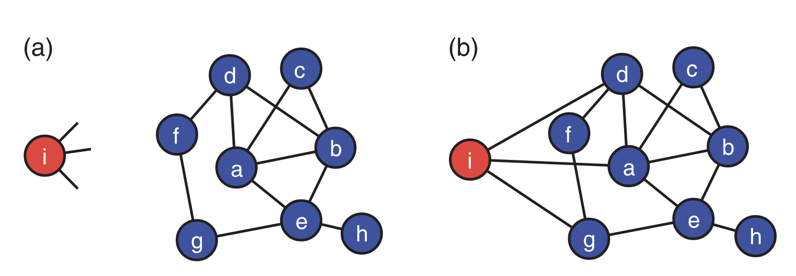

---
transition: slide-up
level: 2
---

# Barabasi-Albertモデル

モデルの考察

<v-clicks depth="2">

- 最初は全てのノードの次数は等しく
- 新しいノードやリンクが追加されることにつれて、ノードの次数は大きくなっていく
  - 新たに追加されたノードは、優先的選択に基づいて既存ノードにリンクを張りる
  - 既に多くのリンクを持つノードがさらにリンクを獲得する確率が高く、次数は非対称に拡大していく
  - 結果として、ノードごとに大きな次数の格差が生まれ、一部のノードがハブ化していく
</v-clicks>

  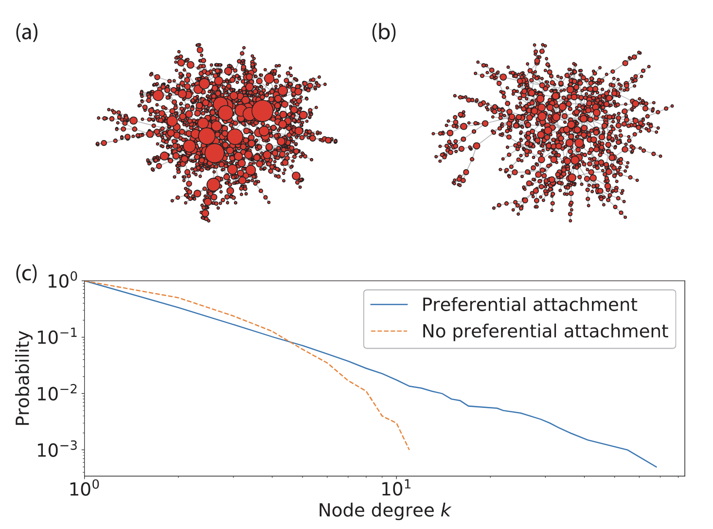

  多くの現実のネットワークの成長時には、優先的選択のメカニズムが働いていることが確認された

---
transition: slide-up
level: 2
---

# Barabasi-Albertモデル

モデルの拡張

<v-clicks depth="2">

- BAモデルの問題点：あるノードに隣接ノードが全くない場合はどうするのか
    - ノードの次数はゼロなので、リンクを獲得する確率もゼロで、そのノードはリンクを持つことはない
        - そのため、完全グラフからスタートすることが多い
        - 「理想」な完全グラフではなくでも機能すべきことは望ましい
- 魅力モデル（Attractiveness Model）：リンクの接続確率は次数と魅力度の和に比例することに変更する
    - $\Pi_i = \frac{k_i + A_i}{\sum_j (k_j + A_j)}$
    - **新規ノードも注目されうる**：魅力度$A_i$により、開始直後でもリンクを得られる
    - 才能、ブランド、知名度など現実世界における影響をもつ要素をモデルに反映できる
        - $A_i$の設計方法による多様なバリエーション
</v-clicks>　

  BAモデルの限界を克服するために、要素を導入したモデルが提案されている

---
transition: slide-up
level: 2
---

# ネットワークの応用：ネットワーク上の伝播モデル

<v-clicks depth="2">

- 影響の伝播と拡散をモデル化することは、ネットワーク科学の重要な応用である。
    - 活性化された隣接ノードの存在や他の条件によって、まだ活性化されていない各ノードの一定割合が順に活性化される影響拡散過程
- 拡散はごく少数のノードの起こることもあるし、ネットワークの大部分を含む大域的拡散が発生することもある
</v-clicks>

  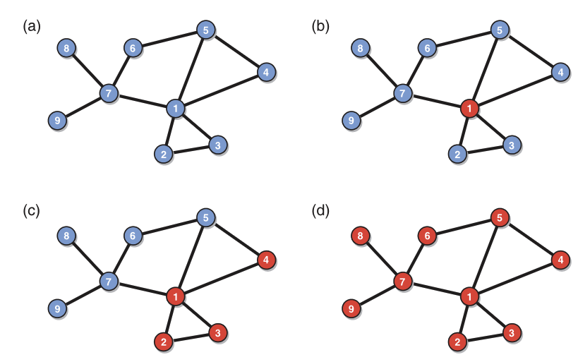

---
transition: slide-up
level: 2
---

# SIRモデルとネットワーク

感染症のシミュレーション

<v-clicks depth="2">

- ネットワークとSIRモデルを組み合わせることで、現実世界の感染状況を反映と予測することが可能である
   - SIRモデルは、感染症の動態を記述する古典的な数理モデル
   - ネットワークは、人々の間の具体的な接触関係や地理的な近接性、移動パターンといった感染経路と伝播のメカニズムを反映する
- ネットワーク構造と感染症の伝播ダイナミクスの関連性分析
- 現実のつながりを取り入れた感染状況の予測
</v-clicks>

  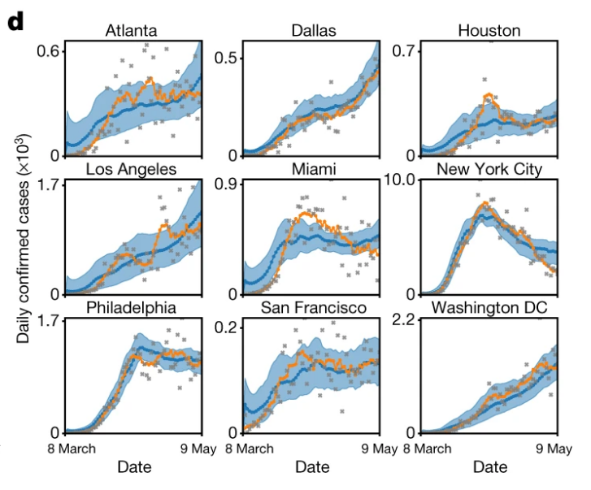

<!--
ネットワーク構造と感染症の伝播ダイナミクスの関連性分析： ネットワーク上にSIRモデルを適用することで、ネットワークの構造（例：中心的なハブの存在、クラスターの密度、ノード間の距離など）が感染症の広がり方にどのように影響するかを詳細に分析できます。例えば、ハブの存在が感染拡大を加速させる一方で、ネットワークの分断（ソーシャルディスタンシングなど）が拡大を抑制する効果を定量的に評価できます。

現実のつながりを取り入れた感染状況の予測： 均一混合仮定のモデルでは捉えきれなかった、現実の複雑な人々のつながりや交流パターンをモデルに取り入れることで、より精度の高い感染状況の予測が可能になります。これにより、特定の地域や集団における感染リスクをより正確に評価し、効果的な介入策（例：特定の場所での行動制限、接触者追跡の強化、特定の層へのワクチン優先接種など）の有効性をシミュレーションによって検証できます。
-->

---
transition: slide-up
level: 2
---

# SIRモデルとネットワーク

SIRモデルの概要

<v-clicks depth="2">

- S (Susceptible)：まだ感染しておらず、感染する可能性がある人々。
- I (Infectious )：現在感染しており、他者に感染させる可能性のある人々。
- R (Recovered)：感染から回復し、免疫を獲得した人々、あるいは死亡や隔離によって感染源から除去された人々
</v-clicks>

  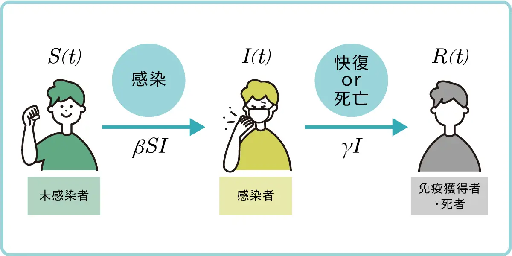

<v-clicks>

- SIRモデルの基本的な考え方は、未感染者（S）が感染者（I）と接触することで感染し、感染者（I）はやがて回復者（R）へと移行する過程を記述する
    - 感染率: SがIと接触したときに感染する確率
    - 回復率: Iが単位時間あたりRに移行する確率
</v-clicks>

---
transition: slide-up
level: 2
---

# SIRモデルとネットワーク

SIRモデルの概要

<v-clicks depth="2">

S(未感染者)の変化:未感染者が感染者と接触し、感染することでその数が減少する
    - 減少する割合は、感染率$\beta$と、相対的な接触機会に比例する
- $$\frac{dS}{dt} = -\beta \frac{S \cdot I}{N}$$
- $\frac{dS}{dt}$: 単位時間あたりの未感染者の変化量
- $\beta$: 感染率
- $\frac{S \cdot I}{N}$: 総人口$N$に対する未感染者と感染者のペアの割合
</v-clicks>

---
transition: slide-up
level: 2
---

# SIRモデルとネットワーク

SIRモデルの概要

<v-clicks depth="2">

感染者 (I) の変化:感染者は、未感染者からの新規感染によって増加し、回復（または隔離・死亡）によって減少
- $$\frac{dI}{dt} = \beta \frac{S \cdot I}{N} - \gamma I$$

- $\beta \frac{S \cdot I}{N}$: 新規感染によって増加する感染者の数
- $\gamma$: 回復率
- $\gamma I$: 回復または除去によって減少する感染者の数

</v-clicks>

<v-clicks depth="2">

回復者 (R) の変化:回復者は、感染者からの回復によってその数が増加
- $$\frac{dR}{dt} = \gamma I$$

- $\frac{dR}{dt}$: 単位時間あたりの回復者の変化量

</v-clicks>

---
transition: slide-up
level: 2
---

# SIRモデルとネットワーク

SIRモデルの概要

<v-clicks depth="2">

基本再生産数$R_0$：1人の感染者が、全員が未感染である集団において、平均して何人に感染を広げるかを示す指標

- $$R_0 = \frac{\beta}{\gamma}$$
- $\beta$: 感染率（1人の感染者が1単位時間で何人に感染させるか）
- $\gamma$:回復率（1人の感染者が単位時間で回復する確率）

- $R_0 > 1$: 感染症は流行し、拡大します。
- $R_0 = 1$: 感染者数は横ばいになり、定常状態になるか、ゆっくりと減少します。
- $R_0 < 1$: 感染症は収束し、流行は終息に向かいます。
</v-clicks>

---
transition: slide-up
level: 2
---

# SIRモデルとネットワーク

SIRモデルの概要

<v-clicks depth="2">

- 初期にはごく少数が感染し、流行の拡大は緩やかである
    - $I$の値が小さいため、新規感染の項（$\beta \frac{S \cdot I}{N}$）も小さく、感染者数の増加率が低い状態が続く
- 指数関数的成長する拡大し、多くの人々に影響を与える
    - 感染者数$I$が増えるにつれて、$\beta \frac{S \cdot I}{N}$ の項が大きくなり、$\frac{dI}{dt}$ が急激に増加する
    - ピーク以降は、未感染者（S）が減少し、感染者（I）の回復が進むことで、新規感染よりも回復による減少が上回り、感染者数は減少し始める
- 最終的には、$I$ がゼロに近づき、$\frac{dI}{dt}$ はゼロに収束する
</v-clicks>

  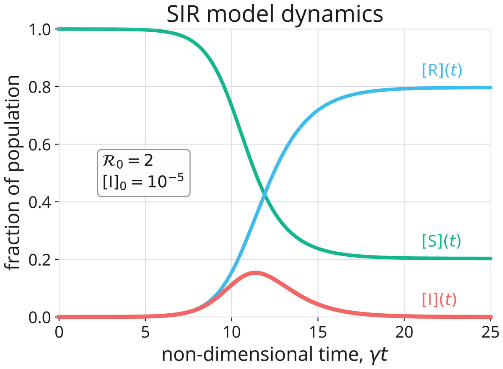

---
transition: slide-up
level: 2
---

# SIRモデルとネットワーク

SIRモデルにおけるネットワークの構造

<v-clicks depth="2">

- 均一混合仮定のSIRモデル：すべての個体が、集団内の誰とでも同じ確率で接触する
    - 感染の確率は$S$と$I$の積に比例:すべての感染者は、すべての未感染者と同じように接触する可能性がある
    - ネットワーク構造を無視している
- しかし、現実世界の接触ネットワークは均質ではない
    - 家族、友人、職場の同僚、特定の地域の人々など、限られた人々と密接に接触
    - 多くの人と接触する「ハブ」となる人物や場所が存在する(医師や飲食店店員)
    - 特定の集団（学校のクラスター、会社の部署など）内では感染が急速に広がる一方で、集団間のつながりは比較的疎である
</v-clicks>

---
transition: slide-up
level: 2
---

# SIRモデルとネットワーク

SIRモデルにおけるネットワークの構造

- ネットワークにおける隣接するノード（接触している人）に一定の確率で感染を広げる
- ネットワークの構造と感染の関係を解析することで、感染のメカニズムに対する理解を深める

| モデル              | 感染拡大の特徴                  | 感染メカニズムへの洞察                |
| ------------------ | ------------------------ | -------------------------- |
| Erdős–Rényiモデル     | 感染は比較的均一に拡大              | ノード間の接触が均一な仮定が有効な場合を理解できる  |
| Watts–Strogatzモデル  | 局所的なクラスターで爆発的に拡大し、全体にも波及 | クラスター発生・局所集中感染のメカニズムを説明できる |
| Barabási–Albertモデル | ハブを通じて急速かつ広範に拡大          | ハブノードによる感染の“超拡散者”効果を理解できる  |

---
transition: slide-up
level: 2
---

# SIRモデルとネットワーク

SIRモデルと現実のネットワーク

- SIRモデルに現実の接触ネットワークを取り入れることで、感染状況を高い精度で予測することは可能である[(Chang et al., 2020)](https://www.nature.com/articles/s41586-020-2923-3)

<v-clicks depth="2">

- 移動ネットワーク：ある居住地域から特定な移動先への訪問者数によって構築したネットワーク
    - 米国の10大都市圏における約9,800万人のモバイルデバイスの位置情報データを使用
- SEIRモデルの適用: ある居住地域から特定な移動先への移動を通じて、感染者が他の住民と接触し、感染が広がる
    - 実際の感染者数データとモデルの出力を比較し、パラメータを調整
</v-clicks>

  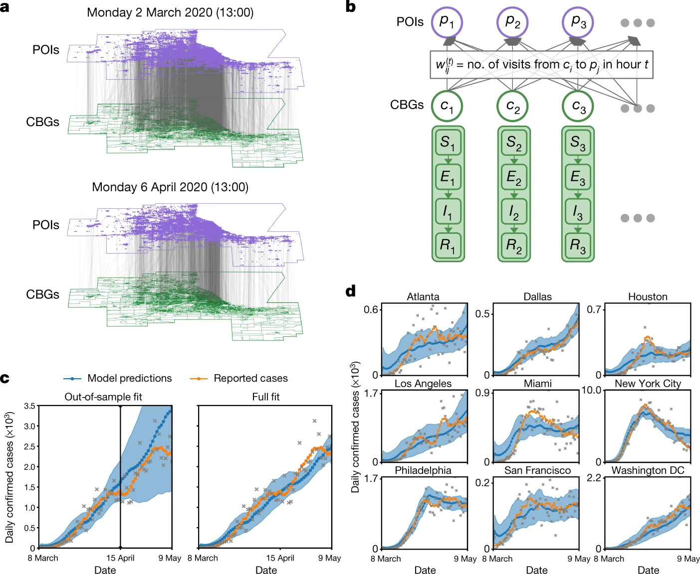

---
transition: slide-up
level: 2
---

# SIRモデルとネットワーク

SIRモデルと現実のネットワーク

  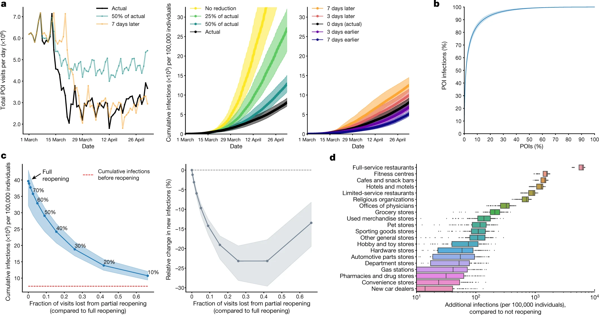

<!--
移動制限の効果の比較：全体的な移動量の削減よりも、各施設の最大収容人数を制限する方が感染拡大の抑制に効果的であることが示されました。

社会的格差の影響：低所得層やマイノリティの居住地域では、移動の削減が困難であり、訪問先の施設も混雑している傾向があるため、これらの地域での感染リスクが高まっていることが明らかになりました。
-->

---
transition: slide-up
level: 2
---

# 社会的感染とSIRモデル

噂の拡散

- SIRモデルはもともと感染症の拡大を記述するために開発されたが、社会的感染にも広く応用されている
    - 関係性を持った人々の間に感染が生じると考える

| SIRモデルの要素 | 噂の拡散における意味                     |
|----------------|------------------------------------------|
| S（Susceptible）| 噂をまだ聞いていない人                     |
| I（Infectious） | 拡散者：噂を信じ、他人に広めている人               |
| R（Recovered）  | 抑制者：噂を知っているが、それを広めない人       |
| 感染率 $\beta$        | 噂を信じて広めるようになる確率             |
| 回復率 $\alpha$       | 噂の拡散をやめる確率                       |
| 接触ネットワーク| 噂が伝わる人間関係やSNSのつながり構造       |

---
transition: slide-up
level: 2
---
# 社会的感染とSIRモデル

噂の拡散

<v-clicks depth="2">

- $i$が噂を知らない人である場合、その隣接ノードの状態を調べる。
- 拡散者である各隣接ノードについて、$i$は確率$\beta$で拡散者になる
- $i$が拡散者であれば、すべての隣接ノードの状態を調べ
   - 抑制者である各隣接ノードについて、$i$が確率$\alpha$で抑制者になる
   - 拡散者である各隣接ノードについて、$i$とその隣接ノードが確率$\alpha$で抑制者になる
</v-clicks>

  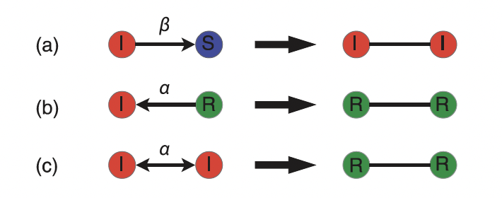
  

      (a) 拡散者が未感染者に出会うと、その人は確率βで拡散者になる。 
      (b) 拡散者が抑制者に出会うと、拡散者は確率αで抑制者になる。 
      (c) 拡散者同士が出会うと、2人とも確率αで抑制者になる。
    

---
transition: slide-up
level: 2
---
# 社会的感染とSIRモデル

噂の拡散

<v-clicks depth="2">

- 均質まネットワークであっても閾値効果を持たず、伝達確率が低くても噂は多くの人に届きわたる
- 非均質なネットワーク(例：スケールフリー型)においても閾値はなく、最終的に噂を知る人の数は、同じノード数とリンク数を持つ均質なネットワークより少なくなる。
    - 噂が早い段階でハブに到達し、多くの人と接触によってすぐに抑制者になるためである
    - 噂がハブから先に十分拡散される前に拡散の連鎖が断ち切られる
</v-clicks>

  SIR モデルは、普遍的な現象を簡素な仕組みでとらえることが可能であり、工夫を加えることで、 さまざまなパターンの流行現象にあてはめる可能性を持っている

---
transition: slide-up
level: 2
---

# ネットワークモデル

まとめ

<v-clicks depth="2">

- ネットワークモデルは、複雑な現実世界を単純化されたルールで再現し、その本質的な特徴がなぜ生まれるのかを理解することに役を立つ
    - WSモデル:高いクラスタリング係数と短い平均経路長を両立するネットワークの構造を説明する
    - BAモデル: 新しいノードはすでに多くのリンクを持つ「ハブ」に優先的に接続される（優先的選択）というルールで成長し、一部のハブが非常に多くの接続を持つ「スケールフリー性」が生まれる
- ネットワーク応用：SIRモデルとの組み合わせを例として
    - より現実に近いネットワークを適用することで、感染拡大のメカニゼムを説明し、最適な介入が設計する

</v-clicks>

