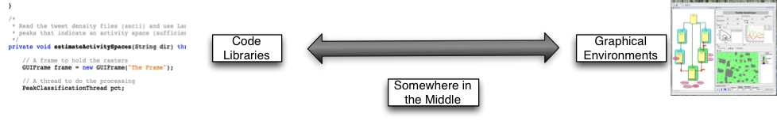
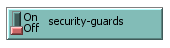
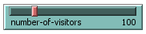
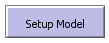
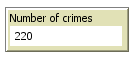
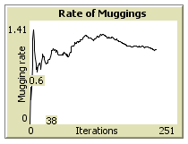
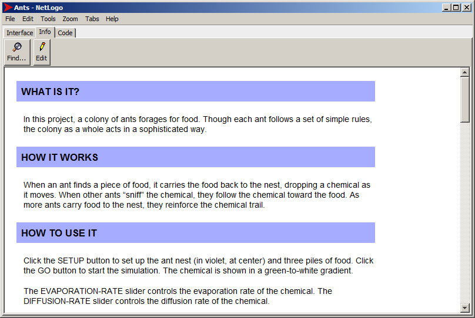
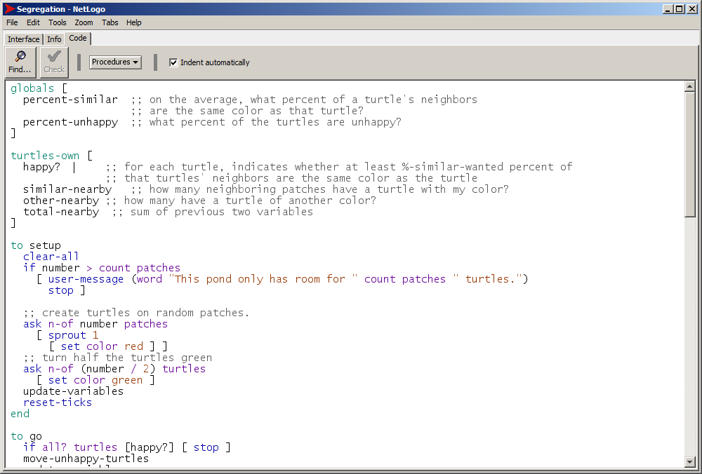

# An Introduction to NetLogo

GEOG5927 Predictive Analytics

*Nick Malleson and Alison Heppenstall*

---
layout: image-right
image: ./image/marmite.jpg
---

# Programming...

In this unit, you will be introduced to computer programming with NetLogo.

- Don't panic!
- The tasks are easy, but computers are stupid
- NetLogo was designed for children — a nice introduction to programming

**Other benefits**

- It will change the way you think (honestly, it will)
- **Basically an essential skill for data analytics**
- Open new, exciting opportunities to research the world

---
layout: quote
---

"The spread of computers and the Internet will put jobs in two categories: people who tell computers what to do, and people who are told by computers what to do."

— *Marc Andreessen*

---

# Outline

1. Tools for individual-level modelling
2. Introduction to NetLogo
3. The Program
4. Turtles and Patches
5. Variables
6. Flow Control
7. Writing Nice Code

---

# Software Tools / Platforms



**What are they?** Pieces of software to help people build models

**Wide range of tools**
- Computer code ('libraries')
- Entire graphical environment
- Somewhere in the middle

---
layout: image-right
image: ./image/code.png
---

# Computer Code ('Libraries')

Researchers write software to perform useful functions:

- Draw graphs
- Visualise the model
- Manage the schedule

Great for programmers — less time worrying about admin, more time on modelling

---
layout: image-right
image: ./image/code.png
---

# Computer Code ('Libraries')

ABM Examples:

- [MASON](http://cs.gmu.edu/~eclab/projects/mason/)
- [Repast Simphony](http://repast.sourceforge.net/)
- [Mesa](https://github.com/projectmesa/mesa)
- Many others listed [here](http://en.wikipedia.org/wiki/Comparison_of_agent-based_modeling_software)

Others you might have heard of:

- [pandas](http://pandas.pydata.org/) (python)
- plyr (R)
- [jQuery](https://jquery.com/) (javascript)
- [numpy](http://www.numpy.org/) (python)

---
layout: image-right
image: ./image/repast-behavior_editor_example.png
---

# Graphical Environments

Entirely visual — no programming needed

Most useful for non-programmers

**Examples**
- [Agent Sheets](http://www.agentsheets.com/)
- [VisualBots](http://visualbots.com/)
- [Repast Simphony](http://repast.sourceforge.net/)
- [Modelling4All](http://m.modelling4all.org/)

---
layout: image-right
image: ./image/netlogo-gui.png
---

# Somewhere in the Middle

Some programs let you do a bit of code writing as well as visual development

- More powerful than purely visual tools, but easier to use
- Save time on simple tasks — concentrate on model behaviour

**e.g. NetLogo**

---
layout: image-right
image: ./image/netlogo-title-wide-60.jpg
---

# NetLogo

- Based on **Star Logo**
- Popular teaching tool
- Designed to be used by children
- But also powerful

<Youtube id="8wU6NdjTVTA" class="mt-4 h-40 w-full" />

---

# NetLogo


- Developed by The Center for Connected Learning (CCL) at Northwestern University
- **Free!** — Uses Java in the background → **Multi platform**
- Can be converted into applets (embedded in websites)

Great for quickly putting a model together:

- Easy to build
- Easy to interact with models
- Easy to extract data and create plots

Excellent documentation: [ccl.northwestern.edu/netlogo/docs/](http://ccl.northwestern.edu/netlogo/docs/)

---
layout: image-right
image: ./image/netlogo-program.png
---

# The Program

NetLogo is "somewhere in the middle"

- **Interface** — Graphical part with sliders, graphs, buttons and a map
- **Procedures** — Scripting part which contains instructions (code)

---

# The Interface


---

# Interface Components

<div class="grid grid-cols-2 gap-6 mt-6">
  <div class="flex items-center gap-4">
    <span class="w-20 font-bold">Switch</span>
    
  </div>
  <div class="flex items-center gap-4">
    <span class="w-20 font-bold">Slider</span>
    
  </div>
  <div class="flex items-center gap-4">
    <span class="w-20 font-bold">Button</span>
    
  </div>
  <div class="flex items-center gap-4">
    <span class="w-20 font-bold">Monitor</span>
    
  </div>
  <div class="flex items-center gap-4">
    <span class="w-20 font-bold">Graph</span>
    
  </div>
</div>

---

# The Information Tab



---

# The Program — Code



---
layout: image-right
image: ./image/turtles-patches.png
---

# Turtles, Patches and the Observer

There are two types of objects in NetLogo: **turtles** and **patches**.

Both are *agents*:
- They have rules that determine their behaviour
- They can interact with other agents

Main differences:
- Patches cannot **move**
- You can create different types of 'turtle' (e.g. person, dog, cat, car...)

> Why turtles? 'Logo' originally controlled robot turtles. The name stuck.

---
layout: image-right
image: ./image/turtles-patches-god.png
---

# Turtles, Patches and the Observer

Also important: the **observer**

- The 'god' of a model
- Oversees everything that happens
- Gives orders to turtles or patches
- Controls data input/output, virtual time, etc.

---

# Variables

In programming, variables are a way of storing information:

```
my-name = "Nick"
seconds-per-minute = 60
pi = 3.142
infected = True
```

Variables can *belong* to different objects in the model:

- **Turtle variables**: `name`, `age`, `occupation`, `wealth`, `energy`
- **Patch variables**: `height-above-sea`, `amount-of-grain`, `deprivation`
- **Observer variables**: `total-wealth`, `weather`, `time-of-day`, `pi`

Different objects can have different *variable values*

---

# Built-In Variables in NetLogo

Each agent type has its own set of built-in variables:

| Agent | Built-in Variables |
|-------|-------------------|
| **Turtle** | `color`, `heading`, `xcor`, `ycor`, `shape`, `label`, `size`, ... |
| **Patch** | `pcolor`, `plabel`, `pxcor`, `pycor`, ... |
| **Observer** | Accesses all turtle and patch variables |

These are always available without needing to declare them first.

---

# NetLogo Commands

Commands are the way of telling NetLogo what we want it to do.

| Command | Description |
|---------|-------------|
| `show "Hello World"` | Prints something to the screen |
| `set my-age 13` | Sets the value of a variable |
| `ask turtles [ ... ]` | Ask the turtles to do something |
| `ask turtles [ set color blue ]` | Asks the turtles to turn blue |

Commands are very [well documented](http://ccl.northwestern.edu/netlogo/docs/tutorial2.html)

---

# Brackets

NetLogo uses both square `[ ]` and round `( )` brackets.

**Round brackets** set the *order of operations*:

```
2 + 3  × 4 = 14
(2 + 3) × 4 = 20
```

**Square brackets** split up commands:

```text
ask turtles [ ... ]
```

The `ask` command expects to find more commands inside the brackets.

---
layout: image-right
image: ./image/contexts.png
---

# Contexts

Contexts are NetLogo's way of controlling where commands are sent.

There are three contexts:

1. **Observer**
2. **Turtle**
3. **Patch**

<span style="color:red; font-weight:bold;">Don't Panic</span>: Lots of opportunity to understand these during the practicals.

---
layout: image-right
image: ./image/ramsay.jpg
---

# Flow Control

Programs are recipes

And computers are really, really stupid cooks.

Programmers need to tell the computer *exactly* what to do, and in what order.

> Q: How do you keep a programmer in the shower forever?
>
> A: Give them a bottle of shampoo that says "lather, rinse, repeat".

---

# Flow Control and Logic

Usually, NetLogo will run through your code one line after the other.

**But!** Sometimes there are two or more possibilities for what to do next.

`if` statements are one example:

```text
... start here ...

if ( age < 18 )
  [ .. do something .. ]

if ( age > 18 )
  [ .. do something else .. ]

... now continue ...
```

---

# Finally: Writing Nice Code

Computers don't care what code looks like, but good conventions make code easier to read.

**Indentation**
- New blocks of code should be *indented* (moved to the right)

**White space**
- Different sections of code can be separated by blank lines

**Comments**
- Anything after a `;` is ignored by NetLogo
- Use comments to explain what your code does

---
layout: two-cols
---

# Indentation

<div class="text-green-600 font-bold mb-2">Good</div>

```text
if age = 15 [

  if count friends > 0 [
    set happiness ( happiness + 1 )
  ]

  if count friends > 5 [
    set happiness ( happiness + 5 )
  ]

]
```

::right::

<div class="text-red-600 font-bold mb-2 mt-10">Bad</div>

```text
if age = 15 [

if count friends > 0 [
set happiness ( happiness + 1 )
]

if count friends > 5 [
set happiness ( happiness + 5 )
]

]
```

---
layout: two-cols
---

# Whitespace

<div class="text-green-600 font-bold mb-2">Good</div>

```text
if age = 15 [

  if count friends > 0 [
    set happiness ( happiness + 1 )
  ]

  if count friends > 5 [
    set happiness ( happiness + 5 )
  ]

]
```

::right::

<div class="text-red-600 font-bold mb-2 mt-10">Not ideal</div>

```text
if age = 15 [
  if count friends > 0 [
    set happiness ( happiness + 1 )
  ]
  if count friends > 5 [
    set happiness ( happiness + 5 )
  ]
]
```

---
layout: two-cols
---

# Comments

<div class="text-green-600 font-bold mb-2">Good</div>

```text
if age = 15 [

  ; This happens if agent is 15 years old:
  if count friends > 0 [
    ; If at least 1 friend, they're happy
    set happiness ( happiness + 1 )
  ]

  if count friends > 5 [
    ; If they have 5+, even more happy
    set happiness ( happiness + 5 )
  ]

]
```

::right::

<div class="text-red-600 font-bold mb-2 mt-10">Bad</div>

```text
if age = 15 [

  if count friends > 0 [
    set happiness ( happiness + 1 )
  ]

  if count friends > 5 [
    set happiness ( happiness + 5 )
  ]

]
```

---
layout: center
class: text-center
---

# Summary

1. Tools for individual-level modelling
2. Introduction to NetLogo
3. The Program
4. Turtles and Patches
5. Variables
6. Flow Control
7. Writing Nice Code
