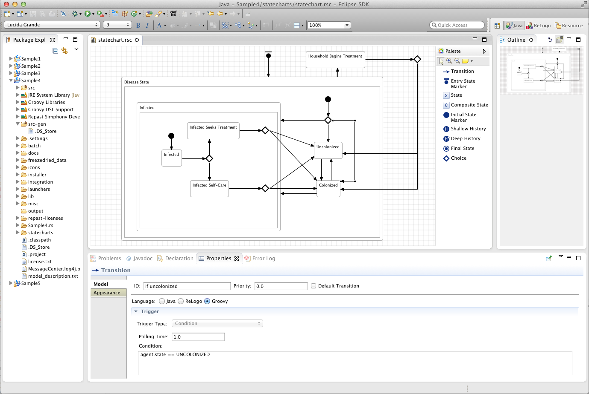
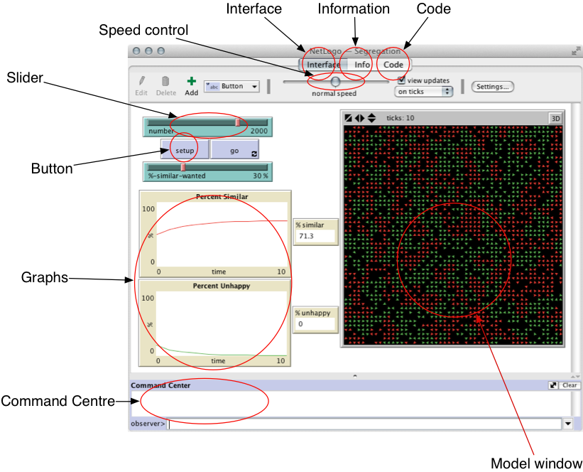

---
# You can also start simply with 'default'
theme: seriph
# random image from a curated Unsplash collection by Anthony
# like them? see https://unsplash.com/collections/94734566/slidev
background: https://cover.sli.dev
# some information about your slides (markdown enabled)
title: Welcome to Slidev
info: |
  ## Slidev Starter Template
  Presentation slides for developers.

  Learn more at [Sli.dev](https://sli.dev)
# apply unocss classes to the current slide
class: text-center
# https://sli.dev/features/drawing
drawings:
  persist: false
# slide transition: https://sli.dev/guide/animations.html#slide-transitions
transition: slide-left
# enable MDC Syntax: https://sli.dev/features/mdc
mdc: true
contextMenu: false
hideNavigation: true
shortcut:
  toc: false
---

# NetLogo入門

エージェントベースシミュレーション


---
layout: two-cols-header
left: 60%
---

# シミュレーションモデルを実装するツール

プログラミングベースのツール

::left::

- Python、Juliaなどのプログラミング言語を用いてシミュレーションモデルを実装することができる
    - 高い柔軟性と拡張性
- モデリングとシミュレーションの実装に支援するライブラリも多くある
    - ライブラリは、自分で毎回ゼロからすべてを実装するのではなく、あらかじめ用意された機能を呼び出して利用できる仕組みである。これにより、開発を効率化し、複雑な処理も比較的容易に実装できる
    - [Mesa](https://github.com/projectmesa/mesa)

::right::

```python {1|3-10|12-18|all}
from mesa import Agent, Model

class MoneyAgent(Agent):
    def __init__(self, model):
        super().__init__(model)
        self.wealth = 1

    def step(self):
        if self.wealth > 0:
            other = self.random.choice(
                list(self.model.agents))
            other.wealth += 1
            self.wealth -= 1

class MoneyModel(Model):
    def __init__(self, N):
        super().__init__()
        for _ in range(N):
            MoneyAgent(self)

    def step(self):
        self.agents.shuffle_do("step")
```


---
layout: two-cols-header
---

# シミュレーションモデルを実装するツール

グラフィックツール

::left::

- インタフェースで操作しながらモデルを構築・実行するツール
    - 直感的に扱いやすく
    - 実装の自由度や拡張性は、プログラミングベースのツールより制限される
- [Agent Sheets](http://www.agentsheets.com/)
- [VisualBots](https://github.com/nyje/visual-bots)
- [Repast Simphony](https://repast.github.io/repast_simphony.html)

::right::
 


<style scoped>
.two-cols-header {
  row-gap: 0.5rem !important;
}
</style>


---
class: flex justify-center items-center gap-20 px-40 text-xl
---

<div
  absolute text-3xl
  :class="$clicks < 1 ? 'text-black' : 'translate-y--18 scale-40 text-black/30'"
  transition duration-500 ease-in-out
>
  <span>コードを少し書きながらビジュアルも使えるツールでもある?</span>
</div>


<div flex flex-col items-center>
  <v-clicks>
    <div mt-12>
      <h1 flex flex-col items-center text="4xl!" style="text-align: center; line-height: 1.4;">
        <a href="https://ccl.northwestern.edu/netlogo/" target="_blank" rel="noopener noreferrer" class="flex items-center gap-3 no-underline">
          
          <span style="color: #000000;">NetLogo</span>
        </a>
      </h1>
    </div>
  </v-clicks>
</div>


---
transition: fade-out
---

# NetLogoの画面

<div class="flex justify-center">
  
</div>

---

# インターフェース画面



---
transition: fade-out
---

# NetLogoの動作の仕組み

<div class="grid grid-cols-2 gap-8 mt-8 items-center">
  <div class="flex justify-center">
    
  </div>

  <div>

  - インターフェース画面でボタンを押すことによって、プログラムが実行される
      - `setup` と`go` の2 つのボタンを作成することが規範的な作り方である
          - `setup` で初期化
          - `go` で実行
  - `go procedure` の中から別の`procedure`を呼び出して、より複雑な処理などを行うことになる
      - `ask`文を使って、エージェントに命令するという形式でプログラミングを行う設定を使うことは多い

  </div>
</div>


---

# NetLogoで構築されるモデルの基本要素

<div class="flex justify-center">
  
</div>

- **patch** がグリッド状に敷き詰められ，その上を **turtle** が動く
- **link** は turtle 同士をつなぐもの（有向リンクと無向リンクがある）
- **observer** は turtle, patch, link に命令を出すことができる


---
class: flex justify-center items-center gap-20 px-40 text-xl
---

<div
  absolute text-3xl
  :class="$clicks < 1 ? 'text-black' : 'translate-y--18 scale-60 text-black/30'"
  transition duration-500 ease-in-out
>
  <span>これからNetLogoの文法を説明する</span>
</div>
<div flex flex-col items-center>
  <div
    mt-12
    :class="$clicks < 1 ? 'opacity-0' : $clicks < 2 ? 'opacity-100' : 'translate-y--8 scale-60 opacity-30'"
    transition duration-500 ease-in-out
  >
    <h1 flex flex-col items-center text="4xl!" style="text-align: center; line-height: 1.4;">
      <span style="color: #000000;">一度にすべてを覚えるのは難しい....</span>
    </h1>
  </div>
  <v-click at="2">
    <div mt-6 text-center text-2xl text-gray-600>
      <span>💡 まずは聞き流し、その後は実践を通して理解していく</span>
    </div>
  </v-click>
</div>

---
transition: fade-out
layout: two-cols-header
---

# Netlogoの基本文法

変数の代入と演算

::left::

<v-click at="1">

**`set` コマンドで変数に値を代入する**

- `x = 10` のような書き方はできない
- 変数の型（数値・文字列など）を宣言する必要はない
- 文字列は `"..."` で囲む

</v-click>

<v-click at="2">

**四則演算**

- `+ - * /` の前後に**半角スペース**が必要
- 余剰演算子は `%` ではなく `mod`
- 論理演算子：`and`，`or`，`not`

</v-click>

::right::

```text {|1-3|5-8}
; 変数の代入
set x 10
set y "hogehoge"

; 四則演算
set x 10 + 5
set y 12 * 2 / 4 - 3
set z 10 mod 3
```


---
transition: fade-out
layout: two-cols-header
---

# 変数の種類

変数の目的による使い分け


::left::

<v-click at="1">

**グローバル変数**（`globals`）
- モデル全体で共有される変数
- どのエージェント・手続きからでも参照・更新できる

</v-click>

<v-click at="2">

**エージェント変数**
- 各エージェントがそれぞれ独立した値を持つ

</v-click>

<v-click at="3">

**ローカル変数**（`let`）
- 手続き内だけで有効な一時的な変数

</v-click>

::right::

```text {1,6|2-3,8,11|16}
globals [total-count]
turtles-own [energy]
patches-own [fertility]

to setup
  set total-count 100
  create-turtles total-count [
    set energy 50
  ]
  ask patches [
    set fertility random 10
  ]
end

to go
  let avg-energy mean [energy] of turtles
  ask turtles [
    set energy energy - 1
  ]
end
```


---
transition: fade-out
layout: two-cols-header
---

# Netlogoの基本文法

リストの操作

::left::

<v-click at="1">

**リストの作成**

- `(list ...)` でリストを作成
- インデックスアクセス（`x[0]`）は**不可**

</v-click>

<v-click at="2">

**要素の取り出し**

- `item (番号) (リスト)` で指定した位置の要素を取得

</v-click>

<v-click at="3">

**要素の置き換え**

- `replace-item (番号) (リスト) (値)` で指定位置の要素を更新

</v-click>

::right::

```text {|1-3|5-7|9-11}
; リストの作成
set y (list 1 2 3)
; => [1 2 3]

; 要素の取り出し
let first-item item 0 y
; => 1

; 要素の置き換え
set y replace-item 0 y 99
; => [99 2 3]
```
---

# 描画画面

<div class="p-4 border-2 border-dashed border-gray-400 rounded bg-gray-50 text-gray-500 text-sm text-center mb-4">
  【画像プレースホルダー】スライドB.6 — 描画画面とModel Settings（座標設定ダイアログ）のスクリーンショット
</div>

- インターフェース画面の黒い部分が patch の描画領域
- 「設定」ボタンを押すと座標設定ダイアログが開く
- 座標の原点・x 軸・y 軸の最大値と最小値を設定可能
- **パッチサイズ**：パッチの一辺のピクセル数（小さくすると描画領域全体が小さくなる）


---
transition: fade-out
layout: two-cols-header
---

# ask 文

エージェントへの命令を定義する

::left::

<v-click at="1">

**turtle への命令**
- `turtles` — 現在存在する全ての turtle
- `turtle (番号)` — 指定した ID の turtle のみ

</v-click>

<v-click at="2">

**patch への命令**
- `patches` — 全ての patch
- `patch (x) (y)` — 指定した座標の patch のみ

</v-click>

<v-click at="3">

**link への命令**
- `links` — 全ての link
- `link (n1) (n2)` — 指定した2つの turtle 間の link のみ

</v-click>


::right::

```text {|1-6|8-12|14-19}
; turtle への命令
ask turtles [
  fd 1                   ; 1歩前進
  set color red          ; 色を赤に変更
]
ask turtle 4 [ rt 90 ]  ; id=4 の turtle のみ右折

; patch への命令
ask patches [
  set pcolor scale-color green fertility 0 10
                         ; fertility の値で緑の濃淡を設定
]
ask patch 0 0 [ set pcolor white ]  ; 原点の patch のみ白

; link への命令
ask links [
  set color gray         ; 全 link をグレーに
  set thickness 0.5      ; 太さを設定
]
ask link 0 1 [ set color red ]  ; turtle 0-1 間の link のみ赤
```

---

# エージェント集合の例

```text
other turtles
; 自分以外の turtle

turtles-here
; この patch の上にいる全ての turtle

turtles-here with [color = red]
; この patch の上にいる全ての赤色（color が red）の turtle

patches with [pxcor > 0]
; 正の x 座標を持つ全ての patch

turtles in-radius 3
; その場所からの距離が3以下にいる全ての turtle

neighbors4
; ノイマン近傍の patch（ただし，その場所の patch は含まれない）

turtles-on neighbors4
; ノイマン近傍にいる全ての turtle
```

---
layout: two-cols
---

# ask 文のサンプル

**setup の例**

```text
to setup
  clear-all
  setup-patches
  setup-turtles
  reset-ticks
end
```

**patch の設定**

```text
to setup-patches
  ask patches [
    set pcolor green
  ]
end
```

::right::

**turtle の設定**

```text
to setup-turtles
  create-turtles 100
  ask turtles [
    setxy random-xcor random-ycor
    set color red
  ]
end
```

- `clear-all`：全てを初期化
- `reset-ticks`：シミュレーションのカウンタを初期化
- `setxy`：turtle の場所を設定
- `random-xcor`, `random-ycor`：x/y 軸上のランダムな値

---

# エージェント変数

<div class="p-4 border-2 border-dashed border-gray-400 rounded bg-gray-50 text-gray-500 text-sm text-center mb-4">
  【画像プレースホルダー】スライドB.12 — turtle・patch・link それぞれの inspect ウィンドウ（エージェント変数一覧）のスクリーンショット
</div>

| エージェント | 主なデフォルト変数 |
|------------|-----------------|
| **turtle** | `who`, `color`, `heading`, `xcor`, `ycor`, `shape`, `label`, ... |
| **patch** | `pcolor`, `plabel`, `pxcor`, `pycor`, ... |
| **link** | `end1`, `end2`, `color`, `label`, `thickness`, ... |

- `turtles-own` 等で定義した変数も同じウィンドウに表示される
- 右クリック → `inspect turtle (番号)` で確認可能

---
layout: two-cols
---

# よく使う基本的な構文

**if 文**

```text
if (条件) [
  （命令）
]
```

**ifelse 文**

```text
ifelse (条件) [
  （命令1）
][
  （命令2）
]
```

**while 文**

```text
while (条件) [
  （命令）
]
```

::right::

**使用例**

```text
ask turtles [
  if xcor > 0 [
    set color red
  ]
]

ask patches [
  ifelse pxcor > 0 [
    set pcolor blue
  ][
    set pcolor red
  ]
]

ask turtle 0 [
  while [any? other turtles-here][
    right random 360
    fd 1
  ]
]
```

---
layout: two-cols
---

# NetLogo特有の構文

**repeat 文**（while 文と似ているが，条件の代わりに数値を書く）

```text
repeat (数値) [
  （命令）
]
```

**foreach 文**（リストの各要素に処理する）

```text
foreach リスト [
  x -> （命令）
]
```

角括弧のブロック内の冒頭で `x ->` のようなコマンドを書く（`x` は任意の変数名）

**loop 文**（条件部分のない while 文。`stop` で抜け出す）

```text
loop [
  （命令）
]
```

::right::

**使用例**

```text
ask turtle 0 [
  repeat 10 [fd 1]
]

set tlist (list turtle 0 turtle 1)
foreach tlist [
  x -> ask x [
    right random 360
    fd 1
  ]
]

loop [
  ask turtle 0 [
    if any? other turtles-here [
      right random 360
      fd 1
      stop
    ]
  ]
]
```

---

# procedure の定義

**通常の procedure（`to`〜`end`）**

```text
to my-procedure
  （中身）
end
```

**戻り値がある procedure（`to-report`〜`end`）**

`return` ではなく `report` を使う点に注意

```text
to-report my-reporter
  （中身）
  report 結果
end
```

**引数をとる procedure**

引数が複数の場合は，角括弧の中に半角スペースで区切って並べる

```text
to my-procedure [argument]
  （中身）
end
```

---

# よく使う命令

**エージェントの生成**

| 命令 | 説明 |
|------|------|
| `create-turtles (数値)` | 指定数の turtle を作成 |
| `hatch` | turtle から新しい turtle を生み出す（親の変数値を受け継ぐ） |

**乱数**

| 命令 | 説明 |
|------|------|
| `random (数値)` | 0 以上・指定値未満の整数をランダムに返す |
| `random-float (数値)` | 0 以上・指定値未満のランダムな浮動小数点数を返す |

**エージェント集合の操作**

| 命令 | 説明 |
|------|------|
| `any?` | エージェント集合が空でなければ `true` を返す |
| `with` | 条件を満たすエージェントだけを返す |
| `of` | エージェントが持つ変数の値を返す：`[pcolor] of patch 3 5` |
| `one-of` | エージェント集合からランダムに1つ返す |
| `max-one-of` | 変数が最大のエージェントを1つ返す |
| `min-one-of` | 変数が最小のエージェントを1つ返す |
| `other` | 自分自身を除いたエージェント集合を返す |

---

# 周辺の patch を取得する命令・stop

**周辺の patch**

| 命令 | 説明 |
|------|------|
| `neighbors4` | ノイマン近傍の4つの patch を返す |
| `neighbors` | ムーア近傍の8つの patch を返す |
| `in-radius (数値)` | 指定距離以下にある patch（または turtle）の集合を返す |
| `patch-here` | turtle がいる patch を返す |
| `patch-at (dx) (dy)` | 対象の turtle から見て相対座標 (dx, dy) の位置にある patch を返す |

**stop**

- 対象エージェントが procedure や ask ブロックから**抜け出す**
- そのエージェントが囲まれたブロックのみを停止するだけであり，**他のエージェントの実行は止めない**
- フォーエバーオプションで実行中の go procedure を停止することも可能

---

# インターフェース画面での変数の設定（スライダー）

<div class="p-4 border-2 border-dashed border-gray-400 rounded bg-gray-50 text-gray-500 text-sm text-center mb-4">
  【画像プレースホルダー】スライドB.15 — スライダーの作成方法とダイアログボックスのスクリーンショット
</div>

- 上部の「ボタン」→「スライダー」を選択し，好きな場所でクリックして作成
- グローバル変数名・最小値・最大値などを入力して設定
- ソースコードを編集せずに，シミュレーション実行時に変数を変更できる
- チューザー（chooser）やインプットボックスも同様に作成可能

---

# グラフの描画

<div class="p-4 border-2 border-dashed border-gray-400 rounded bg-gray-50 text-gray-500 text-sm text-center mb-4">
  【画像プレースホルダー】スライドB.16 — グラフの作成ダイアログとリアルタイムグラフの例のスクリーンショット
</div>

**作成の仕方**
1. 「プロット」を選択し，インターフェース画面に配置
2. ダイアログでグラフの名前・軸のラベルを入力
3. **プロットペン**：何の値をプロットするかのコマンドを記述（例：`plot count turtles`）
4. OK を押す

実行すればリアルタイムにグラフが表示される

---

# コマンドセンター

<div class="p-4 border-2 border-dashed border-gray-400 rounded bg-gray-50 text-gray-500 text-sm text-center mb-4">
  【画像プレースホルダー】スライドB.17 — コマンドセンターのスクリーンショット
</div>

- インターフェース画面の**下部**にある入力欄
- コマンドを直接入力して，エージェントに命令を送ることができる

```text
ask patches [set pcolor green]
```

全ての patch を緑色に変更できる（シミュレーション実行中でも可能）

- `observer>` の部分をクリックすれば，`patches` / `turtles` / `links` を選択可能
- turtle を右クリック → `inspect turtle (番号)` でも個別のコマンドセンターが利用可能

---
layout: center
class: text-center
---

# まとめ

1. ABMのためのソフトウェアツール
2. NetLogoとは
3. NetLogoの基本構成（画面・動作の仕組み）
4. NetLogo世界の基本要素（turtle・patch・link・observer）
5. 変数の定義と代入
6. ask 文とエージェント集合
7. 基本的な構文（if / ifelse / while / repeat / foreach）
8. procedure の定義
9. よく使う命令
10. インターフェースの活用（スライダー・グラフ・コマンドセンター）


<style>
.toc { display: none !important; }
</style>